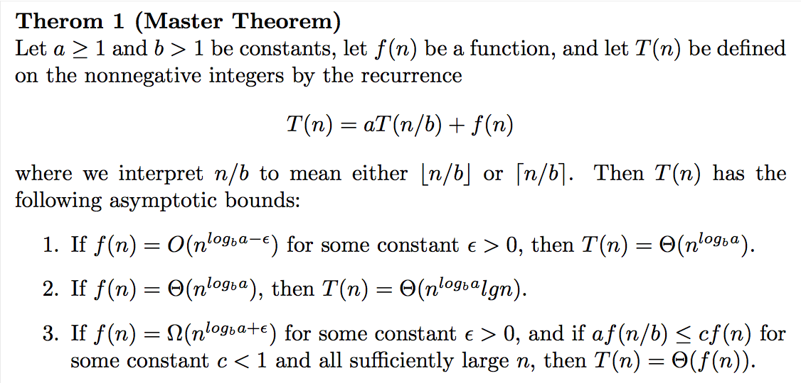

- [Abstract](#abstract)
- [Materials](#materials)
- [Online Judges](#online-judges)
- [References](#references)
  - [video](#video)
  - [Book](#book)
  - [Visualizations](#visualizations)
- [Online Interviews](#online-interviews)
- [Datatype Range](#datatype-range)
- [Algorithm Proof](#algorithm-proof)
- [Algorithm Analysis](#algorithm-analysis)
- [Master Theorem](#master-theorem)
- [Computation Complexity](#computation-complexity)
- [Commandline By Programming Languages](#commandline-by-programming-languages)
- [Collections By Programming Languages](#collections-by-programming-languages)
- [How to practise](#how-to-practise)
- [Problems by categories](#problems-by-categories)
- [Basic](#basic)
  - [Loop](#loop)
  - [Recursion](#recursion)
- [Data Structures](#data-structures)
  - [Array](#array)
  - [Matrix](#matrix)
  - [Bit Manipulation](#bit-manipulation)
  - [Partial Sum (Prefix Sum)](#partial-sum-prefix-sum)
  - [Partial Min (Prefix Min)](#partial-min-prefix-min)
  - [List, LinkedList](#list-linkedlist)
  - [Stack](#stack)
  - [Mono Stack](#mono-stack)
  - [Double Stack](#double-stack)
  - [Queue](#queue)
  - [Heap](#heap)
  - [Double Heap](#double-heap)
  - [Deque](#deque)
  - [Hash Map, Set](#hash-map-set)
  - [Ordered Map](#ordered-map)
  - [Rolling Hash](#rolling-hash)
  - [Bidirectional Indexing](#bidirectional-indexing)
  - [String](#string)
  - [Suffix Array](#suffix-array)
  - [Tree](#tree)
  - [Balance Tree](#balance-tree)
  - [Binary Search Tree](#binary-search-tree)
  - [Binary Indexed Tree](#binary-indexed-tree)
  - [Segment Tree](#segment-tree)
  - [Disjoint Set, Union Find, Merge Find](#disjoint-set-union-find-merge-find)
  - [Graph](#graph)
  - [DFS (Depth First Search)](#dfs-depth-first-search)
  - [BFS (Breadth First Search)](#bfs-breadth-first-search)
  - [Double BFS](#double-bfs)
  - [DFS, BFS](#dfs-bfs)
  - [DFS, dijkstra](#dfs-dijkstra)
  - [Topological Sort](#topological-sort)
  - [Trie](#trie)
  - [Network Flow](#network-flow)
- [Algorithms](#algorithms)
  - [Sort](#sort)
  - [Double Sort](#double-sort)
  - [Search](#search)
  - [Binary Search](#binary-search)
  - [Numerical Analysis](#numerical-analysis)
  - [Number Theory, Math](#number-theory-math)
  - [Computational Geometry](#computational-geometry)
  - [Line Sweep](#line-sweep)
  - [Exhaustive Search](#exhaustive-search)
  - [Divide And Conquer](#divide-and-conquer)
  - [Dynamic Programming](#dynamic-programming)
  - [Memoization](#memoization)
  - [Greedy](#greedy)
  - [Combinatorial Search](#combinatorial-search)
  - [Backtracking](#backtracking)
  - [Shortest Path](#shortest-path)
  - [Optimization Problems To Decision Problems](#optimization-problems-to-decision-problems)
  - [Combinatorial game theory](#combinatorial-game-theory)
  - [Minimax](#minimax)
  - [Two Pointers](#two-pointers)
  - [Sliding Window](#sliding-window)
  - [Finding 1st, 2nd](#finding-1st-2nd)
  - [Brain Teaser](#brain-teaser)
  - [Design](#design)
  - [Reservoir Sampling](#reservoir-sampling)
  - [Rejection Sampling](#rejection-sampling)
  - [Random](#random)
  - [Palindrome](#palindrome)
  - [Simulated Annealing](#simulated-annealing)
- [Famous Problems](#famous-problems)
  - [Subarray](#subarray)
  - [Subsequence](#subsequence)
  - [Design](#design-1)
  - [Find Peak Element](#find-peak-element)
  - [Egg Drop](#egg-drop)
  - [Parentheses](#parentheses)
  - [Best Time to Buy and Sell Stock](#best-time-to-buy-and-sell-stock)
  - [Jump Game](#jump-game)
  - [Basic Calculator](#basic-calculator)
  - [Brace Expansion](#brace-expansion)
  - [TSP](#tsp)
  - [Meeting Rooms](#meeting-rooms)
  - [Knapsack Problems](#knapsack-problems)
  - [Win Lose](#win-lose)
  - [Water](#water)
  - [Bulb Switcher](#bulb-switcher)
  - [Palindrome](#palindrome-1)
  - [Paint House](#paint-house)
  - [Course Schedule](#course-schedule)
  - [Decode Ways](#decode-ways)
- [Concurrency](#concurrency)
- [Database](#database)
- [Bash](#bash)
- [Excercises](#excercises)
  - [Leetcode Top Interview Questions](#leetcode-top-interview-questions)
  - [Cracking The Coding Intervew 6 th](#cracking-the-coding-intervew-6-th)
    - [Arrays And Strings](#arrays-and-strings)
    - [Linked Lists](#linked-lists)
    - [Stacks and Queues](#stacks-and-queues)
    - [Trees and Graphs](#trees-and-graphs)
    - [Bit Manipulation](#bit-manipulation-1)
    - [Math and Logic Puzzles](#math-and-logic-puzzles)
    - [Object Oriented Design](#object-oriented-design)
    - [Recursion and Dynamic Programming](#recursion-and-dynamic-programming)
    - [System Design and Scalability](#system-design-and-scalability)
    - [Sorting and Searching](#sorting-and-searching)
    - [Testing](#testing)
    - [C and C++](#c-and-c)
    - [Java](#java)
    - [Databases](#databases)
    - [Threads and Locks](#threads-and-locks)
    - [Moderate](#moderate)
    - [Hard](#hard)
  - [백준온라인](#백준온라인)

----

# Abstract

- 프로그래밍 훈련을 위해 유용한 문제들을 체계적으로 분류해서 정리해 본다.

# Materials

- L | [leetcode](https://leetcode.com/)
- C | [cracking the coding interview](http://www.crackingthecodinginterview.com/)
  - [src](https://github.com/careercup/CtCI-6th-Edition) 
- 알 | [알고리즘문제해결전략](http://book.algospot.com/)
  - [algospot](https://algospot.com/judge/problem/list/) 
- 백 | [백준온라인강좌](https://code.plus/courses/1)
- H | [hackerrank](https://www.hackerrank.com/)
- R | [careercup](https://careercup.com/categories)
- G | [geeksforgeeks](http://www.geeksforgeeks.org/)
  - [Top 10 algorithms in Interview Questions](http://www.geeksforgeeks.org/top-10-algorithms-in-interview-questions/)
- dynamic programming
  - [Dynamic Programming(Beginner to advanced) @ youtube](https://www.youtube.com/playlist?list=PLb3g_Z8nEv1h1w6MI8vNMuL_wrI0FtqE7)
  - [DP on Trees(Beginner to advanced) @ youtube](https://www.youtube.com/playlist?list=PLb3g_Z8nEv1j_BC-fmZWHFe6jmU_zv-8s)
  - [DP with Bitmasks @ youtube](https://www.youtube.com/playlist?list=PLb3g_Z8nEv1icFNrtZqByO1CrWVHLlO5g)
  - [Dynamic Programming @ youtube](https://www.youtube.com/playlist?list=PLVrpF4r7WIhTT1hJqZmjP10nxsmrbRvlf)
  - [Dynamic Programming Patterns @ leetcode discussion](https://leetcode.com/discuss/general-discussion/458695/dynamic-programming-patterns)
- [cp-algorithms](https://cp-algorithms.com/)
  - algorithm catalogue
- [50 coding questions @ bytebybyte](https://www.byte-by-byte.com/wp-content/uploads/2019/12/50-Coding-Interview-Questions-V2.pdf)
  - frequent asekd 50 coding interview questions
- [interactive coding challenges](https://github.com/donnemartin/interactive-coding-challenges)
- [elements of programming interviews in c++](https://www.amazon.com/Elements-Programming-Interviews-Insiders-Guide/dp/1479274836)
- [Coding Interview Questions](https://www.amazon.com/Coding-Interview-Questions-Narasimha-Karumanchi-ebook/dp/B01MTCOXPV/ref=sr_1_2?s=books&ie=UTF8&qid=1500287754&sr=1-2&keywords=coding+interview+questions)
- [Programming Interviews Exposed](https://www.amazon.com/Programming-Interviews-Exposed-Secrets-Landing-ebook/dp/B008SGNJOW/ref=pd_cp_351_2?_encoding=UTF8&psc=1&refRID=A7HZWTE0YTRTEPZ9RZXM)
- [programming challenges](https://www.amazon.com/Programming-Challenges-Contest-Training-Computer-ebook/dp/B008AFF2ZU/ref=sr_1_1?ie=UTF8&qid=1500287669&sr=8-1&keywords=programming+challenges)
- [programming pearls](https://www.amazon.com/Programming-Pearls-2nd-Jon-Bentley/dp/0201657880/ref=sr_1_1?s=books&ie=UTF8&qid=1473590537&sr=1-1&keywords=programming+pearls)
- [Dynamic Programming for Coding Interviews: A Bottom-Up approach to problem solving](https://www.amazon.com/Dynamic-Programming-Coding-Interviews-Bottom-Up-ebook/dp/B01N4P93O7/ref=sr_1_1?ie=UTF8&qid=1500344454&sr=8-1&keywords=dynamic+programming+for+coding+interviews)
- [How to solve it by G. Polya](https://press.princeton.edu/titles/669.html)
- [Competitive Programmer's Handbook](https://cses.fi/book.html)
  - 알고리즘대회 참가자들을 위한 알고리즘 요약책

# Online Judges

- L | [leetcode](https://leetcode.com/)
- H | [hackerrank](https://www.hackerrank.com/)
- 알 | [알고스팟](https://algospot.com/)
- 백 | [백준온라인](https://www.acmicpc.net/)
- A | [codeforces](http://codeforces.com/)
- T | [topcoder](https://arena.topcoder.com)
- G | [geekforgeeks practice](http://www.practice.geeksforgeeks.org/)
- [codility](https://app.codility.com/programmers/lessons/1-iterations/)
- [programming-challenges](http://www.programming-challenges.com/)
- [UVa online](https://uva.onlinejudge.org/)
- [spoj](http://www.spoj.com/)

# References

## video

- [Back To Back SWE @ youtube](https://www.youtube.com/channel/UCmJz2DV1a3yfgrR7GqRtUUA/videos)
  - videos for leetcode
- [엔지니어대한민국 @ youtube](https://www.youtube.com/channel/UCWMAh9cSkEn8v42YRO90BHA)
  - 여러가지 알고리즘들을 쉽게 설명한다. 특히 Big O notation 설명이 인상적이다.
- [백준온라인강좌](https://code.plus/courses/1)
  - 유료이긴하지만 다양한 문제풀이 강좌가 있다.
- [c++로 배우는 알고리즘 동영상](https://www.youtube.com/watch?v=mzM3S5FtKuw&list=PLl5LpJCoD2mCIRn0Fkt8z07EK320ZmHgY)
- [Sedgewick Algorithms I](https://www.coursera.org/learn/algorithms-part1)
  - [Sedgewick Algorithms II](https://www.coursera.org/learn/algorithms-part2)
- [michael sambol short videos](https://www.youtube.com/channel/UCzDJwLWoYCUQowF_nG3m5OQ)
- [Curtis Lassam short videos](https://www.youtube.com/watch?v=r4r1DZcx1cM&list=PLmVb1OknmNJuC5POdcDv5oCS7_OUkDgpj&index=22)
  - trie, bloom filters, Endianness, scrum
- [mycodeschool @ youtube](https://www.youtube.com/user/mycodeschool/featured)

## Book

- C | [cracking the coding interview](http://www.crackingthecodinginterview.com/)
  - [src](https://github.com/careercup/CtCI-6th-Edition) 
- [알고리즘문제해결전략](http://book.algospot.com/)
- [c로 배우는 알고리즘](http://www.yes24.com/24/goods/18005?scode=032&OzSrank=1)
- [Algorithms 4th Edition by Robert Sedgewick and Kevin Wayne](http://algs4.cs.princeton.edu/home/)
  - [src](https://algs4.cs.princeton.edu/code/)
- [The Algorithm Design Manual 2nd Edition by Steven S Skiena](http://www.amazon.com/Algorithm-Design-Manual-Steven-Skiena/dp/1848000693/ref=sr_1_1?s=books&ie=UTF8&qid=1460283355&sr=1-1&keywords=the+algorithm+design+manual)
- [Data Structures and Algorithm Analysis in C 2nd Edition by Mark A. Weiss ](https://users.cs.fiu.edu/~weiss/)
  - [src](https://users.cs.fiu.edu/~weiss/dsaa_c++4/code/)
- [Introduction to Algorithms, 3rd Edition (MIT Press)](http://www.amazon.com/Introduction-Algorithms-3rd-MIT-Press/dp/0262033844/ref=sr_1_1?s=books&ie=UTF8&qid=1460283565&sr=1-1&keywords=introduction+to+algorithms)
  - [solution](http://sites.math.rutgers.edu/~ajl213/CLRS/CLRS.html)
- [The Art of Computer Programming (TAOCP) by Donald Knuth](http://www-cs-faculty.stanford.edu/~knuth/taocp.html)

## Visualizations

- [Data Structure Visualization](https://www.cs.usfca.edu/~galles/visualization/Algorithms.html)
- [visualgo](https://visualgo.net/en)

# Online Interviews

- [codesignal](https://codesignal.com/)
  - uber, dropbox
- [hackerrank](https://www.hackerrank.com/)
  - rivian, linkedin
- [codeshare](https://codeshare.io/)
- [coding.sh](http://coding.sh/)
- [pramp](https://www.pramp.com/)
- [interviewing.io](https://interviewing.io)

# Datatype Range

| Type               | Typical Bit Width |                                          Typical Range |
| :----------------- | :---------------- | -----------------------------------------------------: |
| char               | 1byte             |                                            -128 to 127 |
| unsigned char      | 1byte             |                                               0 to 255 |
| short int          | 2byte             |                                      -32,768 to 32,767 |
| unsigned short int | 2byte             |                                            0 to 65,535 |
| int                | 4byte             |                        -2,147,483,648 to 2,147,483,647 |
| unsigned int       | 4byte             |                                     0 to 4,294,967,295 |
| long long          | 8byte             | –9,223,372,036,854,775,808 ~ 9,223,372,036,854,775,807 |
| unsigned long long | 8byte             |                         0 ~ 18,446,744,073,709,551,615 |
| float              | 4byte             |                          -3.4E +/- 38 ~ 3.4E +/- 38 () |
| double             | 8byte             |                        -1.7E +/- 308 ~ 1.7E +/- 308 () |

```
float와 double로 표현할 수 있는 정수 범위

float  = 1 sign bit +  8 exponent bit + 23 fraction bit (-2^23 ~ 2^23)
double = 1 sign bit + 11 exponent bit + 52 fraction bit (-2^52 ~ 2^52)

2^23 = 8,388,608
2^52 = 4,503,599,627,370,496

 float 의 경우 소수점 이하 유효자리수는 이진수로 23 자리이므로 십진수로 약  7자리이다.
double 의 경우 소수점 이하 유효자리수는 이진수로 52 자리이므로 십진수로 약 16자리이다.
```

# Algorithm Proof

- [Mathmatical Induction](doc/proof.md#수학적-귀납법-mathmatical-induction)
- [Proof by Contradiction](doc/proof.md#귀류법-모순증명법-proof-by-contradiction)
- [Direct Proof](doc/proof.md#직접-증명법-direct-proof)
- [Contrapositive Proof](doc/proof.md#대우-증명법-contrapositive-proof)
- [Existence Proof](doc/proof.md#존재-증명법-existence-proof)
- [Proof by Counter Example](doc/proof.md#반례-증명법-proof-by-counter-example)
- [if and only if proof](doc/proof.md#필요충분조건-증명법-if-and-only-if-proof)

# Algorithm Analysis

- [빅오(Big-O)표기법 완전정복 @ youtube](https://www.youtube.com/watch?v=6Iq5iMCVsXA)
- [Know Thy Complexities!](https://www.bigocheatsheet.com/?fbclid=IwAR1qOG-mJUkSce83XStQhS8eoa8I54XiPedTQqs8K-Y5Nv-cI9jY_tF8CQg)
- The RAM Model of Computation
- The asymptotic analysis of worst-case complexity
- notations
  - f(n) = O(g(n)) means c · g(n) is an upper bound on f (n). Thus there exists some constant c such that f (n) is always ≤ c · g(n), for large enough n (i.e. , n ≥ n0 for some constant n0).
  - f(n) = Ω(g(n)) means c · g(n) is a lower bound on f(n). Thus there exists some constant c such that f(n) is always ≥ c · g(n), for all n ≥ n0.
  - f(n) = Θ(g(n)) means c1 · g(n) is an upper bound on f(n) and c2 · g(n) is a lower bound on f(n), for all n ≥ n0. Thus there exist constants c1 and c2 such that f (n) ≤ c1 · g(n) and f (n) ≥ c2 · g(n). This means that g(n) provides a nice, tight bound on f(n).
  - 
  - 

# Master Theorem



# Computation Complexity

- [TIL/computationcomplexity](https://github.com/iamslash/TIL/tree/master/pvsnp/README.md)
- P
  - P means the existence of an algorithm for the task that runs in polynomial time.
- NP
  - set of decision problems for which any yes instance has some 'proof' that verifies the problem to be yes in polynomial step
- NP Hard
  - A decision problem H is NP-hard when for every problem L in NP,
 there is a polynomial-time reduction from L to H
- NP Complete
  - A decision problem C is NP-complete if:
    - C is in NP, and
    - Every problem in NP is reducible to C in polynomial time.
 
# Commandline By Programming Languages

- Programming Languages
  - c++, java, kotlin, python
  - go, typescript, javascript, swift
  - rust, objc, cs  
  - scala, ruby, haskell, clojure

- c++

```bash 
> g++ -std=c++11 -o a.out a.cpp
> ./a.out
```

- java

```bash
> javac A.java
> java A
```

- python

```bash
> python a.py
```

- kotlin

```bash
# kotlinc is alias of kotlinc-jvm
# build with kotlinc run with java
$ kotlinc a.kt -include-runtime -d a.jar
$ java -jar a.jar

# build with kotlinc run with kotlin
$ kotlinc a.kt
$ kotlin AKt
```

- typescript

```bash
# Install tsc
$ npm install -g typescript
# Build with tsc
$ tsc a.ts
# Run with node
$ node a.js

# Install ts-node 
$ npm install -g ts-node
# Run with ts-node
$ ts-node a.ts
```

- go

```bash
> go run a.go
> go build -o a.out a.go
> ./a.out
```

- javascript

```bash
> node a.js
```

- Rust

```bash
> rustc a.rs
> ./a
```

- ruby

```bash
> ruby a.rb
```

- cs

```bash
# dotnet core
# https://dotnet.microsoft.com/en-us/learn/dotnet/hello-world-tutorial/create
$ dotnet new -o console A
$ cd A
$ dotnet run

# Mono
$ mcs -out:a.exe a.cs
$ mono a.exe
$ csc -out:a.exe a.cs
$ a.exe
```

- objc

```bash
> clang -framework Foundation -o a.out a.m
> ./a.out
```

- swift

```bash
> swift a.swift
> swiftc -o a.out a.swift
> ./a.out
```

- clojure

```bash
> clj a.clj
> lein repl
>> (load-file "a.clj")
```

# Collections By Programming Languages

* `array, vector, deque`
* `list, stack, queue`
* `set, map`

| c++                  | java                           | python              | go                     | js   |
| :------------------- | :----------------------------- | :------------------ | :--------------------- | :--- |
| `if, else`           | `if, else`                     | `if, elif, else`    | `if, else`             |      |
| `for, while`         | `for, while`                   | `for, while`        | `for`                  |      |
| `array`              | `Collections.unmodifiableList` | `tuple`             | `array`                |      |
| `vector`             | `Vector, ArrayList`            | `list`              | `slice`                |      |
| `deque`              | `Deque, ArrayDeque`            | `deque`             |                        |      |
| `forward_list`       |                                | `list`              |                        |      |
| `list`               | `List, LinkedList`             | `deque`             | `list`                 |      |
| `stack`              | `Stack, Deque`                 | `list`              | `slice`                |      |
| `queue`              | `Queue, LinkedList`            | `deque`             | `slice`                |      |
| `priority_queue`     | `Queue, PriorityQueue`         | `heapq`             | `heap`                 |      |
| `set`                | `SortedSet, TreeSet`           | ``                  |                        |      |
| `multiset`           |                                | ``                  |                        |      |
| `map`                | `SortedMap, TreeMap`           | ``                  |                        |      |
| `multimap`           |                                | ``                  |                        |      |
| `unordered_set`      | `Set, HashSet`                 | `set`               | `map[keytype]struct{}` |      |
| `unordered_multiset` |                                | `Counter`           |                        |      |
| `unordered_map`      | `Map, HashMap`                 | `dict`              | `map[keytype]valtype`  |      |
| `unordered_multimap` |                                | `defaultdict(list)` |                        |      |

# How to practise

* Start stop watch
* Understand a problem
* Find rules with examples and make questions
* Design a algorithm
  * brute force, dynamic programming, divide and conquer, greedy
  * quick sort, merge sort
  * binary search, two pointers, sliding window
  * backtracking, BFS, DFS, in-order, pre-order, post-order
  * stack, mono stack, double stack, heap, double heap, disjointset
  * hash map, hash set, rolling hash
  * trie, suffix array
* Validate a algorithm with examples
* Think about exceptions
* Make a code by hand on paper
* Build
* Submit
* If it exceeded 50 mins, watch the solution and write a description
  and try again.

# Problems by categories

* [leetcode by tags](https://github.com/iamslash/devinterview/wiki/Algorithm)

# Basic

## Loop

* [subarray](doc/linear_traversal.md#subarray)
* [move one by one shortly](doc/linear_traversal.md#move-one-by-one-shortly)
  * [Minimum Cost Homecoming of a Robot in a Grid](https://leetcode.com/problems/minimum-cost-homecoming-of-a-robot-in-a-grid/)
* [up and down](/doc/linear_traversal.md#up-and-down)
  * [L](/leetcode/BullsandCows/README.md) | [Bulls and Cows](https://leetcode.com/problems/bulls-and-cows/)
* [reverse order](/doc/linear_traversal.md#reverse-order)
  * [L](/leetcode2/BackspaceStringCompare/README.md) | [Backspace String Compare](https://leetcode.com/problems/backspace-string-compare/)
  * [L](/leetcode/NextPermutation/README.md) | [Next Permutation](https://leetcode.com/problems/next-permutation/)
* [multi control flow in loop](/doc/linear_traversal.md#multi-control-flow-in-loop)
  * [L](/leetcode2/DistinctNumbersinEachSubarray/) | [Distinct Numbers in Each Subarray](https://leetcode.com/problems/distinct-numbers-in-each-subarray/)
* [number out loop](/doc/linear_traversal.md#number-out-loop)
  * [L](/leetcode/MissingRanges/README.md) | [Missing Ranges](https://leetcode.com/problems/missing-ranges/)
* longest non-decreasing substring
  * [L](/leetcode2/LongestSubstringOfAllVowelsinOrder/README.md) | [Longest Substring Of All Vowels in Order](https://leetcode.com/problems/longest-substring-of-all-vowels-in-order/)
* group count, member count
  * [L](/leetcode2/MinimumNumberofDaystoMakemBouquets/a.go) | [Minimum Number of Days to Make m Bouquets](https://leetcode.com/problems/minimum-number-of-days-to-make-m-bouquets/)
* covered count   
  * [L](/leetcode2/MinimumNumberofTapstoOpentoWateraGarden/README.md) | [Minimum Number of Taps to Open to Water a Garden](https://leetcode.com/problems/minimum-number-of-taps-to-open-to-water-a-garden/) 
* continuous count
  * [L](/leetcode2/BulbSwitcherIV/a.cpp) | [Bulb Switcher IV](https://leetcode.com/problems/bulb-switcher-iv/)
* win count
  * [L](/leetcode2/FindtheWinnerofanArrayGame/a.go) | [Find the Winner of an Array Game](https://leetcode.com/problems/find-the-winner-of-an-array-game/)
* produce, consume, update
  * [L](/leetcode/ReadNCharactersGivenRead4II/README.md) | [Read N Characters Given Read4 II - Call multiple times](https://leetcode.com/problems/read-n-characters-given-read4-ii-call-multiple-times/)
* [forward and backward](/doc/linear_traversal.md#forward-and-backward)
  * [L](/leetcode/ProductofArrayExceptSelf/README.md) | [Product of Array Except Self](https://leetcode.com/problems/product-of-array-except-self/)
* [Probe and forward](/doc/linear_traversal.md#probe-and-forward)
  * [L](/leetcode/TextJustification/README.md) | [Text Justification](https://leetcode.com/problems/text-justification/)
* [count of subarray sum less equal to k](/doc/linear_traversal.md#)
  * [L](/leetcode2/KthSmallestSubarraySum/README.md) | [Kth Smallest Subarray Sum](https://leetcode.com/problems/kth-smallest-subarray-sum/)
* skip index
  * [L](/leetcode3/MinimumCostofBuyingCandiesWithDiscount/) | [ Minimum Cost of Buying Candies With Discount](https://leetcode.com/problems/minimum-cost-of-buying-candies-with-discount/)
* [L](/leetcode2/DetectPatternofLengthMRepeatedKorMoreTimes/a.js) | [Detect Pattern of Length M Repeated K or More Times](https://leetcode.com/problems/detect-pattern-of-length-m-repeated-k-or-more-times/)

## Recursion

* F | [fibonacci number](/fundamentals/recursion/fibonacci/README.md)
* F | [pick k numbers from n numbers](/fundamentals/recursion/pickKnumbers/README.md)
* F | [tower of hanoi](/fundamentals/recursion/towerofhanoi/README.md)
* [L](/leetcode/MergeTwoSortedLists/README.md) | [Merge Two Sorted Lists](https://leetcode.com/problems/merge-two-sorted-lists/)

# Data Structures

## Array

* F | [Boyer-Moore Majority Vote algorithm](/fundamentals/array/boyermooremajority/README.md)
* F | [kadane's algorithm](/fundamentals/array/kadane/README.md)
* F | [Maximum Subarray No Less Than K](/fundamentals/array/MaximumSubarrayNoLessThanK/README.md)
* [L](/leetcode/MaximumSubarray/README.md) | [Maximum Subarray](https://leetcode.com/problems/maximum-subarray/submissions/)
* [L](/leetcode/MajorityElement/) | [MJRTY - A FAST MAJORITY VOTE ALGORITHM](https://leetcode.com/problems/majority-element/description/)
* [L](/leetcode/MajorityElementII/) | [Majority Element II](https://leetcode.com/problems/majority-element-ii/description/) 
* [G](geeksforgeeks/rotateby90degree/) | [rotate by 90 degree](http://practice.geeksforgeeks.org/problems/rotate-by-90-degree/0)

## Matrix

* [rotate matrix](/doc/matrix.md)
  * [L](/leetcode2/DetermineWhetherMatrixCanBeObtainedByRotation/) | [Determine Whether Matrix Can Be Obtained By Rotation](https://leetcode.com/problems/determine-whether-matrix-can-be-obtained-by-rotation/)
* F | [diagonal, spiral traversal of matrix](/fundamentals/matrix/traversal/README.md)  
* F | [2D loop descencing, decreasing](/fundamentals/matrix/loopdescdec/README.md)  

## Bit Manipulation

- F | [bitmask set](fundamentals/bitmask/bitmaskset/README.md)
- F | [hamming weight](/fundamentals/bitmask/hammingweight/README.md)
- F | [Gray code](/fundamentals/bitmask/graycode/README.md)
- F | [sieve of eratosthenes](fundamentals/numbertheory/sieveoferatosthenes/README.md)
- F | [15 puzzle](fundamentals/bitmask/15puzzle/README.md)
- F | [priority queue with O(1)](fundamentals/bitmask/priorityqueue/README.md)
- F | [maximal stable set](fundamentals/bitmask/maximalstableset/README.md)★
- F | [Bit Twiddling Hacks](http://graphics.stanford.edu/~seander/bithacks.html)
- [L](/leetcode/Subsets/) | [Subsets](https://leetcode.com/problems/subsets)
- [L](/leetcode2/DecodeXORedPermutation/README.md) | [Decode XORed Permutation](https://leetcode.com/problems/decode-xored-permutation/)
- [알](/algospot/GRADUATION/) | [GRADUATION](https://algospot.com/judge/problem/read/GRADUATION)
- [H](hackerrank/algorithms/TheGreatXor/) | [The Great XOR](https://www.hackerrank.com/challenges/the-great-xor)

## Partial Sum (Prefix Sum)

- F | [partial sum](/doc/partial_sum_overview.md)
- F | [partial sum, range sum](/fundamentals/partialsum/partialsum/README.md)
- F | [grid sum](/fundamentals/partialsum/gridsum/README.md)
- F | [range caching](/fundamentals/rangecaching/README.md)
- F | [variance](/fundamentals/partialsum/variance/README.md)
- F | [range which is close to zero](/fundamentals/partialsum/rangewhichisclosetozero/README.md)
- [L](/leetcode/RangeSumQuery2D/README.md) | 
[Range Sum Query 2D - Immutable](https://leetcode.com/problems/range-sum-query-2d-immutable/)
- [L](/leetcode3/CounttheNumberofBeautifulSubarrays/) | [Count the Number of Beautiful Subarrays](https://leetcode.com/problems/count-the-number-of-beautiful-subarrays/)
- [알](/algospot/CHRISTMAS/) | [CHRISTMAS](https://algospot.com/judge/problem/read/CHRISTMAS)

## Partial Min (Prefix Min)

- F | [partial min](doc/partial_min_overview.md)

## List, LinkedList

* F | [dynamic array](/fundamentals/list/dynamicarray/README.md)
* F | [singly linked list](/fundamentals/list/singlylinkedlist/README.md)
* F | [reverse singly lniked list](/fundamentals/list/reverse/README.md)
* F | [doubly linked list](/fundamentals/list/doublylinkedlist/README.md)
* F | [skip list](/fundamentals/list/skiplist/README.md)
* tortoise and the hare algorithm  
  * [L](/leetcode/FindTheDuplicateNumber/README.md) | [Find The Duplicate Number](/leetcode/FindTheDuplicateNumber)
* [알](/algospot/JOSEPHUS/) | [JOSEPHUS](https://algospot.com/judge/problem/read/JOSEPHUS)
* 알 | [Dancing Links](https://arxiv.org/abs/cs/0011047)

## Stack 

* F | [LIFO implementation](/fundamentals/stack/lifoimpl/README.md)
  * L | [Last-in-first-out Data Structure](https://leetcode.com/explore/learn/card/queue-stack/230/usage-stack/1369/)
* [L](/leetcode/ValidParentheses/) | [Valid Parentheses](https://leetcode.com/problems/valid-parentheses)
* [L](/leetcode/LongestValidParentheses/) | [Longest valid Parentheses](https://leetcode.com/problems/longest-valid-parentheses/)
* [L](/leetcode/DecodeString/a.py) | [Decode String](https://leetcode.com/problems/decode-string/)
* [알](/algospot/FENCE/) | [FENCE](http://algospot.com/judge/problem/read/FENCE)
* [알](/algospot/BRACKETS2/) | [BRACKETS2](http://algospot.com/judge/problem/read/BRACKETS2)
* G | [Maximum of minimum for every window size](http://www.practice.geeksforgeeks.org/problem-page.php?pid=170)

## Mono Stack

* F | [mono stack](/doc/stack_overview.md#mono_stack)
* [L](/leetcode2/MaximumSubarrayMin-Product/README.md) | [Maximum Subarray Min-Product](https://leetcode.com/problems/maximum-subarray-min-product/)
* [L](/leetcode2/MaximumofMinimumValuesinAllSubarrays/README.md) | [Maximum of Minimum Values in All Subarrays](https://leetcode.com/problems/maximum-of-minimum-values-in-all-subarrays/)
* [L](/leetcode3/NumberofPeopleThatCanBeSeeninaGrid/) | [Number of People That Can Be Seen in a Grid](https://leetcode.com/problems/number-of-people-that-can-be-seen-in-a-grid/)

## Double Stack

* F | [double stack](/doc/stack_overview.md#double-stack)
* [L](/leetcode2/BuildBinaryExpressionTreeFromInfixExpression/Solution.java) | [Build Binary Expression Tree From Infix Expression](https://leetcode.com/problems/build-binary-expression-tree-from-infix-expression/)

## Queue

- F | [FIFO implementation](/fundamentals/queue/fifoimpl/README.md)
- F | [Circular Queue](/fundamentals/queue/circularqueue/README.md)
- F | [heap for priority queue](fundamentals/tree/heap/README.md)
- [알](/algospot/JOSEPHUS/) | [JOSEPHUS](https://algospot.com/judge/problem/read/JOSEPHUS)
- [알](/algospot/ITES/) | [ITES](http://algospot.com/judge/problem/read/ITES)
  - online algorithm
  - offline algorithm

## Heap

- [L](/leetcode/MergekSortedLists/) | [Merge k Sorted Lists](https://leetcode.com/problems/merge-k-sorted-lists)
- [L](/leetcode2/MaximumAveragePassRatio/README.md) | [Maximum Average Pass Ratio](https://leetcode.com/problems/maximum-average-pass-ratio/)

## Double Heap
  
* [L](/leetcode2/SlidingWindowMedian/README.md) | [Sliding Window Median](https://leetcode.com/problems/sliding-window-median/)
* [L](/leetcode/FindMedianfromDataStream/) | [Find Median from Data Stream](https://leetcode.com/problems/find-median-from-data-stream/) 
* [L](/leetcode2/ProcessTasksUsingServers/) | [Process Tasks Using Servers](https://leetcode.com/problems/process-tasks-using-servers/)

## Deque

- G | [Level order traversal in spiral form](http://www.practice.geeksforgeeks.org/problem-page.php?pid=700201)
- [L](/leetcode2/LongestContinuousSubarrayWithAbsoluteDiffLessThanorEqualtoLimit/a.cpp) | [Longest Continuous Subarray With Absolute Diff Less Than or Equal to Limit](https://leetcode.com/problems/longest-continuous-subarray-with-absolute-diff-less-than-or-equal-to-limit/)
- [L](/leetcode2/ConstrainedSubsequenceSum/a.cpp) | [Constrained Subsequence Sum](https://leetcode.com/problems/constrained-subsequence-sum/)
- [L](/leetcode2/ShortestSubarraywithSumatLeastK/a.cpp) | [Shortest Subarray with Sum at Least K](https://leetcode.com/problems/shortest-subarray-with-sum-at-least-k/)

## Hash Map, Set

- F | [separate chaining](/fundamentals/hash/separatechaining/README.md)
- F | [linear probing](/fundamentals/hash/linearprobing/README.md)
- F | [double hashing](/fundamentals/hash/doublehashing/README.md)
- F | [consistent hashing @ TIL](https://github.com/iamslash/TIL/blob/master/consistenthasing/README.md)
- F | [rolling hash](/fundamentals/hash/rollinghash/README.md)
- F | [last index](/fundamentals/hash/lastidx/README.md)
- [L](/leetcode/DesignHashSet/MyHashSet.java) | [Design HashSet](https://leetcode.com/problems/design-hashset/)
- [L](/leetcode/DesignHashMap/MyHashMap.java) | [Design HashMap](https://leetcode.com/problems/design-hashmap/)
- [G](geeksforgeeks/asimplefraction/) | [A Simple Fraction](http://www.practice.geeksforgeeks.org/problem-page.php?pid=514)

## Ordered Map

- [L](/leetcode/ExamRoom/README.md) | [Exam Room](https://leetcode.com/problems/exam-room/)

## Rolling Hash

* F | [rolling hash](/fundamentals/hash/rollinghash/README.md)
* [L](/leetcode/LongestChunkedPalindromeDecomposition/README.md) | [Longest Chunked Palindrome Decomposition](https://leetcode.com/problems/longest-chunked-palindrome-decomposition/)

## Bidirectional Indexing

- [L](/leetcode2/AllOoneDataStructure/README.md) | [All O`one Data Structure](https://leetcode.com/problems/all-oone-data-structure/)
- [L](/leetcode/LRUCache/README.md) | [LRU Cache](https://leetcode.com/problems/lru-cache)
- [L](/leetcode2/LFUCache/README.md) | [LFU Cache](https://leetcode.com/problems/lfu-cache/)

## String

- F | [string searching algorithm](/fundamentals/string/stringsearchingalgorithm/README.md)
- F | [search with naive algorithm](/fundamentals/string/naivesearch/README.md)
- F | [search with kmp algorithm](/fundamentals/string/kmpsearch/README.md)★
- F | [make pi array with naive algorithm](/fundamentals/string/kmppinaive/README.md)
- F | [make pi array with kmp algorithm](/fundamentals/string/kmppikmp/README.md)★
- F | [longest common prefix array](/fundamentals/string/lcp/README.md)
- F | [circular string](/fundamentals/string/circularstring/README.md)
- F | [the number of different substrings](fundamentals/string/thenumberofdifferenctsubstring/README.md)
- F | [Boyer Moore algorithm](/fundamentals/string/boyermoore/README.md)★
- F | [Rabin-Karp algorithm](/fundamentals/string/rabinkarp/README.md)★
- F | [suffix tree](fundamentals/tree/suffixtree/README.md)★
- F | [Aho–Corasick algorithm](fundamentals/tree/ahocorasic/README.md)★
- F | [manacher's algorithm](fundamentals/string/manacher/README.md)★
- [L](leetcode/LongestSubstringwithAtLeastKRepeatingCharacters/) | [Longest Substring with At Least K Repeating Characters](https://leetcode.com/problems/longest-substring-with-at-least-k-repeating-characters/description/)
- [알](/algospot/NAMING/) | [NAMING](http://algospot.com/judge/problem/read/NAMING)
- [알](/algospot/PALINDROMIZE/) | [PALINDROMIZE](http://algospot.com/judge/problem/read/PALINDROMIZE)
- [알](/algospot/JAEHASAFE/) | [JAEHASAFE](http://algospot.com/judge/problem/read/JAEHASAFE)  
- [알](/algospot/HABIT/) | [HABIT](http://algospot.com/judge/problem/read/HABIT)

## Suffix Array

- F | [suffix array search](fundamentals/string/suffixarraysearch/README.md)
- F | [make suffix array with naive algorithm](fundamentals/string/suffixarraynaive/README.md)
- F | [make suffix array with manber myers algorithm](fundamentals/string/suffixarraymanber/README.md)★

## Tree

- F | [tree](/doc/tree.md)
- F | [inorder, preorder, postorder traversals](/fundamentals/tree/traversal/README.md)
- F | [get kth element](/fundamentals/tree/getkthelement/README.md)
- F | [get largest subtree with same value](/fundamentals/tree/largestsubtreewithsamevalue/README.md)
- F | [get count of elements which are lesser than X](fundamentals/tree/getcountlessthan/README.md)
- F | [trie](/fundamentals/tree/trie/README.md)
- F | triple array trie
  - use less memory than trie
- F | [suffix trie](/fundamentals/tree/suffixtrie/README.md)
- F | [suffix tree](/fundamentals/tree/suffixtree/README.md)★
- F | [radix tree (patricia tree)](/fundamentals/tree/radixtree/README.md)★
  - compress trie like suffix tree.
- F | [Aho–Corasick algorithm](/fundamentals/tree/ahocorasic/README.md)★
- F | [heap for priority queue](fundamentals/tree/heap/README.md)
- F | [lca (lowest common ancestor)](/fundamentals/tree/lca/README.md)
- L | [Unique Binary Search Tree](/leetcode/UniqueBinarySearchTrees/README.md)
- L | [Validate Binary Search Tree](/leetcode/ValidateBinarySearchTree/README.md)
- [L](/leetcode/LowestCommonAncestorofaBinaryTree/README.md) | [Lowest Common Ancestor of a Binary Tree (LCA)](https://leetcode.com/problems/lowest-common-ancestor-of-a-binary-tree/)
- [L](/leetcode2/LowestCommonAncestorofaBinaryTreeII/README.md) | [Lowest Common Ancestor of a Binary Tree II](https://leetcode.com/problems/lowest-common-ancestor-of-a-binary-tree-ii/)
- [알](/algospot/TRAVERSAL/) | [TRAVERSAL](http://algospot.com/judge/problem/read/TRAVERSAL)
- [알](/algospot/FORTRESS/) | [FORTRESS](http://algospot.com/judge/problem/read/FORTRESS)
- [알](/algospot/NERD2/) | [NERD2](http://algospot.com/judge/problem/read/NERD2)
- [알](/algospot/INSERTION/) | [INSERTION](http://algospot.com/judge/problem/read/INSERTION)
- [알](/algospot/RUNNINGMEDIAN/) | [RUNNINGMEDIAN](http://algospot.com/judge/problem/read/RUNNINGMEDIAN)
- [알](/algospot/MORDOR/README.md) | [MORDOR](http://algospot.com/judge/problem/read/MORDOR)
- [알](/algospot/FAMILYTREE/README.md) | [FAMILYTREE](http://algospot.com/judge/problem/read/FAMILYTREE)
- [알](/algospot/MEASURETIME/) | [MEASURETIME](http://algospot.com/judge/problem/read/MEASURETIME)★
- [알](/algospot.com/EDITORWARS/) | [EDITORWARS](http://algospot.com/judge/problem/read/EDITORWARS)
- [알](/algospot.com/SOLONG/) | [SOLONG](http://algospot.com/judge/problem/read/SOLONG)
- [알](/algospot.com/NH/) | [NH](http://algospot.com/judge/problem/read/NH)

## Balance Tree

* F | [B Tree](/fundamentals/tree/b-tree/README.md)
* F | [B+Tree](/fundamentals/tree/b+tree/README.md)
* F | [red black tree (balanced binary search tree)★](/fundamentals/tree/redblacktree/README.md)
* F | [avl tree (balanced binary search tree)](/fundamentals/tree/avltree/README.md)★
* F | [treap (balanced binary search tree)](/fundamentals/tree/treap/README.md)★

## Binary Search Tree

- F | [binary search tree](/fundamentals/tree/binarysearchtree/README.md)
- in-order traversal, dummy node, prev node
  - [L](/leetcode/ConvertBinarySearchTreetoSortedDoublyLinkedList) | [Convert Binary Search Tree to Sorted Doubly Linked List](https://leetcode.com/problems/convert-binary-search-tree-to-sorted-doubly-linked-list/submissions/)
  
## Binary Indexed Tree

- F | [fenwick tree (binary indexed tree)](/fundamentals/tree/fenwick/README.md)

## Segment Tree

- F | [segment tree](fundamentals/tree/segmenttree/README.md)★
- F | [RMQ (range minimum query)](fundamentals/tree/rmq/README.md)★
- F | [get two smallest in a range](fundamentals/tree/gettwosmallest/README.md)★
- F | [get the maximum frequency of occurrence in the range of ordered sequences](fundamentals/tree/getthemaxfreq/README.md)★

## Disjoint Set, Union Find, Merge Find

* F | [disjoint set (union-find, merge-find)](fundamentals/disjointset/unionfind/README.md)
* F | [check the connectivity of a graph](/fundamentals/disjointset/checkconnectivity/README.md)
* F | [track the largest set](/fundamentals/disjointset/traclargestset/README.md)  
* [L](/leetcode/MostStonesRemovedwithSameRoworColumn/README.md) | [Most Stones Removed with Same Row or Column](https://leetcode.com/problems/most-stones-removed-with-same-row-or-column/)

## Graph

- F | [graph](doc/graph.md)
- F | [finding out two vertices are connected](/fundamentals/graph/findingouttwovertices/README.md)
- F | [counting the number of components](/fundamentals/graph/countingthenumber/README.md)
- F | [eulerian circuit](fundamentals/graph/euleriancircuit/README.md)
- F | [eulerian trail](fundamentals/graph/euleriantrail/README.md)
- F | [check the cycle](fundamentals/graph/checkthecycle/README.md)
- F | [cut vertex (articulation point)](/fundamentals/graph/cutvertex/README.md)
- F | [bridge](fundamentals/graph/bridge/README.md)
- F | [tarjan's algorithm](fundamentals/graph/tarjan/README.md)
- F | [15 puzzle - bfs](/fundamentals/graph/15puzzlebfs/README.md)
- F | [15 puzzle - bfs bidrectional search](fundamentals/graph/15puzzlebs/README.md)
- F | [15 puzzle - bfs ids (iteratively deep searching)](fundamentals/graph/15puzzleids/README.md)
- F | [Dijkstra algorithm](/fundamentals/graph/dijkstra/README.md)
- F | [Dijkstra algorithm without priority queue](/fundamentals/graph/dijkstrawithoutpq/README.md)
- F | [Bellman-Ford algorithm](/fundamentals/graph/bellmanford/README.md)
- F | [Kruskal's minimum spanning tree](/fundamentals/graph/kruskal/README.md)
- F | [Prim's minimum spanning tree](/fundamentals/graph/prim/README.md)
- F | [Floyd algorithm](/fundamentals/graph/floyd/README.md)
- F | [Ford-Fulkerson algorithm with adjacency matrix](fundamentals/graph/fordfulkersonadjmatrix/README.md)
- F | [Ford-Fulkerson algorithm with adjacency list](fundamentals/graph/fordfulkersonadjlist/README.md)
- F | [bipartite matching](/fundamentals/graph/bipartitematching/README.md)
- F | [dinic algorithm](/fundamentals/graph/dinic/README.md)
- F | [successive shortest path](doc/graph_successive_shortest_path.md)
- F | [Kuhn–Munkres algorithm (hungarian algorithm)](/fundamentals/graph/kuhn-munkres/README.md)
- F | vertex cover problem
  - Kőnig's theorem
- F | Hopcroft-Karp algorithm 
- F | [de bruijn sequence](/leetcode/CrackingtheSafe/README.md)
- [알](/algospot/DICTIONARY/) | [DICTIONARY](http://algospot.com/judge/problem/read/DICTIONARY)
- [알](/algospot/WORDCHAIN/) | [WORDCHAIN](http://algospot.com/judge/problem/read/WORDCHAIN)
- [알](/algospot/GALLERY/) | [GALLERY](http://algospot.com/judge/problem/read/GALLERY)
  - dominating set
  - unrooted tree
- [알](/algospot/MEETINGROOM/) | [MEETINGROOM](doc/algospot_MEETINGROOM.md)★
  - sat (SATisfiability, boolean satisfiability problem)
  - conjunctive normal form
  - 2-sat
  - implication graph
- [알](/algospot/SORTGAME/) | [SORTGAME](http://algospot.com/judge/problem/read/SORTGAME)
- [알](/algospot/CHILDRENDAY/) | [CHILDRENDAY](doc/algospot_CHILDRENDAY.md)★
- [알](/algospot/HANOI4/) | [HANOI4](http://algospot.com/judge/problem/read/HANOI4)
- [알](/algospot/ROUTING/) | [ROUTING](http://algospot.com/judge/problem/read/ROUTING)
- [알](/algospot/FIRETRUCKS/) | [FIRETRUCKS](http://algospot.com/judge/problem/read/FIRETRUCKS)
- [알](/algospot/NTHLON/) | [NTHLON](http://algospot.com/judge/problem/read/NTHLON)★
- [알](/algospot/TIMETRIP/) | [TIMETRIP](http://algospot.com/judge/problem/read/TIMETRIP)
- [알](/algospot/DRUNKEN/) | [DRUNKEN](http://algospot.com/judge/problem/read/DRUNKEN)
- [알](/algospot/PROMISES/) | [PROMISES](http://algospot.com/judge/problem/read/PROMISES)
- [알](/algospot.com/LAN/) | [LAN](http://algospot.com/judge/problem/read/LAN)
- [알](/algospot.com/TPATH/) | [TPATH](http://algospot.com/judge/problem/read/TPATH)
- 알 | [MILEAGE](http://algospot.com/judge/problem/read/MILEAGE)
- 알 | [SAINTTAIL](http://algospot.com/judge/problem/read/SAINTTAIL)
- [알](/algospot/MATCHFIX/) | [MATCHFIX](http://algospot.com/judge/problem/read/MATCHFIX)
- [알](/algospot/PROJECTS/) | [PROJECTS](http://algospot.com/judge/problem/read/PROJECTS)★
- 알 | [TRAVELPICTURES](http://algospot.com/judge/problem/read/TRAVELPICTURES)
- 알 | [DOMINOS](http://algospot.com/judge/problem/read/DOMINOS)
- [알](/algospot/BISHOPS/) | [BISHOPS](http://algospot.com/judge/problem/read/BISHOPS)
- [알](/algospot/TRAPCARD/) | [TRAPCARD](http://algospot.com/judge/problem/read/TRAPCARD)★
- 알 | [maxium independent set problem](doc/graph_max_independent_set.md)

## DFS (Depth First Search)

- F | [DFS (depth first search)](fundamentals/graph/dfs/README.md)
- F | [dfs spanning tree](fundamentals/graph/dfsspanningtree/README.md)
- [L](/leetcode/RobotRoomCleaner/README.md) | [Robot Room Cleaner](https://leetcode.com/problems/robot-room-cleaner/)
- [L](/leetcode3/ChooseEdgestoMaximizeScoreinaTree/) | [Choose Edges to Maximize Scorein a Tree](https://leetcode.com/problems/choose-edges-to-maximize-score-in-a-tree/)
  - with or without node

## BFS (Breadth First Search)

- F | [BFS (breadth first search)](fundamentals/graph/bfs/README.md)
- F | [BFS shortest path](fundamentals/graph/bfsshortestpath/README.md)
- [L](/leetcode2/MapofHighestPeak/README.md) | [Map of Highest Peak](https://leetcode.com/problems/map-of-highest-peak/)
- [L](/leetcode/valuateDivision/README.md) | [valuate Division](https://leetcode.com/problems/evaluate-division/)

## Double BFS

* [L](/leetcode2/MinimumMovestoMoveaBoxtoTheirTargetLocation/README.md) | [Minimum Moves to Move a Box to Their Target Location](https://leetcode.com/problems/minimum-moves-to-move-a-box-to-their-target-location/)

## DFS, BFS

* [L](/leetcode2/ShortestPathinaHiddenGrid/) | [Shortest Path in a Hidden Grid](https://leetcode.com/problems/shortest-path-in-a-hidden-grid/)

## DFS, dijkstra

* [L](/leetcode/RobotRoomCleaner/README.md) | [Robot Room Cleaner](https://leetcode.com/problems/robot-room-cleaner/)
* [L](/leetcode2/MinimumPathCostinaHiddenGrid/README.md) | [Minimum Path Cost in a Hidden Grid](https://leetcode.com/problems/minimum-path-cost-in-a-hidden-grid/)

## Topological Sort

* F | [topological sort](fundamentals/graph/topologicalsort/README.md)
* F | proof of topological sort★  
* F | topological sort of scc★
* [L](/leetcode/AlienDictionary/README.md) | [Alien Dictionary](https://leetcode.com/problems/alien-dictionary/)

## Trie

* F | [trie](/fundamentals/tree/trie/README.md)
* [L](/leetcode2/ImplementTrieII/README.md) | [Implement Trie II (Prefix Tree)](https://leetcode.com/problems/implement-trie-ii-prefix-tree/)
  
## Network Flow

- F | [network flow](doc/network_flow.md)

# Algorithms

## Sort

- F | [sort](/fundamentals/sort/overview/README.md)
  - sort and stable
- F | [insertion sort](fundamentals/sort/insertionsort/README.md)
- F | [shell sort](/fundamentals/sort/shellsort/README.md)
- F | [bubble sort](/fundamentals/sort/bubblesort/README.md)
- F | [selection sort](fundamentals/sort/selectionsort/README.md)
- F | [merge sort](fundamentals/sort/mergesort/README.md)
- F | [quick sort](fundamentals/sort/quicksort/README.md)
- F | [heap sort](/fundamentals/sort/heapsort/README.md)
- F | [bucket sort](fundamentals/sort/bucketsort/README.md)
- F | [counting sort](fundamentals/sort/countingsort/README.md)
- F | [radix sort](/fundamentals/sort/radixsort/README.md)

## Double Sort

* [L](/leetcode2/TheNumberofWeakCharactersintheGame/) | [The Number of Weak Characters in the Game](https://leetcode.com/problems/the-number-of-weak-characters-in-the-game/)

## Search

- F | [upper_bound, lower_bound](/fundamentals/search/upperlowerbound/README.md)
- F | [Binary Search with array](/fundamentals/search/binarysearch/README.md)
- F | [Binary Search closest with array](/fundamentals/search/binarysearchclosest/README.md)
- F | [quick select](/fundamentals/search/quickselect/README.md)
- [L](leetcode/SearchinRotatedSortedArrayII/) | [Binary Search with rotated array](https://leetcode.com/problems/search-in-rotated-sorted-array-ii/description/)
- [L](/leetcode2/DivideChocolate/README.md) | [Divide Chocolate](https://leetcode.com/problems/divide-chocolate/) 
- [L](/leetcode/TheEarliestMomentWhenEveryoneBecomeFriends/a.cpp) | [The Earliest Moment When Everyone Become Friends](https://leetcode.com/problems/the-earliest-moment-when-everyone-become-friends/)
- [L](/leetcode/KokoEatingBananas/README.md) | [Koko Eating Bananas](https://leetcode.com/problems/koko-eating-bananas/)
- [L](/leetcode/CapacityToShipPackagesWithinDDays/README.md) | [Capacity To Ship Packages Within D Days](https://leetcode.com/problems/capacity-to-ship-packages-within-d-days/)
- [L](/leetcode/MinimizeMaxDistancetoGasStation/README.md) | [Minimize Max Distance to Gas Station](https://leetcode.com/problems/minimize-max-distance-to-gas-station/)
- [L](/leetcode/SplitArrayLargestSum/README.md) | [Split Array Largest Sum](https://leetcode.com/problems/split-array-largest-sum/)

## Binary Search

- [L](/leetcode2/FindtheIndexoftheLargeInteger/README.md) | [Find the Index of the Large Integer](https://leetcode.com/problems/find-the-index-of-the-large-integer/)
- [L](/leetcode3/MaximumCountofPositiveIntegerandNegativeInteger/) | [Maximum Count of Positive Integer and Negative Integer](https://leetcode.com/problems/maximum-count-of-positive-integer-and-negative-integer/)

## Numerical Analysis

- F | [bisection method](doc/numerical_anal_bisection.md)
- F | [ternary search](doc/numerical_anal_ternary.md)
- F | simpson's method  
- [알](/algospot/ROOTS/) | [ROOTS](https://algospot.com/judge/problem/read/ROOTS)
- [알](/algospot/LOAN/) | [LOAN](https://algospot.com/judge/problem/read/LOAN)
- [알](/algospot/RATIO/) | [RATIO](https://algospot.com/judge/problem/read/RATIO)
- 알 | [FOSSIL](https://algospot.com/judge/problem/read/FOSSIL)
- [U](uva/10385_Duathlon) | [Duathlon](https://uva.onlinejudge.org/index.php?option=com_onlinejudge&Itemid=8&category=15&page=show_problem&problem=1326)  

## Number Theory, Math

* F | [number theory](doc/number_theory.md)
* F | [previous, next boundary](doc/number_theory.md#previous-next-boundary)
  * [L](/leetcode2/TheNumberofFullRoundsYouHavePlayed/README.md) | [The Number of Full Rounds You Have Played](https://leetcode.com/problems/the-number-of-full-rounds-you-have-played/) 
* F | [base convert](doc/base_convert.md)
  * [L](/leetcode2/SumofDigitsinBaseK) | [Sum of Digits in Base K](https://leetcode.com/problems/sum-of-digits-in-base-k/)
* F | [math functions](/fundamentals/numbertheory/mathfunction/README.md)
* F | [prime number, composite number](fundamentals/numbertheory/primenumber/README.md)
* F | [prime factorization](fundamentals/numbertheory/primefactorization/README.md)
* F | [sieve of eratosthenes](fundamentals/numbertheory/sieveoferatosthenes/README.md)
* F | [prime factorization with sieve of eratosthenes](fundamentals/numbertheory/primefactorizationwithsieveoferatosthenes/README.md)
* F | [Euclidean algorithm, GCD](fundamentals/numbertheory/euclideanalgorithm/README.md)
* F | [modular arithmetic](fundamentals/numbertheory/modulararithmatic/README.md)
* F | [extended euclidean algorithm](fundamentals/numbertheory/exeuclideanalgorithm/README.md)
* F | [chinese remainder theorem](fundamentals/numbertheory/chineseremaindertheorem/README.md)
* F | [lucas' theorem](fundamentals/numbertheory/lucas/README.md)
* F | [permutation, combination, binomial coefficient](/doc/dynamic_binomial_coefficient.md)
* [L](/leetcode/UglyNumberIII/README.md) | [Ugly Number III](https://leetcode.com/problems/ugly-number-iii/)
* [알](/algospot/PASS486/) | [PASS486](https://algospot.com/judge/problem/read/PASS486)
* [알](/algospot/POTION/) | [POTION](https://algospot.com/judge/problem/read/POTION)

## Computational Geometry

- F | [event conflict](/fundamentals/computationalgeometry/eventconflict/README.md)
- F | [vector class](/fundamentals/computationalgeometry/vector/README.md)
  - normalize, dot product, cross product, polar, how much closer
- F | [intersection](/fundamentals/computationalgeometry/intersection/README.md)
  - line intersection point, segment intersection point, segment intersection
- F | [point to line](/fundamentals/computationalgeometry/pointtoline/README.md)
- F | [polygon area](/fundamentals/computationalgeometry/polygonarea/README.md)
- F | [polygon inside](/fundamentals/computationalgeometry/polygoninside/README.md)
- F | [sutherland hodgman algorithm](/fundamentals/computationalgeometry/sutherland/README.md)
- F | [convex hull (Gift Wrapping aks Javis's March)](fundamentals/computationalgeometry/giftwrapping/README.md)
- F | [convex hull (Graham Scan)](/fundamentals/computationalgeometry/grahamscan/README.md)
- L | [convex hull (Monotone Chain)](/leetcode2/ErecttheFence/README.md)
- F | [union area](/fundamentals/computationalgeometry/unionarea/README.md) 
- F | [intersection area](/fundamentals/computationalgeometry/interarea/README.md) 
- F | [intersection lines](/fundamentals/computationalgeometry/interlines/README.md) 
- F | segment intersects (Shamos-Hoey)
- F | segment intersects (Bentley-Ottmann)
- F | [rotating calipers](/fundamentals/computationalgeometry/rotatingcalipers/README.md)
- F | spline (bezier spline)
- F | spline (hermite spline)
- F | spline (B-spline, Basis spline)
- F | [closest pair of points](/fundamentals/computationalgeometry/closestpair/README.md)
- F | voronoi diagrams
- F | [geometry algorithms](http://geomalgorithms.com/)
- [알](/algospot/PINBALL/) | [PINBALL](https://algospot.com/judge/problem/read/PINBALL)
- [알](/algospot/TREASURE/) | [TREASURE](https://algospot.com/judge/problem/read/TREASURE)
- [알](/algospot/NERDS/) | [NERDS](https://algospot.com/judge/problem/read/NERDS)

## Line Sweep

* F | [line sweep](/doc/line_sweep.md)
* [L](/leetcode/TheSkylineProblem/) | [The Skyline Problem](https://leetcode.com/problems/the-skyline-problem)
* [L](/leetcode2/MaximumPopulationYear/README.md) | [Maximum Population Year](https://leetcode.com/problems/maximum-population-year/)

## Exhaustive Search

- F | [exhaustive search](doc/exhaustive_search.md)
- [알](/algospot/BOGGLE/) | [BOGGLE](https://algospot.com/judge/problem/read/BOGGLE)
- [알](/algospot/PICNIC/) | [PICNIC](https://algospot.com/judge/problem/read/PICNIC)
- [알](/algospot/BOARDCOVER/) | [BOARDCOVER](https://algospot.com/judge/problem/read/BOARDCOVER)
- [알](/algospot/CLOCKSYNC/) | [CLOCKSYNC](https://algospot.com/judge/problem/read/CLOCKSYNC)

## Divide And Conquer

- F | The fast sum of a sequence
- F | the fast square of a matrix
- F | Karatsuba  
- [L](/leetcode/DifferentWaystoAddParentheses/) | [Different Ways to Add Parentheses](https://leetcode.com/problems/different-ways-to-add-parentheses/)
- 알 | [QUADTREE](https://algospot.com/judge/problem/read/QUADTREE)
- 알 | [FENCE](https://algospot.com/judge/problem/read/FENCE)★ 
- 알 | [FANMEETING](https://algospot.com/judge/problem/read/FANMEETING)★
  
## Dynamic Programming

- F | [dynamic programming](/doc/dynamic_programming.md)
- F | [binomial coefficient, combination](/doc/dynamic_binomial_coefficient.md)
- F | [0/1 knapsack problem](/fundamentals/dynamicprog/knapsack01/README.md)
- F | Hidden Markov Model, HMM
  - Viterbi algorithm
- F | [memoization with non-integer parameters](/doc/dynamic_memoization_with_non_integer.md)
- F | [combinatorial game](/doc/dynamic_combinatorial_game.md)
- F | [iterative vs recursive](/doc/dynamic_iterative_vs_recursive.md)
- F | [levenshtein distance](/leetcode/EditDistance/README.md)
- F | [LCS (Longest Common Substring)](/fundamentals/dynamicprog/lcsubstring/README.md)
- F | [LCS (Longest Common Subsequence)](/fundamentals/dynamicprog/lcsubsequence/README.md)
- [L](/leetcode3/MaximumAlternatingSubarraySum/) | [Maximum Alternating Subarray Sum](https://leetcode.com/problems/maximum-alternating-subarray-sum/)
- [L](/leetcode/LongestIncreasingSubsequence/README.md) | [LIS (Longest Increasing Subsequence)](https://leetcode.com/problems/longest-increasing-subsequence/description/)
- [L](/leetcode/CoinChange/README.md) | [Coin Change](https://leetcode.com/problems/coin-change/description/)
- [L](/leetcode/CoinChange2/README.md) | [Coin Change 2](https://leetcode.com/problems/coin-change-2/)
- [L](/leetcode2/FindtheShortestSuperstring/README.md) | [Find the Shortest Superstring (TSP)](https://leetcode.com/problems/find-the-shortest-superstring/)
- [알](/algospot/JUMPGAME/) | [JUMPGAME](https://algospot.com/judge/problem/read/JUMPGAME)
- [알](/algospot/WILDCARD/) | [WILDCARD](https://algospot.com/judge/problem/read/WILDCARD)
- [알](/algospot/TRIANGLEPATH/) | [TRIANGLEPATH](https://algospot.com/judge/problem/read/TRIANGLEPATH)
- [알](algospot/LIS/) | [LIS](https://algospot.com/judge/problem/read/LIS)
- [알](algospot/JLIS/) | [JLIS](https://algospot.com/judge/problem/read/JLIS)
- [알](/algospot/PI/) | [PI](https://algospot.com/judge/problem/read/PI)
- [알](/algospot/QUANTIZE/) | [QUANTIZE](https://algospot.com/judge/problem/read/QUANTIZE)
- [알](/algospot/TILING2/) | [TILING2](https://algospot.com/judge/problem/read/TILING2)
- [알](/algospot/TRIPATHCNT/) | [TRIPATHCNT](https://algospot.com/judge/problem/read/TRIPATHCNT)
- [알](/algospot/SNAIL/) | [SNAIL](https://algospot.com/judge/problem/read/SNAIL)
- [알](/algospot/ASYMTILING/) | [ASYMTILING](https://algospot.com/judge/problem/read/ASYMTILING)
- [알](/algospot/POLY/) | [POLY](https://algospot.com/judge/problem/read/POLY)
- [알](/algospot/NUMB3RS/) | [NUMB3RS](https://algospot.com/judge/problem/read/NUMB3RS)★
- [알](/algospot/PACKING/) | [PACKING](https://algospot.com/judge/problem/read/PACKING)
- [알](/algospot/OCR/) | [OCR](https://algospot.com/judge/problem/read/OCR)★
- [알](/algospot/MORSE/) | [MORSE](https://algospot.com/judge/problem/read/MORSE)
- [알](/algospot/KLIS/) | [KLIS](https://algospot.com/judge/problem/read/KLIS)★
- [알](/algospot/DRAGON/) | [DRAGON](https://algospot.com/judge/problem/read/DRAGON)
- [알](/algospot/TSP/) | [TSP](https://algospot.com/judge/problem/read/TSP1)
- [알](/algospot/ZIMBABWE/) | [ZIMBABWE](https://algospot.com/judge/problem/read/ZIMBABWE)★
- [알](/algospot/RESTORE/) | [RESTORE](https://algospot.com/judge/problem/read/RESTORE)
- [알](/algospot/TICTACTOE/) | [TICTACTOE](https://algospot.com/judge/problem/read/TICTACTOE)
- [알](algospot/NUMBERGAME/) | [NUMBERGAME](https://algospot.com/judge/problem/read/NUMBERGAME)
- [알](algospot/BLOCKGAME/) | [BLOCKGAME](https://algospot.com/judge/problem/read/BLOCKGAME)
- [알](algospot/SUSHI/) | [SUSHI](https://algospot.com/judge/problem/read/SUSHI)
- [알](algospot/GENIUS/) | [GENIUS](https://algospot.com/judge/problem/read/GENIUS)

## Memoization

- [L](/leetcode/LongestIncreasingPathinaMatrix/) | [Longest Increasing Path in a Matrix](https://leetcode.com/problems/longest-increasing-path-in-a-matrix)
  
## Greedy

- F | [fractional knapsack problem](/fundamentals/greedy/knapsackfractional/README.md)
- F | [greedy algorithm proof](doc/greedy_proof.md)
- F | [optimization problem](doc/greedy_optimization_problem.md)
- F | [activity selection problem](fundamentals/greedy/activityselection/README.md)
- F | [huffman code](doc/greedy_huffman_code.md)
- [알](/algospot/MATCHORDER/) | [MATCHORDER](https://algospot.com/judge/problem/read/MATCHORDER)
- [알](/algospot/LUNCHBOX/) | [LUNCHBOX](https://algospot.com/judge/problem/read/LUNCHBOX)
- [알](/algospot/STRJOIN/) | [STRJOIN](https://algospot.com/judge/problem/read/STRJOIN)
- [알](/algospot/MINASTIRITH/) | [MINASTIRITH](https://algospot.com/judge/problem/read/MINASTIRITH)★

## Combinatorial Search

- F | [combinatorial search](doc/combinatorial_search.md)
- F | [permutation](/fundamentals/combinatorialsearch/permutation/README.md)
- F | [subset](/fundamentals/combinatorialsearch/subset/README.md)
  - [L](/leetcode2/SumofAllSubsetXORTotals/README.md) | [Sum of All Subset XOR Totals](https://leetcode.com/problems/sum-of-all-subset-xor-totals/) 
- F | [sudoku](/fundamentals/combinatorialsearch/sudoku/README.md)
- F | [A*](/fundamentals/combinatorialsearch/astar/README.md)
- F | [pathfinding](/fundamentals/combinatorialsearch/pathfinding/README.md)
- [L](/leetcode/SubsetsII/README.md) | [Subsets With Duplicates](https://leetcode.com/problems/subsets-ii/description/)
- [L](/leetcode/N-Queens/README.md) | [N-Queens](https://leetcode.com/problems/n-queens/)
- [알](/algospot/TSP2/README.md) | [TSP2](https://algospot.com/judge/problem/read/TSP2)
  - [backtracking](/algospot/TSP2/README.md#backtracking)
  - [simple pruning](/algospot/TSP2/README.md#simple-pruning)
  - [simple heuristic pruning](/algospot/TSP2/README.md#simple-heuristic-pruning)
  - [greedy](/algospot/TSP2/README.md#greedy)
  - [swapping past paths pruning](/algospot/TSP2/README.md#swapping-past-paths-pruning)
  - [MST heuristic pruning](/algospot/TSP2/README.md#mst-heuristic-pruning)
  - [partial dynamic programming](/algospot/TSP2/README.md#partial-dynamic-programming)
- [알](/algospot/BOARDCOVER2/README.md) | [BOARDCOVER2](https://algospot.com/judge/problem/read/BOARDCOVER2)
- [알](/algospot/ALLERGY) | [ALLERGY](https://algospot.com/judge/problem/read/ALLERGY)
- [알](/algospot/KAKURO2/README.md) | [KAKURO2](https://algospot.com/judge/problem/read/KAKURO2)
- [알](/algospot/NQUEEN/README.md) | [NQUEEN](https://algospot.com/judge/problem/read/NQUEEN)

## Backtracking

* F | [backtracking](/doc/backtracking.md)
* [L](/leetcode/Subsets/) | [Subsets](https://leetcode.com/problems/subsets)
* [L](/leetcode/GenerateParentheses/) | [Generate Parentheses](https://leetcode.com/problems/generate-parentheses/)
* [L](/leetcode2/ConstructtheLexicographicallyLargestValidSequence/README.md) | [Construct the Lexicographically Largest Valid Sequence](https://leetcode.com/problems/construct-the-lexicographically-largest-valid-sequence/)

## Shortest Path

* F | [path finding, shorest path](/fundamentals/combinatorialsearch/pathfinding/README.md)
* F | [bfs shortest path](/fundamentals/graph/bfsshortestpath/README.md) (unweighted graphs)
* F | [Dijkstra algorithm](/fundamentals/graph/dijkstra/README.md) (non-negative weighted graphs)
* F | [Bellman-Ford algorithm](/fundamentals/graph/bellmanford/README.md) (negative weighted graphs)
* F | [Floyd algorithm](/fundamentals/graph/floyd/README.md)
* [L](/leetcode3/MinimumOperationstoConvertNumber/README.md) | [Minimum Operations to Convert Number](https://leetcode.com/problems/minimum-operations-to-convert-number/)
  * cost of edge is 1 and finding shortest path cost 
  
## Optimization Problems To Decision Problems

- F | [optimization problems to descision problems](doc/optimization_to_decision.md)
- [알](/algospot/DARKPA/) | [DARPA](https://algospot.com/judge/problem/read/DARPA)
- [알](/algospot/ARCTIC/) | [ARCTIC](https://algospot.com/judge/problem/read/ARCTIC)
- [알](/algospot/CANADATRIP/) | [CANADATRIP](https://algospot.com/judge/problem/read/CANADATRIP)
- [알](/algospot/WITHDRAWAL/) | [WITHDRAWAL](https://algospot.com/judge/problem/read/WITHDRAWAL)

## Combinatorial game theory

* F | [cobinatorial game theory](doc/algorithm_game.md)
* Sprague-Grundy theorem. Nim
  * [L](/leetcode2/GameofNim/README.md) | [Game of Nim](https://leetcode.com/problems/game-of-nim/)

## Minimax

- [L](/leetcode/GuesstheWord/REAME.md) | [Guess the Word](https://leetcode.com/problems/guess-the-word/)

## Two Pointers

* [one step j, multi step i](/doc/two_pointers.md#one-step-j-multi-step-i)
  * [L](/leetcode/LongestSubstringwithAtMostTwoDistinctCharacters/) | [Longest Substring with At Most Two Distinct Characters](https://leetcode.com/problems/longest-substring-with-at-most-two-distinct-characters/)
* [finding pairs with the condition](#finding-pairs-with-the-condition)
  * [L](/leetcode2/CountPairsinTwoArrays/README.md) | [Count Pairs in Two Arrays](https://leetcode.com/problems/count-pairs-in-two-arrays/)
* [L](/leetcode/TrappingRainWater/README.md) | [Trapping Rain Water](https://leetcode.com/problems/trapping-rain-water)
* [L](/leetcode2/GettheMaximumScore/README.md) | [Get the Maximum Score](https://leetcode.com/problems/get-the-maximum-score/)

## Sliding Window

* F | [sliding window shrinkable](/fundamentals/slidingwindow/nestedloop/README.md#sliding-window-shrinkable)
  * [L](/leetcode2/FrequencyoftheMostFrequentElement/README.md) | [Frequency of the Most Frequent Element](https://leetcode.com/problems/frequency-of-the-most-frequent-element/)
* F | [sliding window non-shrinkable](/fundamentals/slidingwindow/nestedloop/README.md#sliding-window-non-shrinkable)
  * [L](/leetcode2/FrequencyoftheMostFrequentElement/README.md) | [Frequency of the Most Frequent Element](https://leetcode.com/problems/frequency-of-the-most-frequent-element/)
* [L](/leetcode/SubarraySumsDivisiblebyK/) | [Subarray Sums Divisible by K](https://leetcode.com/problems/subarray-sums-divisible-by-k/)
* [L](/leetcode2/MaximumErasureValue/README.md) | [Maximum Erasure Value](https://leetcode.com/problems/maximum-erasure-value/)
* [L](/leetcode/KEmptySlots/README.md) | [K Empty Slots](https://leetcode.com/problems/k-empty-slots/)

## Finding 1st, 2nd

* [L](/leetcode2/MinimumFallingPathSumII/README.md) | [Minimum Falling Path Sum II](https://leetcode.com/problems/minimum-falling-path-sum-ii/)
* [L](/leetcode3/MinimumOperationstoMaketheArrayAlternating) | [Minimum Operations to Make the Array Alternating](https://leetcode.com/problems/minimum-operations-to-make-the-array-alternating/submissions/) 

## Brain Teaser

- [L](/leetcode/BulbSwitcher/a.cpp) | [Bulb Switcher](https://leetcode.com/problems/bulb-switcher/)

## Design

* [L](/leetcode/LRUCache/) | [LRU Cache](https://leetcode.com/problems/lru-cache)
* [L](/leetcode/DesignIn-MemoryFileSystem/README.md) | [Design In-Memory File System](https://leetcode.com/problems/design-in-memory-file-system/) 

## Reservoir Sampling

- [L](/leetcode/RandomPickIndex/a.cpp) | [Random Pick Index](https://leetcode.com/problems/random-pick-index/)
  
## Rejection Sampling

- [L](/leetcode/RandomPickIndex/a.cpp) | [Random Pick Index](https://leetcode.com/problems/random-pick-index/)
  
## Random

- [L](/leetcode/ImplementRand10()UsingRand7/a.cpp) | [Implement Rand10() Using Rand7()](https://leetcode.com/problems/implement-rand10-using-rand7/)

## Palindrome

* F | [generate palindrome](/fundamentals/palindrome/generatepalindrome/README.md)
* F | [is palindrome](/fundamentals/palindrome/ispalindrome/README.md)
* [L](/leetcode2/NextPalindromeUsingSameDigits/README.md) | [Next Palindrome Using Same Digits](https://leetcode.com/problems/next-palindrome-using-same-digits/)

## Simulated Annealing

* [L](/leetcode2/BestPositionforaServiceCentre) | [Best Position for a Service Centre](https://leetcode.com/problems/best-position-for-a-service-centre/)

# Famous Problems

## Subarray

* F | [subarray](/doc/subarray.md)
* [L](/leetcode3/SumofTotalStrengthofWizards/) | [Sum of Total Strength of Wizards](https://leetcode.com/problems/sum-of-total-strength-of-wizards/)

## Subsequence

* F | [subsequence](/doc/subsequence.md)

## Design

* [L](/leetcode/LRUCache/README.md) | [LRU Cache](https://leetcode.com/problems/lru-cache)
* [L](/leetcode2/LFUCache/README.md) | [LFU Cache](https://leetcode.com/problems/lfu-cache/)
* [L](/leetcode/InsertDeleteGetRandom/) | [Insert Delete GetRandom O(1)](https://leetcode.com/problems/insert-delete-getrandom-o1/) 

## Find Peak Element

* [L](/leetcode/FindPeakElement/README.md) | [Find Peak Element](https://leetcode.com/problems/find-peak-element/)
* [L](/leetcode2/FindaPeakElementII/README.md) | [Find a Peak Element II](https://leetcode.com/problems/find-a-peak-element-ii/)

## Egg Drop

* [L](/leetcode2/SuperEggDrop/README.md) | [Super Egg Drop](https://leetcode.com/problems/super-egg-drop/)
* [L](/leetcode2/EggDropWith2EggsandNFloors/README.md) | [Egg Drop With 2 Eggs and N Floors](https://leetcode.com/problems/egg-drop-with-2-eggs-and-n-floors/)

## Parentheses

* [L](/leetcode/RemoveInvalidParentheses/README.md) | [Remove Invalid Parentheses](https://leetcode.com/problems/remove-invalid-parentheses/)

## Best Time to Buy and Sell Stock

- [L](/leetcode/BestTimetoBuyandSellStock/README.md) | [Best Time to Buy and Sell Stock](https://leetcode.com/problems/best-time-to-buy-and-sell-stock)
- [L](/leetcode/BestTimetoBuyandSellStockII/README.md) | [Best Time to Buy and Sell Stock II](https://leetcode.com/problems/best-time-to-buy-and-sell-stock-ii)
- [L](/leetcode/BestTimetoBuyandSellStockIII/README.md) | [Best Time to Buy and Sell Stock III](https://leetcode.com/problems/best-time-to-buy-and-sell-stock-iii)
- [L](/leetcode/BestTimetoBuyandSellStockIV/README.md) | [Best Time to Buy and Sell Stock IV](https://leetcode.com/problems/best-time-to-buy-and-sell-stock-iV)
- [L](/leetcode/BestTimetoBuyandSellStockwithCooldown/README.md) | [Best Time to Buy and Sell Stock With Cooldown](https://leetcode.com/problems/best-time-to-buy-and-sell-stock-with-cooldown/)
- [L](/leetcode/BestTimetoBuyandSellStockwithTransactionFee/README.md) | [Best Time to Buy and Sell Stock with Transaction Fee](https://leetcode.com/problems/best-time-to-buy-and-sell-stock-with-transaction-fee/)

## Jump Game

* [L](/leetcode/JumpGame/README.md) | [Jump Game](https://leetcode.com/problems/jump-game/)
* [L](/leetcode/JumpGameII/a.cpp) | [Jump Game II](https://leetcode.com/problems/jump-game-ii/)
* [L](/leetcode2/JumpGameIII/Solution.java) | [Jump Game III](https://leetcode.com/problems/jump-game-iii/)
* [L](/leetcode2/JumpGameIV/README.md) | [Jump Game IV](https://leetcode.com/problems/jump-game-iv/)
* [L](/leetcode2/JumpGameV/) | [Jump Game V](https://leetcode.com/problems/jump-game-v/)
* [L](/leetcode2/JumpGameVI/README.md) | [Jump Game VI](https://leetcode.com/problems/jump-game-vi/)
* [L](/leetcode2/JumpGameVII/) | [Jump Game VII](https://leetcode.com/problems/jump-game-vii/)

## Basic Calculator

* [L](/leetcode2/BasicCalculator/a.cpp) | [Basic Calculator](https://leetcode.com/problems/basic-calculator/)
* [L](/leetcode/BasicCalculatorII/a.cpp) | [Basic Calculator II](https://leetcode.com/problems/basic-calculator-ii/)
* [L](/leetcode/BasicCalculatorIII/README.md) | [Basic Calculator III](https://leetcode.com/problems/basic-calculator-iii/)
* [L](/leetcode2/BasicCalculatorIV/a.py) | [Basic Calculator IV](https://leetcode.com/problems/basic-calculator-iv/)

## Brace Expansion

* [L](/leetcode/BraceExpansion/README.md) | [Brace Expansion](https://leetcode.com/problems/brace-expansion/)
* [L](/leetcode2/BraceExpansionII/README.md) | [Brace Expansion II](https://leetcode.com/problems/brace-expansion-ii/)

## TSP

* [알](/algospot/TSP/) | [TSP](https://algospot.com/judge/problem/read/TSP1)
* [알](/algospot/TSP2/README.md) | [TSP2](https://algospot.com/judge/problem/read/TSP2)
* [L](/leetcode2/FindtheShortestSuperstring/README.md) | [Find the Shortest Superstring (TSP)](https://leetcode.com/problems/find-the-shortest-superstring/)

## Meeting Rooms

* [백](/fundamentals/greedy/activityselection/README.md) | [회의실배정](https://www.acmicpc.net/problem/1931)
* [L](/leetcode/MeetingRooms/a.cpp) | [Meeting Rooms](https://leetcode.com/problems/meeting-rooms)
* [L](/leetcode/MeetingRoomsII/) | [Meeting Rooms II](https://leetcode.com/problems/meeting-rooms-ii)
* [L](/leetcode/MergeIntervals/) | [Merge Intervals](https://leetcode.com/problems/merge-intervals)
* [알](/algospot/MEETINGROOM/) | [MEETINGROOM](doc/algospot_MEETINGROOM.md)★

## Knapsack Problems

* F | [0/1 knapsack problem](/fundamentals/dynamicprog/knapsack01/README.md)
* F | [fractional knapsack problem](/fundamentals/greedy/knapsackfractional/README.md)
* [L](/leetcode/CoinChange/README.md) | [Coin Change](https://leetcode.com/problems/coin-change/)
* [L](/leetcode/CoinChange2/README.md) | [Coin Change 2](https://leetcode.com/problems/coin-change-2/)

## Win Lose

* [L](/leetcode/CanIWin/README.md) | [Can I Win](https://leetcode.com/problems/can-i-win/)
* L | [Predict the Winner](https://leetcode.com/problems/predict-the-winner/)
* L | [Stone Game III](https://leetcode.com/problems/stone-game-iii/)

## Water

* [알](/algospot/FENCE/) | [FENCE](http://algospot.com/judge/problem/read/FENCE)
* [L](/leetcode/TheSkylineProblem/) | [The Skyline Problem](https://leetcode.com/problems/the-skyline-problem)
* [L](/leetcode/TrappingRainWater/README.md) | [Trapping Rain Water](https://leetcode.com/problems/trapping-rain-water)
* [L](/leetcode/TrappingRainWaterII/README.md) | [Trapping Rain Water II](https://leetcode.com/problems/trapping-rain-water-ii/)
* [L](/leetcode/PourWater/a.cpp) | [Power Water](https://leetcode.com/problems/pour-water/)
* [L](/leetcode/ContainerWithMostWater/) | [Container With Most Water](https://leetcode.com/problems/container-with-most-water)

## Bulb Switcher

* [L](/leetcode/BulbSwitcher/a.cpp) | [Bulb Switcher](https://leetcode.com/problems/bulb-switcher/)
* [L](/leetcode/BulbSwitcherII/README.md) | [Bulb Switcher II](https://leetcode.com/problems/bulb-switcher-ii/)
* [L](/leetcode2/BulbSwitcherIII/a.cpp) | [Bulb Switcher III](https://leetcode.com/problems/bulb-switcher-iii/)
* [L](/leetcode2/BulbSwitcherIV/a.cpp) | [Bulb Switcher IV](https://leetcode.com/problems/bulb-switcher-iv/)

## Palindrome

* [L](/leetcode/ValidPalindrome/) | [Valid Palindrome](https://leetcode.com/problems/valid-palindrome)
* [L](/leetcode/LongestPalindromicSubsequence/a.cpp) | [Longest Palindromic Subsequence](https://leetcode.com/problems/longest-palindromic-subsequence/)
* [L](/leetcode2/MinimumInsertionStepstoMakeaStringPalindrome/README.md) | [Minimum Insertion Steps to Make a String Palindrome](https://leetcode.com/problems/minimum-insertion-steps-to-make-a-string-palindrome/)

## Paint House

* [L](/leetcode/PaintHouse/a.cpp) | [Paint House I](https://leetcode.com/problems/paint-house/)
* [L](/leetcode/PaintHouseII/README.md) | [Paint House II](https://leetcode.com/problems/paint-house-ii/)
* [L](/leetcode2/PaintHouseIII/a.cpp) | [Paint House III](https://leetcode.com/problems/paint-house-iii/)

## Course Schedule

* [L](/leetcode/CourseSchedule/a.cpp) | [Course Schedule](https://leetcode.com/problems/course-schedule/)
* [L](/leetcode/CourseScheduleII/a.cpp) | [Course Schedule II](https://leetcode.com/problems/course-schedule-ii/)
* [L](/leetcode2/CourseScheduleIII/README.md) | [Course Schedule III](https://leetcode.com/problems/course-schedule-iii/)
* [L](/leetcode2/CourseScheduleIV/README.md) | [Course Schedule IV](https://leetcode.com/problems/course-schedule-iv/)

## Decode Ways

* [L](/leetcode/DecodeWays/REAME.md) | [Decode Ways](https://leetcode.com/problems/decode-ways/)
* [L](/leetcode2/DecodeWaysII/README.md) | [Decode Ways II](https://leetcode.com/problems/decode-ways-ii/)

# Concurrency

- L | [Print in Order](https://leetcode.com/problems/print-in-order)
- L | [Building H2O](https://leetcode.com/problems/building-h2o)

# Database

- L | [Nth Highest Salary](https://leetcode.com/problems/nth-highest-salary/)

# Bash

- L | [Valid Phone Numbers](https://leetcode.com/problems/valid-phone-numbers)
- L | [Tenth Line](https://leetcode.com/problems/tenth-line)
- L | [Word Frequency](https://leetcode.com/problems/transpose-file)

# Excercises

## Leetcode Top Interview Questions

* [Top Interview Questions @ leetcode](https://leetcode.com/problemset/top-interview-questions/)

## Cracking The Coding Intervew 6 th

### Arrays And Strings

- C | IsUnique
- C | CheckPermutation
- C | URLify
- C | Palindrome Permutation
- C | One Away
- C | String Compression
- C | Rotate Matrix
- C | Zero Matrix
- C | String Rotation

### Linked Lists

- C | Remove Dups
- C | Return Kth to Last
- C | Delete Middle Node
- C | Partition
- C | Sum Lists
- C | Palindrome
- C | Intersection
- C | Loop Detection

### Stacks and Queues

- C | Three in One
- C | Stack Min
- C | Stack of Plates
- C | Queue via Stacks
- C | Sort Stack
- C | Animal Shelter

### Trees and Graphs

- C | Route Between Nodes
- C | Minimal Tree
- C | List of Depths
- C | Check Balanced
- C | Validate BST
- C | Successor
- C | Build Order  
- C | First Common Ancestor
- C | BST Sequences
- C | Check Subtree
- C | Random Node
- C | Paths with Sum

### Bit Manipulation

- C | Insertion
- C | Binary to String
- C | Flip Bit to Win
- C | Next Number
- C | Debugger
- C | Conversion
- C | Pairwise Swap
- C | Draw Line

### Math and Logic Puzzles

- C | Egg Drop
- C | The Apocalypse
- C | Test Strips

### Object Oriented Design

- C | Deck_of_Cards
- C | Call_Center	
- C | Jukebox	
- C | Parking_Lot	
- C | Online_Book_Reader
- C | Jigsaw	
- C | Chat_Server	
- C | Othello	
- C | Circular_Array	
- C | Minesweeper	
- C | File_System	
- C | Hash_Table

### Recursion and Dynamic Programming

- C | Triple Step
- C | Robot in a Grid
- C | Magic Index
- C | Power Set
- C | Recursive Multiply
- C | Towers of Hanoi
- C | Permutations without Dups
- C | Permutations with Dups
- C | Parens
- C | Paint Fill
- C | Coins
- C | Eight Queens
- C | Stack of Boxes
- C | [boolean evaluation](/crackingthecodinginterview/8.14_BooleanEvaluation/)

### System Design and Scalability

- C | Social Network
- C | Cache

### Sorting and Searching

- C | Sorted Merge
- C | Group Anagrams
- C | Search in Rotated Array
- C | Sorted Search, No Size
- C | Sparse Search
- C | Missing Int
- C | Find Duplicates
- C | Sorted Matrix Search
- C | Rank from Stream
- C | Peaks and Valleys

### Testing

TODO

### C and C++

* Last K Lines
* Reverse String
* Hash Table vs. STL Map
* Virtual Functions
* Shallow vs. Deep Copy
* Volatile
* Virtual Base Class
* Copy Node
* Smart Pointer
* Malloc
* 20 Alloc

### Java

- C | Private Constructor
- C | Return from Finally
- C | Final, etc.
- C | Generics vs. Templates
- C | TreeMap, HashMap, LinkedHashMap
- C | Object Reflection
- C | Lambda Expressions
- C | Lambda Random

### Databases

TODO

### Threads and Locks

- C | Dining Philosophers
- C | Deadlock Free Class
- C | Call in Order
- C | Synchronized Methods
- C | FizzBuzz

### Moderate

- C | Number Swapper
- C | Word Frequencies
- C | Intersection
- C | Tic Tac Win
- C | Factorial Zeros
- C | Smallest Difference
- C | Number Max
- C | English Int
- C | Operations
- C | Living People
- C | Diving Board
- C | XML Encoding
- C | Bisect Squares
- C | Best Line
- C | Master Mind
- C | SubSort
- C | Contiguous Sequence
- C | Pattern Matching
- C | Pond Sizes
- C | T9
- C | Sum Swap
- C | Langton'sAnt
- C | Rand7 from RandS
- C | Pairs with Sum
- C | LRU Cache
- C | Calculator

### Hard

- C | Add Without Plus
- C | Shuffle
- C | Random Set
- C | Missing Number
- C | Letters and Numbers
- C | Count of 25
- C | Baby Names
- C | Circus Tower
- C | Kth Multiple
- C | Majority Element
- C | Word Distance
- C | BiNode
- C | Re-Space
- C | Smallest K
- C | Longest Word
- C | The Masseuse
- C | Multi Search
- C | Shortest Supersequence
- C | Missing Two
- C | Continuous Median
- C | Volume of Histogram
- C | Word Transformer
- C | MaxBlackSquare
- C | Max Submatrix
- C | Word Rectangle
- C | Sparse Similarity

## 백준온라인

- [acmicpcnet](acmicpcnet.md)
