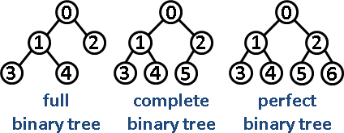

# Abstract

- 트리에 대해 적는다.

# 유용한 용어들

* node, edge
  * 트리의 최소 구성 요소이며 노드와 간선이라고 한다.

* parent
  * 특정 노드의 상위 노드

* child
  * 특정 노드의 자식 노드

* sibling
  * 특정 노드의 형제 노드

* ancestor
  * 부모 노드를 포함한 상위노드들을 선조라고 한다.

* descendant
  * 자식 노드를 포함한 하위노드들을 후손이라고 한다.

* root
  * 제일 상위의 노드로써 부모가 없다.

* leaf
  * 제일 하위의 노드로써 자식이 없다.

* depth 
  * 특정 노드가 root로 부터 얼만큼 떨어져 있는가를 나타내는 수치이다.
  * root는 depth가 0이다.

* height

  * 특정 노드가 최 하위 leaf로부터 얼만큼 떨어져 있는가를 나타내는 수치이다.

* balanced tree
  * 모든 leaf node들의 height차이가 1이하이다. balanced tree의 경우 최상의 검색 속도가 보장된다.

* binary tree

  * 

* full binary tree
  * 모든 node 는 0 개 혹은 2 개의 자식들을 가지고 있다.

* complete binary tree
  * 최 하위 노드들을 제외하면 full binary tree 이다. 그리고 최 하위 노드들은 왼쪽에서 오른쪽으로 빈틈없이 채워져 있다.

* perfect binary tree
  * full binary tree 이면서 complete binary tree 이다.

# 유용한 문제의 유형들

- pre, in, post order
- LCA (longest common ancestor)
