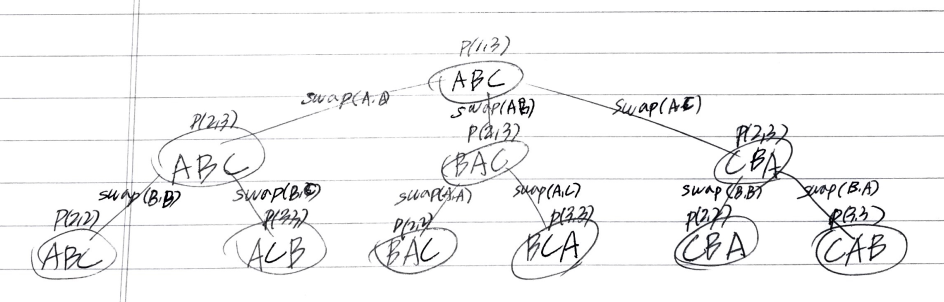

# Problem

양의 정수 `n` 을 입력받았을 때 `[1..n]` 의
숫자를 일렬로 늘어뜨리는 방법을 모두 찾는다.

# References

* [Write a program to print all permutations of a given string @ geeksforgeeks](https://www.geeksforgeeks.org/write-a-c-program-to-print-all-permutations-of-a-given-string/)

# Idea

예를 들어 `n = 4` 일 경우 가장 왼쪽의 숫자가 `1` 인
순열을 다음과 같이 만들어낼 수 있다. 

```
1234
1243
1324
1342
1423
1432
```

이것을 다음과 같이 graph 으로 그려보자.
`unordered_set<int>` 을 사용하여 사용된 숫자를
점검하면서 순회하는 것보다는 swap 을 이용하여 순서를 뒤집으면서 해결하는 것이 훨씬 성능이 좋다.

다음은 문자열 `A B C` 의 순열을 찾는 과정의 recursion tree 이다.



# Implementation

* [c++11](a.cpp)

# Complexity

```
O(N!) O(N)
```