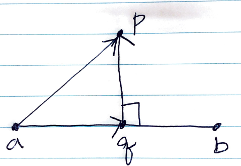

# Abstract

세점이 주어졌을때 한 점과 나머지 두점이 구성하는 직선 사이의 거리를 구해보자.

# Idea

한점을 `p` 라고 하고 직선위의 두점을 `a, b` 라고 하자.
점 `p` 에서 직선의 방향으로 선분을 그어 직선과 수직인 교차점 `q` 를 찾자.
벡터 `qp, aq, ap` 는 다음과 같은 식이 성립한다.



```
qp = ap - aq
```

벡터 `aq` 는 벡터 `ap` 를 벡터 `ab` 에 project 한 벡터이다.

결과적으로 벡터 `qp` 의 길이가 점과 직선사이의 거리이다.

# Implementation

* [c++11](a.cpp)