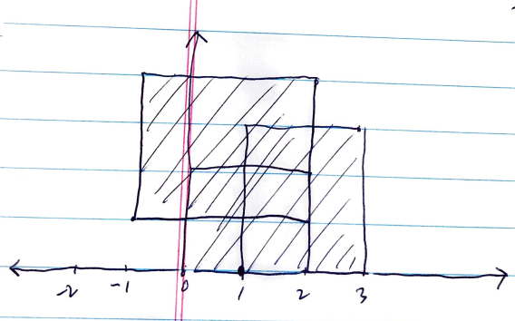

# Abstract

평면 스위핑 혹은 라인 스위핑은 평면을 세로로 수직선을 여러개 그어서
문제를 해결하는 방법이다.

# References

* [Rectangle Area II @ learntocode](/leetcode/RectangleAreaII/README.md)

# Problem

직사각형들의 합집합에 해당하는 넓이의 합을 평면 스위핑을 이용하여
구해보자.

# Idea

사각형의 데이터를 왼쪽 아래점 `(LBP, left bottom point)` 과 오른쪽
위점 `(RTP, right top point)` 을 이용해서 입력 받자.  하나의 사각형은 `LBP,
RTP` 와 같이 두개의 점으로 표현된다.

모든 점들을 `x` 를 기준으로 리스트 `A` 에 담고 `y` 를 기준으로 리스트 `B` 에
담는다.  이때 두 리스트를 모아 놓고 `x` 좌표 혹은 `y` 좌표를 기준으로
오름차순으로 정렬한다. 리스트 `A` 의 첫번째 부터 순회 하면서 다음
점까지의 `x` 축 거리와 `y` 축 거리를 얻어내면 부분 넓이를 얻을 수 있다.  이
것들을 모두 더하면 모든 사각형들의 합집합의 넓이에 해당한다.

예를 다음과 같은 세종류의 사각형이 있다고 하자.

```
 (0, 0), (2, 2)
 (1, 0), (3, 3)
(-1, 1), (2, 4)
```



위 그림에서 표시된 순서 대로 부분 넓이를 구하고 전체 넓이를 구할 수 있다.

# Implementation

* [c++11](a.cpp)

# Complexity

```
O(N^2) O(N)
```