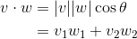
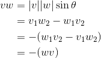

# Abstract

벡터클래스를 정의해서 세점중 어느 두점이 가까운지, 내적, 외적등을 구현하자.

# 내적 (dot product)



```latex
\begin{align*}
v \cdot w &= |v||w|\cos\theta \\
          &= v_{1}w_{1} + v_{2}w_{2}
\end{align*}
```

# 외적 (cross product)



```latex
\begin{align*}
v × w &= |v||w|\sin\theta \\
      &= v_{1}w_{2} - w_{1}v_{2} \\
      &= -(w_{1}v_{2} - v_{1}w_{2}) \\
      &= -(w × v)
\end{align*}
```

2D 에서 외적의 결과는 두 벡터의 사이각을 의미한다. 예를 들어서 `v × w
= r` 이라고 하자. `r` 은 스칼라이다. `r` 이 양수이면 `w` 는 `v` 의 `[0..ccw180]` 에
있고 `r` 이 음수이면 `w` 는 `v` 의 `[0..cw180]` 에 있다.

# 극각도 (polar angle)

벡터 `a` 가 `x` 축으로 부터 부터 반시계 방향으로 
회전된 각도이다. `atan2` 를 이용하여 다음과 같이 구한다.
`atan2` 의 값은 `[-π, π]` 이다. 극각도의 범위를 `[0, 2π]` 으로
하기 위해 `2π` 를 더하고 `2π` 로 모듈러 연산 했다.

```cpp
  double polar() const {
    return fmod(atan2(y, x) + 2 * PI, 2 * PI);
  }
```

# 사영된 벡터 (projected vector)

벡터 `a` 가 벡터 `b` 에 사영된 벡터를 구해보자.
벡터 `b` 의 단위 벡터에 벡터 `a` 와 벡터 `b` 의 내적을 곱하자.


```latex
b_{proj} = a \boldsymbol{\cdot} b \cdot {b} 
```

# 가까운 점 (how much closer)

점 `p, a, b` 가 있다. 점 `a` 와 `b` 중 점 `p` 에 더욱 가까운 것은 무엇일까?
벡터 `p-a` 와 `p-b` 의 크기를 비교하면 알 수 있다.

# Implementation

* [c++11](a.cpp)
