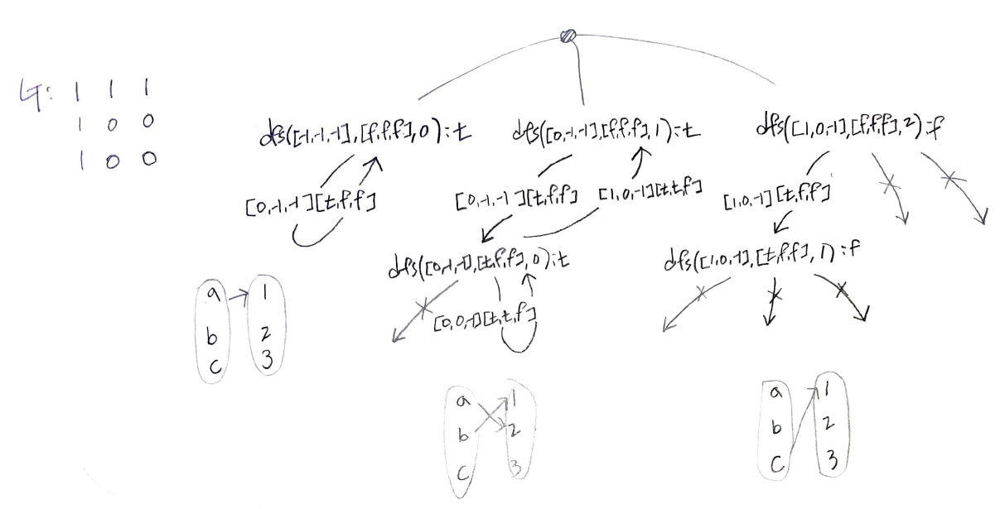

# Prerequisites

* matching
  * 그래프에서 끝점을 공유하지 않는 간선의 집합
* maximum matching problem
  * 가장 큰 matching 을 찾는 문제. 흔히 매칭 문제라고 한다.
* Edmonds' matching algorithm
  * 모든 그래프에서 maximum matching 을 찾는 알고리즘
  * 복잡하고 까다롭다.
* bipartite graph
  * 정점을 두 그룹으로 나눠서 모든 간선이 서로 다른 그룹의 정점들을
    연결할 수 있는 그래프들을 이분 그래프라고 한다.

    

* bipartite matching problem
  * bipartite graph 에서 maximum matching 을 찾는 문제
  * bipartite graph 에서 왼쪽 그룹의 왼쪽에 src 를 두고 오른쪽 그룹의 오른쪽에 sink 를 두면 [ford fulkerson algorithm](/fundamentals/graph/fordfulkersonadjmatrix/README.md) 을 이용해서 해결할 수 있다. 그러나 이 방법은 구현이 어렵다. DFS 를 이용하여 좀 더 단순하게 구현할 수 있다.

# Problem

이분 그래프 `G[][]` 가 주어지면 최대 매칭의 크기를 구하라.

# References

* [32강 - 이분 매칭(Bipartite Matching) [ 실전 알고리즘 강좌(Algorithm Programming Tutorial) #32 ] @ youtube](https://www.youtube.com/watch?v=PwXNTA0rpXc)
  * [29. 이분 매칭(Bipartite Matching) @ naverblog](https://m.blog.naver.com/PostView.nhn?blogId=ndb796&logNo=221240613074&proxyReferer=https:%2F%2Fwww.google.com%2F)
* [maximum bipartite matching @ geeksforgeeks](http://www.geeksforgeeks.org/maximum-bipartite-matching/)

# Keyword

```cpp
bool G[][], vector<int> match, vector<bool> visit, dfs, bipartite_match
```

# Idea


[ford fulkerson algorithm](/fundamentals/graph/fordfulkersonadjmatrix/README.md)
를 이용하는 방법은 구현이 어렵다. dfs 를 이용해서 더욱 간단히 해결할 수 있다.

예를 들어 다음과 같은 경우를 살펴보자. 왼쪽에 `a,b,c` 가 있고 오른쪽에 `1,2,3` 이 있다고 해보자. `G[][]` 의 행 인덱스는 `a,b,c`
의 인덱스를 의미하고 `G[][]` 의 열 인덱스는 `1,2,3` 의 인덱스를 의미한다. `G[0][0] == 1` 이면 `a -> 1` 의 연결이 가능하다는 의미이다.

```
G: 1 1 1
   1 0 0
   1 0 0
```

다음과 같은 부분문제 `dfs` 를 정의한다.

```c
bool dfs(G[][], match[], visit[], u)

return: Is there a way to start from u, with maximum match?
 match: match[v]=u means we found pair of u -> v before
        u is a right node, v is a left node
 visit: visit[v] is visited before?
     u: left node to visit
```

다음은 `dfs` 의 recursion tree 이다.



아래는 위 recursion tree 의 호출 상황이다.

```
match: [-1,-1,-1,], visit: [f,f,f,], u: 0
match: [0,-1,-1,], visit: [f,f,f,], u: 1
 match: [0,-1,-1,], visit: [t,f,f,], u: 0
match: [1,0,-1,], visit: [f,f,f,], u: 2
 match: [1,0,-1,], visit: [t,f,f,], u: 1
```

`maxCnt` 는 maximum bipartite matching count 를 의미한다. 왼쪽 노드에서 오른쪽 노드로 가능한 최대 연결의 개수이다. maximum matching 이 가능한 최대 경우의 수가 아님을 유의하자.

알고리즘을 조금 더 정리해 보면 다음과 같다. 

* `a` 에서 `1` 로 연결을 해본다. 잘된다. 최소한 하나의 연결을 할 수 있다. 따라서 `maxCnt` 를 하나 증가한다.
* `b` 에서 `1` 로 연결을 해본다. 앞서 `1` 과 연결되었던 `a` 에서 `2,3` 으로 연결이 되는지 확인해 본다. `a->2` 가 가능하다. 따라서 `b->1,a->2` 가 가능하다. `maxCnt` 를 하나 증가한다. 
  * `a-3` 는 시도해 볼 필요가 없다. `a-3` 이 성공하거나 실패해도 `maxCnt` 는 더이상 증가할 수 없다. 이미 `b->1,a->2` 가 가능함을 검증했기 때문이다.
* `c` 에서 `1` 로 연결을 해본다. 앞서 `1` 과 연결되었던 `b` 에서 `2,3` 으로 연결이 되는지 확인해 본다. 가능하지 않다. 이것은 `maxCnt` 는 더이상 증가할 수 없음을 의미한다.

모든 반복을 마치면 `maxCnt` 를 증가한다. 이것은 어디까지나 maximum count 를 발견하는 문제이다. 왼쪽 노드중 하나인 `u` 에서 출발하여 오른쪽 노드중 하나인 `v` 에 연결이 가능한지 확인한다. 이때 지금까지 연결이 가능했던 왼쪽 노드들에 대해 `v` 를 제외한 오른쪽 노드들과 연결이 가능한지 검증해 본다. 

모두 연결이 가능하다면 `u->v` 는 새로운 연결을 의미하기 때문에 `maxCnt` 를 증가할 만 하다. 만약 모두 연결이 불가능하다면 `u->v` 는 새로운 연결이 될 수 없기 때문에 `maxCnt` 를 증가할 필요는 없다.

# Implementation

* [java8](MainApp.java)

# complexity

```
O(|V||E|)
```

# Similar Questions

* [Maximum Number of Accepted Invitations @ learntocode](/leetcode2/MaximumNumberofAcceptedInvitations/README.md)
  