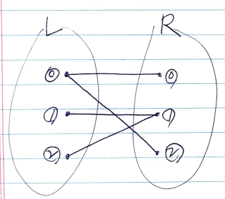

# Abstract

- matching
  - 그래프에서 끝점을 공유하지 않는 간선의 집합
- maximum matching problem
  - 가장 큰 matching 을 찾는 문제. 흔히 매칭 문제라고 한다.
- Edmonds' matching algorithm
  - 모든 그래프에서 maximum matching 을 찾는 알고리즘
  - 복잡하고 까다롭다.
- bipartite graph
  - 정점을 두 그룹으로 나눠서 모든 간선이 서로 다른 그룹의 정점들을
    연결할 수 있는 그래프들을 이분 그래프라고 한다.

    

- bipartite matching problem
  - bipartite graph 에서 maximum matching 을 찾는 문제
  - bipartite graph 에서 왼쪽 그룹의 왼쪽에 src 를 두고 오른쪽 그룹의 오른쪽에 sink 를 두면 [ford fulkerson algorithm](/fundamentals/graph/fordfulkersonadjmatrix/README.md) 을 이용해서 해결할 수 있다. 이때 DFS 를 이용하여 좀 더 단순하게 구현할 수 있다.

# References

* [32강 - 이분 매칭(Bipartite Matching) [ 실전 알고리즘 강좌(Algorithm Programming Tutorial) #32 ] @ youtube](https://www.youtube.com/watch?v=PwXNTA0rpXc)
  * [29. 이분 매칭(Bipartite Matching) @ naverblog](https://m.blog.naver.com/PostView.nhn?blogId=ndb796&logNo=221240613074&proxyReferer=https:%2F%2Fwww.google.com%2F)
* [maximum bipartite matching @ geeksforgeeks](http://www.geeksforgeeks.org/maximum-bipartite-matching/)

# Problem

이분 그래프 `G[][]` 가 주어지면 최대 매칭의 크기를 구하는 문제이다.

# Keyword

```cpp
bool G[][], vector<int> match, vector<bool> visit, dfs, bipartite_match
```

# Idea


[ford fulkerson algorithm](/fundamentals/graph/fordfulkersonadjmatrix/README.md)
를 이용하는 방법은 구현이 어렵다.

dfs 를 이용해서 더욱 간단히 해결할 수 있다.

# Implementation

* [java8](MainApp.java)

# complexity

```
O(|V||E|)
```

# Similar Questions

* [Maximum Number of Accepted Invitations @ learntocode](/leetcode2/MaximumNumberofAcceptedInvitations/README.md)
  