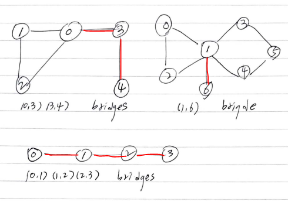

# Abstract

무향 그래프에서 고민해보자. 무향 그래프는 `cross edge` 가 없다. `forward, back
edge` 는 서로 같다. 특정 간선을 삭제 했을때 그 간선을 포함하던 컴포넌트가 두개의
컴포넌트로 쪼개질 경우 언급한 간선을 `bridge` 라고 한다.

# References

* [DFS spanning tree](/fundamentals/graph/dfsspanningtree/README.md)
* [Critical Connections in a Network @ learntocode](/leetcode/CriticalConnectionsinaNetwork)

# Keyword

각 노드별 발견순서가 중요하다. 다시 방문하는 것을 피하기 위해
부모 노드를 이용한다.

```cpp
adj[][]
counter
found[]
dfs(u, p)
vector<vector<int,int>> bridges, 
```

# Problem

그래프 `adj[][]` 가 주어지면 `bridge` 를 구하는 문제이다. `bridge` 를 제거하면
두 component 사이에 어떠한 간선도 없다. 즉, 별도의 component 로 나누어 진다.

# Idea

`bridge` 는 `tree edge` 일 수 밖에 없다. `(u, v)` 가 `forward, backedge` 라면
`u, v` 를 잇는 또 다른 경로가 있다는 것이다. `tree edge` 들에 대해서만 `bridge`
판정을 해야 한다.

`p` 를 `u` 의 선조라 하고 `v` 를 `u` 의 자손이라고 하자. `p` 는 다시 방문하지
않기 위해 필요하다. `v` 를 루트로 하는 서브트리의 노드들 중 가장 빨리 발견된
것의 발견 순서가 `u` 의 발견 순서보다 크다면 `(u, v)` 는 bridge 이다.

다음은 bridge 의 예이다.



자세한 풀이는 [Critical Connections in a Network @ learntocode](/leetcode/CriticalConnectionsinaNetwork) 를 참고한다.

# Implementation

* [c++11](a.cpp)

# Complexity

```
O(E+V) O(N)
```
