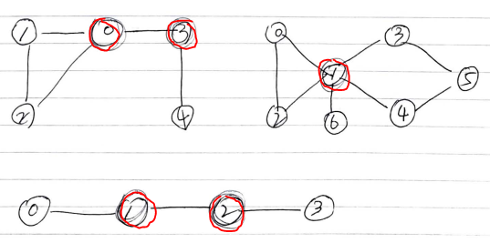
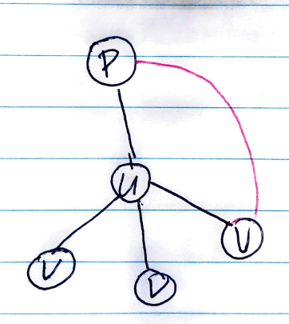

# Abstract

특정 정점과 인접한 간선들을 모두 지우면 컴포넌트가 두개 이상으로 나뉘어진다. 그 특정 정점을 절단점 (cut vertex, articulation point) 라고 한다.

무향 그래프에서 절단점을 포함하지 않는 서브그래프를 이중 결합 컴포넌트 (biconnected component) 라고 한다. biconnected component 에서 임의의 한 vertex 를 지우더라도 vertex간의 연결은 유지된다.

# Keyword

```cpp
biconnected components
adj[][], discovered[], counter, cutvertexes[], findcutvertex(int u, bool broot)
```

# Problem

그래프 `adj[][]` 가 주어지면 cut vertex 를 구하는 문제이다.

# Idea



무향 그래프에서 고민해보자. 무향 그래프는 `cross edge` 가 없다. 그리고 `forward, back edge` 는 서로 구분이 없다. 다음과 같은 여러가지 상황을 구현해 보자.

`root node` 는 자식이 두개 이상이어야 `cut vertex` 가 될 수 있다. 자식이 한개라면 root 와 인접한 간선을 지워봐야 두개 이상의  컴포넌트로 나뉘어 지지 않는다.

`leaf node` 는 `cut vertex` 가 될 수 없다.

`root, leaf node` 가 아닌 노드를 `u` 라고 하자. `v` 를 `u` 의 자손들 이라고 하고 `p` 를 `u` 의 선조들 이라고 하자.
`(v,p)` 가 없으면 `u` 는 `cut vertex` 가 될 수 있다.



`cross edge` 는 없기 때문에 `finished[]` 는 필요 없다.

# Implementation

* [c++11](a.cpp)

# Complexity

```
O(N) O(1)
``` 