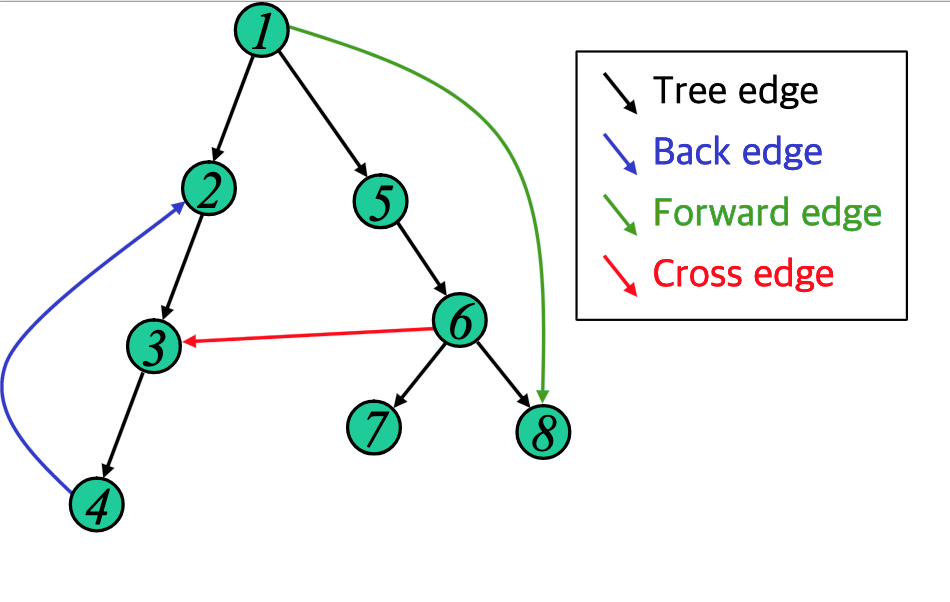

# Abstract

그래프를 [DFS](/fundamentals/graph/dfs/README.md) 로 순회했을때 만들어지는 트리를 spanning tree 라고 한다. 트리를 구성하는 트리 간선을 포함해서 다음과 같은 4 가지 종류의 간선을 발견할 수 있다.

- tree edge
  - 스패닝 트리에 포함된 간선
- forward edge
  - 스패닝 트리의 선조에서 자손으로 연결되었지만 트리 간선이 아닌 간선
- back edge
  - 스패닝 트리의 자손에서 선조로 연결되는 간선
- cross edge
  - tree, forward, back edge 가 아닌 간선

무향 그래프는 다음과 같은 특징이 있다.

- 무향 그래프 에서 `(u, v)` 가 `tree edge` 라면 한번의 방문으로 `(v,
  u)` 역시 `tree edge` 가 된다.
- 모든 간선이 양방향으로 통행 가능하므로 `cross edge` 가 존재 할 수
  없다. `cross edge` 가 존재하기 전에 이미 `tree edge` 혹은 `forward
  edge` 이다.
- 양방향이기 때문에 `forward edge, back edge` 의 구분이 없다. `(u, v)`
  중 누가 선조인지 구분할 수 없다.

# Problem

그래프 `adj` 가 주어지면 dfs spanning tree 를 만들고 각 간선의 종류를
출력하는 문제이다.

# Keyword

```cpp
tree edge, forward edge, back edge, cross edge
adj[][], discovered[], finished[], counter, dfs_spanning_tree(u)
```
  
# Idea

[DFS](/fundamentals/graph/dfs/README.md) 를 수행하면서 간선의 종류를 구분하자.

`i` 정점의 방문순서를 `discovered[i]` 에 저장한다. 방문순서는
`counter` 를 증가하면서 이용한다.  `finished[i]` 는 `i` 정점의
탐색종료 여부를 의미한다.

정점 `u` 에서 정점 `v` 를 방문할 때 다음과 같은 여러가지 상황을 생각할
수 있다.

* `v` 가 아직 발견되지 않았다면 간선 `(u,v)` 는 `tree edge` 이다.
* `u` 가 `v` 보다 먼저 발견되었다면 간선 `(u,v)` 는 `foward edge` 이다.
* `v` 가 탐색을 종료하지 않았다면 간선 `(u,v)` 는 `back edge` 이다.
* 그외의 경우 간선 `(u,v)` 는 `cross edge` 이다.



# Implementation

* [c++11](a.cpp)

# Complexity

```
O(V+E) O(1)
```
