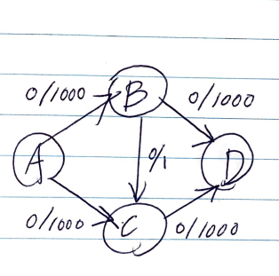

# Abstract

각 간선에 capacity 가 존재한 weighted graph 를 flow network 라고 한다. flow
network 에서 두 정점 사이의 max flow (최대 유량) 을 구하는 알고리즘이다. 포드와
풀커슨이 네트워크 유량 문제에 대해 쓴 논문은 구현을 포함하지 않는다. 그래서
알고리즘 보다는 방법 (method) 이라고 부른다. augmenting path 를 BFS 로 구현하는
알고리즘을 edmonds karp algorithm 이라고 한다. 

DFS 구하는 방법은 다음과 같은 비효율적인 경우가 발생한다. DFS 의 경우 1 씩
유량을 증가시키기 때문에 2000 번 증가경로를 탐색한다. BFS 는 2 번 증가경로를
탐색한다. 

  

다음은 flow network 의 주요한 개념들이다.  

- capacity
  - 네트워크 용량이다. 간선의 flow (유량) 은 capacity(용량) 를 초과할 수 없다.
- maxflow problem
  - flow network 에서 두 정점 사이의 최대 유량을 구하는 문제
- flow network 는 다음과 같은 세가지 속성을 만족해야 한다.
  - capacity constraint (용량제한속성)
    - f(u, v) <= c(u, v)
    - 각 edge (간선) 의 flow (유량) 은 해당 edge (간선) 의 capacity (용량) 을 초과할 수 없다.
  - 유량의대칭성
    - f(u, v) = -f(v, u)
    - u 에서 v 로 유량이 흘러올 경우, v 의 입장에서 u 로 음수의 유량을 보내는 것이다.
  - local equilibrium (유량의보존)
    - 각 정점에 들어오는 유량과 나가는 유량은 같다.
- augmenting path
  - flow (유량) 을 보내는 path (경로)
- flow network 에서 시작점을 source(s), 종료점을 sink(t)라고 한다.
- residual capacity
  - 잔여 용량
  - r(u, v) = c(u, v) - f(u, v)
  - 특정 간선의 capacity 가 10 이고 flow 가 6 이라면 residual capacity 는 4 이다.
- cut
  - flow network 의 정점들에 대하여 source 와 sink 가 각각 다른 집합에
    속하도록 그래프의 정점들을 두 개의 집합으로 나눈 것. 마치 잘라서 나눈 것 같다.
- cut 의 자명한 속성
  - cut 의 flow 는 source 에서 sink 로 가는 총 flow 와 같다.
  - cut 의 flow 는 capacity 와 같거나 더 작다.
- mincut problem
  - flow network 에서 capacity 가 가장 작은 cut 을 찾는 문제
  - [이곳](http://www.mathcs.emory.edu/~cheung/Courses/323/Syllabus/NetFlow/max-flow-min-cut.html) 을 참고 해서
    mincut 을 찾아보자. T 에서 S 로 가는 edge 의 capacity 는 무시하고 S 에서 T 로 가는 edge 의 capacity 를
    모두 더하자. 
- min-cut max-flow theorem
  - flow network 에서 capacity 와 flow 가 같은 cut S', T' 가 존재한다고 하자.
    이때 S', T' 는 항상 최소 컷이며 현재 소스에서 싱크로 보내는 유량은
    네트워크의 최대 유량임을 보일 수 있다. S', T' 보다 용량이 작은 컷이 존재한다면
    해당 컷에 대해 유량이 용량보다 크므로 모순이고, 이보다 많은 유량을 보내는 방법이
    있을 경우 S', T' 에 대해 유량이 용량보다 크므로 모순이기 때문이다.
  - 따라서 min-cut 은 max-flow 이다.
  - 증가 경로가 더이상 존재하지 않은 경우 min-cut 은 발견된다. 곧 max-flow 이다.
  - 증가 경로가 여러개인 경우 증가 경로를 잘 못 택하여 최대 유량을 찾기 전에 막혀서
    더 이상 증가 경로를 찾지 못하게 되는 일은 없다는 것을 증명하는 정리.
    증가 경로가 여러개인 경우 그중 아무 것이나 택해도 괜찮다. 이 것은
    ford-fulkerson 알고리즘의 정당성을 증명해 준다.

# References

- [for fulkerson in 5 minutes at youtube](https://www.youtube.com/watch?v=Tl90tNtKvxs)

# Keyword

```cpp
capacity[][], flow[][]
ford_fulkerson, vector<int> parent, queue<int> q
```

# Problem

그래프 `adj[][]` 와 정점 `src, snk` 가 주어지면 최대유량을 구하는 문제이다.

# Idea


- find a augmenting path
  - non-full forward edges (유량이 용량보다 작은 정방향 간선들) 과
    non-empty backward edges (유량이 비어있지 않은 역방향 간선들) 을 대상으로
    path 를 찾는다.
- compute the bottle neck capacity
  - path 에서 각 간선의 capacity 를 초과하지 않는 최대 유량을 계산한다.
- augment each edge and the total flow
  - path 의 각 간선의 유량을 더한다.

# Implementation

* [c++11](a.cpp)

# Complexity

```
O(min(Ef, VE^2) O(V^2)
```