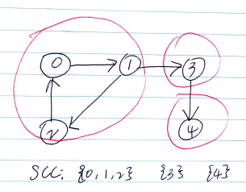

# Abstract

무향 그래프에서 절단점 (cut vertex, articulation point) 을 포함하지 않는 서브그래프를 이중 결합 컴포넌트  (biconnected component) 라고 한다. biconnected component 에서 임의의 한 vertex 를 지우더라도 vertex 간의 연결은 유지된다.

biconnected component 는 무향 그래프에서만 정의되지만 강결합 컴포넌트 (strongly connected components) 는 방향 그래프에서만 정의된다. 방향 그래프에서 두 정점 `u, v` 에 대해 양방향으로 가는 경로가 모두 있을때 두 정점은 `SCC` 에 속해 있다고 한다.



`SCC` 사이를 연결하는 간선들을 모으면 각 `SCC` 들을 정점으로 하는 `DAG` 를 구성할 수 있다. 이러한 과정을 압축 (condensation) 이라고 한다.

한 `cycle` 에 포함된 정점들은 항상 같은 `SCC` 에 속해 있다. 반대로 한 `SCC` 에 속한 두 정점 사이를 잇는 양방향 경로를 합치면 두 정점을 포함하는 사이클이 된다.

`tarjan algorithm` 은 그래프를 `SCC` 로 분할 하는 방법이다.

# Problem

그래프 `adj[][]` 가 주어지면 `SCC` 를 구하는 문제이다.

# Keyword

```cpp
SCC (strongly connected components)
condensation
adj, scc_id, discovered, finished, stck, scc_counter, vertex_counter, dfs_scc, tarjan_scc
```

# Idea

[dfs spanning tree](fundamentals/graph/dfsspanningtree/README.md) 를 제작한다.

이번에 방문하는 정점을 `u` 라고 하고 발견된 순서에 따라 자손을 `v` 라고 하자. 

`tree, back edge` 판단을 하고 나서 `minord == discovered[u]` 이면 stack 을 활용하여 `u` 와 `v` 들을 모두 하나의 `SCC` 에 포함시킨다.

# Implementation

* [c++11](a.cpp)

# Complexity

```
O(V+E) O(1)
```