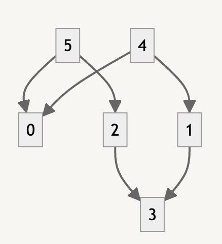
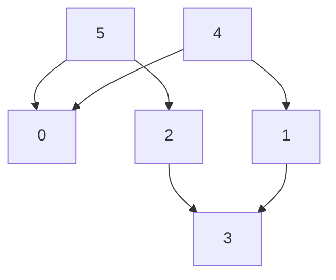

- [Problem](#problem)
- [DFS](#dfs)
  - [Rerences](#rerences)
  - [Keyword](#keyword)
  - [Idea](#idea)
  - [Complexity](#complexity)
  - [Implementation](#implementation)
- [BFS - Kahn Algorithm](#bfs---kahn-algorithm)
  - [References](#references)
  - [Keyword](#keyword-1)
  - [Idea](#idea-1)
  - [Implementation](#implementation-1)
  - [Complexity](#complexity-1)

----

# Problem

어떤 작업을 수행하는데 선행해야 하는 작업이 존재할 때 선행작업을 먼저 수행하는 식으로 정렬하는 방법이다. 사이클이 있다면 위상정렬은 불가능 하다. 정렬의 결과는 여러개일 수 있다.

다음은 임의의 directed graph 이다.





다음은 가능한 모든 위상정렬의 결과들이다.

```
4, 5, 0, 2, 3, 1
4, 5, 2, 0, 3, 1
4, 5, 2, 3, 0, 1
4, 5, 2, 3, 1, 0
5, 4, 0, 2, 3, 1
5, 4, 2, 0, 3, 1
5, 4, 2, 3, 0, 1
5, 4, 2, 3, 1, 0
```

# DFS

## Rerences

- [Topological Sorting | geeksforgeeks](https://www.geeksforgeeks.org/topological-sorting/)

## Keyword

```cpp
graph[][], visit, order[], dfs()
// Build graph
// dfs with building visit, order
// Reverse order
// Check back-edges
```

## Idea

[DFS](/fundamentals/graph/dfs/README.md) 를 수행한다. 방문한 순서를 `order[]` 에 저장한다. 그리고 `order[]` 를 뒤집는다.

[DFS spanning tree](/fundamentals/graph/dfsspanningtree/README.md) 에서 배웠던 `back-edge` 가 있는지 다음과 같이 검사한다. 만약 있다면 cycle 이 존재하기 때문에 위상정렬은 불가능하다.

```cpp
  // check invalid edge direction
  for (int i = 0; i < N - 1; ++i) {
    for (int j = i + 1; j < N; ++j) {
      if (adj[order[j]][order[i]] > 0)
        return std::vector<int>();
    }
  }
```

## Complexity

```
O(V+E) O(V)
```

## Implementation

- [c++11](topologicalsortstack.cpp)
- [java17](MainApp.java)

# BFS - Kahn Algorithm

## References

[Kahn’s algorithm for Topological Sorting | geeksforgeeks](https://www.geeksforgeeks.org/topological-sorting-indegree-based-solution/)

## Keyword

```cpp
graph[][], indegrees[], q, order[], BFS
// Build graph
// Build indegrees
// Build q
// BFS with building order
```

## Idea

먼저 모든 노드들의 in-degree 개수를 기록한다. in-degree 개수가 0 인 녀석을 queue 에 삽입한다. 이후 다음을 반복한다. 

1. queue 에서 노드를 하나 꺼내어 연결된 노드의 in-degree 를 하나 감소한다. 
2. in-degree 가 0 인 녀석을 queue 에 삽입한다.  

방문한 순서가 곧 위상정렬의 결과이다. 모든 노드를 방문하지 않고 queue 가 비워진다면 싸이클이 존재하는 것이다.

## Implementation

- [c++11](topologicalsortqueue.cpp)
- [java17](MainApp.java)

## Complexity

```
O(V+E) O(V)
```
