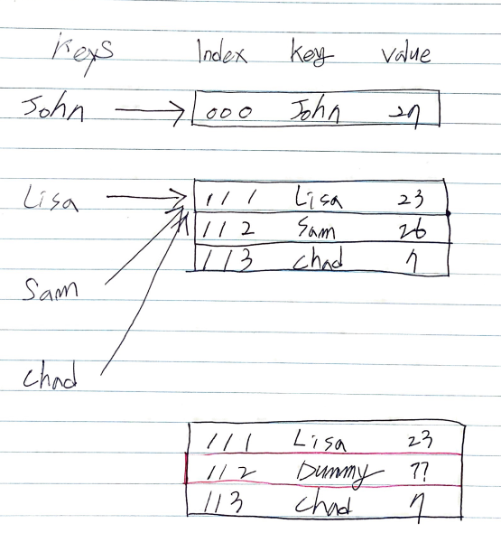

# Abstract

- open addressing 은 `key, val` 이 주어지면 hash collision 이 발생했을 때 배열의 사용하지 않는 공간에 저장하는 방법을 말한다. open addressing 은 사용되지 않는 공간을 검색하는 방법에 때라 linear probing, Quadratic probing, double hashing 등이 있다.
- linear probing 은 hash collision 이 발생했을 때  1 칸씩 선형검사하여 unused space 를 찾는다.



# References

- [해쉬 테이블의 이해와 구현 (Hashtable) @ 조대협](https://bcho.tistory.com/1072)
- [linear probing @ youtube](https://www.youtube.com/watch?v=BwcKHxUYRB4&list=PLl5LpJCoD2mCIRn0Fkt8z07EK320ZmHgY&index=123)
- [linear probing @ geeksforgeeks](http://www.geeksforgeeks.org/hashing-set-3-open-addressing/)

# Algorithm Insert

## Idea

위의 그림과 같이 `Sam` 을 삽입하려 했을 때 `Lisa` 와 충돌하므로 인덱스 `112` 에 저장한다. `Chad` 를 삽입하려 했을 때 역시 `Lisa` 와 충돌하므로 인덱스 `113` 에 저장한다.

## Complexity

```
O(1) O(N)
```

# Algorithm Delete

## Idea

위의 그림과 같이 `Sam` 를 삭제해보자. `Lisa` 와 충돌하므로 한칸씩 이동하여 `Sam` 을 찾는다. 따라서 인덱스 `112` 를 삭제한다. 이때 연속된 인덱스 `113`  에 `Chad` 가 저장되어 있으므로 인덱스 `112` 에 Dummy Entry 를 저장하여 `Chad` 가 linear probing 될 수 있도록 한다.

## Complexity

```
O(1) O(N)
```

# Implementation

* [c++11](a.cpp)