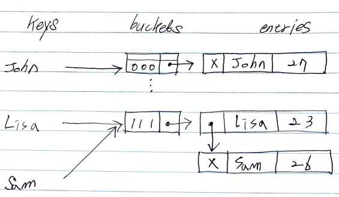

# Abstract

- separate chaining 에 대해 적어본다.



# References

- [해쉬 테이블의 이해와 구현 (Hashtable) @ 조대협](https://bcho.tistory.com/1072)
- [separate chaining @ youtube](https://www.youtube.com/watch?v=BwcKHxUYRB4&list=PLl5LpJCoD2mCIRn0Fkt8z07EK320ZmHgY&index=123)
- [separate chaining @ geeksforgeeks](http://www.geeksforgeeks.org/hashing-set-2-separate-chaining/)

# Algorithm Insert

## Idea

`key, val` 이 주어지면 `hash(key)` 에 해당하는 bucket 의 list 에 삽입한다. 이때 `hash(key)` 가 같아서 충돌되는 경우 list 에 계속 추가된다.

## Complexity

```
O(1) O(N)
```

# Algorithm Delete

## Idea

`key` 가 주어지면 `hash(key)` 에 해당하는 bucket 의 list 를 처음부터 순회하여 `key` 를 삭제한다.

## Complexity

```
O(1) O(N)
```

# Implementation

* [HashSet c++11](a.cpp)
* [HashMap java8](/leetcode/DesignHashMap/MyHashMap.java)
* [HashSet java8](/leetcode/DesignHashSet/MyHashSet.java)
