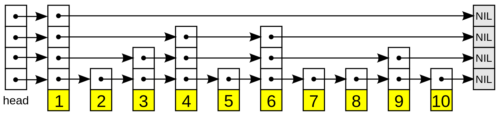

# Problem

[Design Skiplist](https://leetcode.com/problems/design-skiplist/)

skip list 를 구현해 보자.

# References

* [Skip list @ wikipedia](https://en.wikipedia.org/wiki/Skip_list)
* [Skip list @ youtube](https://www.youtube.com/watch?v=7pWkspmYUVo&feature=emb_logo)

# Idea

skip list 는 다음과 같은 특성을 갖는 linked list 이다.

* linked list 가 여러 layer 로 존재한다. 듬성 듬성한 linked list 가 여러개 있다. 검색 속도를 향상할 수 있다.
* `add, search, erase` 의 time complexity 가 `O(lgN)` 이다.
* [treap (balanced binary search tree)](/fundamentals/tree/treap/README.md), [red
  black tree (balanced binary search
  tree)★](/fundamentals/tree/redblacktree/README.md) 와 비슷한 기능을 한다.
  그러나 구현은 더욱 간단하다. 과연 그러한가?



`80, 45` 를 삽입하는 과정은 다음과 같다.


search 는 다음과 같이 구현한다.

* linked list 하나를 검색하는 것은 시간복잡도가 `O(N)` 이다.
* 듬성 듬성한 linked list 를 여러개 둔다. 
* 가장 원소의 개수가 작은 linked list 부터 검색한다. 

# Implementation

[c++11](a.cpp)

# complexity

```
   add: O(lgN) O(N)
search: O(lgN) O(N)
 erase: O(lgN) O(N)
```
