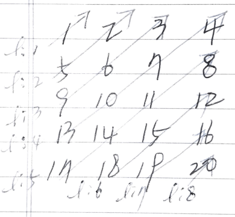

# Abstract

다음과 같은 행렬 `M[][]`  을 순회하는 방법들에 대해 정리한다.

```
    1     2     3     4
    5     6     7     8
    9    10    11    12
   13    14    15    16
   17    18    19    20
```

# Diagonal

## Idea

`M[][]` 을 diagonal traversal 한 결과는 다음과 같다.

```
    1
    5     2
    9     6     3
   13    10     7     4
   17    14    11     8
   18    15    12
   19    16
   20
```

다음과 같은 변수들을 선언한다. `i, h, w, l, c, n` 

```cpp
int i;  // iterator
int h = M.size();
int w = M[0].size();
int l;  // diagonal line order
int c;  // start column
int n;  // count of diagonal line
```



출력의 행의 개수는 `h + w - 1` 이다. 출력의 각 행은 곧 대각선의 수열과 같다. 대각선에 1 부터 시작하는 번호를 할당하고 `l` 에 저장하자.

`l` 을 `[1..h+w-1]` 동안 순회하면서 다음을 반복한다.

0. 대각선 `l` 의 수열의 원소가 시작하는 컬럼을 `c` 에, 수열의 개수를 `n` 에 저장한다.
1. 인덱스 `i` 를 `[0..n)` 까지 순회하면서 다음을 반복한다.
  0. `M[min(h, l) - i - 1][c + i]` 을 출력한다.

# Spiral

`M[][]` 을 spiral traversal 한 결과는 다음과 같다.

```
1 2 3 4 8 12 16 20 19 18 17 13 9 5 6 7 11 15 14 10
```

다음과 같은 변수들을 선언한다. `h, w, y, x` 를 증가 혹은 감소하면서
순회한다.

```cpp
int i;  // iterator
int ey = M.size();  // end of y
int ex = M[0].size();  // end of x
int sy = 0;  // start of y
int sx = 0;  // start of x
```

# Implementation

* [c++11](a.cpp)
