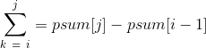

# Abstract

- 구간합이 0에 가까운 것을 구하자.

# Implementation

- 다음과 같은 배열 A가 있다. rsum(i, j)가 0에 가까운 합은 얼마일까?
  배열 A의 모든 숫자를 순회하면서 합을 구하면 O(N^2)의 시간이 걸린다.

```
i       0  1  2  3  4  5  6  7  8  9
A[i]  -14  7  2  3 -8  4 -6  8  9 11
```

- rsum(i, j)는 다음과 같이 표현할 수 있다.



```
\sum_{k\ =\ i}^{j} = psum[j] - psum[i-1]
```

- rsum(i, j)가 0에 가깝다는 말은 psum두가지의 차이가 가장 적다는 뜻이다.
  psum을 정렬해서 인접한 두녀석의 차이가 가장 작은 녀석을 찾아보자.
  시간복잡도는 O(NlgN)이다.


```cpp
#define MAXN 987654321

std::vector<int> partial_sum(const std::vector<int>& v) {
  std::vector<int> r(v.size(), 0);
  r[0] = v[0];
  for (int i = 1; i < v.size(); ++i) {
    r[i] = r[i - 1] + v[i];
  }
  return r;
}

int close_psum_to_zero(std::vector<int>& psum) {
  int r = MAXN;

  std::sort(psum.begin(), psum.end());
  for (int i = 1; i < psum.size(); ++i) {
    r = std::min(r, std::abs(psum[i] - psum[i-1]));
  }

  return r;
}

int main() {
  std::vector<int> a = {-14, 7, 2, 3, -8, 4, -6, 8, 9, 11};
  std::vector<int> psum = partial_sum(a);
  printf("%d\n", close_psum_to_zero(psum));
  return 0;
}
```
