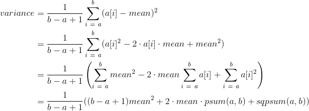

# Abstract

- 분산을 부분합과 구간합등을 이용하여 구해보자.

# Variance

- 정수열의 인덱스 a부터 b까지의 분산은 a부터 b까지 (mean - a[i])^2의
  합이다. 식을 전개하면 sqpsum, psum, range_sum을 이용하여 구 할 수 있다.



```latex
\begin{align*}
variance &= \frac{1}{b - a + 1} \sum_{i\ =\ a}^{b} (a[i] - mean)^{2} \\ 
         &= \frac{1}{b - a + 1} \sum_{i\ =\ a}^{b} (a[i]^{2} - 2\cdot a[i] \cdot mean + mean^{2} ) \\
         &= \frac{1}{b - a + 1} \left (\sum_{i\ =\ a}^{b} mean^{2} - 2 \cdot mean \sum_{i\ =\ a}^{b} a[i] + \sum_{i\ =\ a}^{b} a[i]^{2} \right ) \\
         &= \frac{1}{b - a + 1} ( (b - a + 1)mean^{2} + 2 \cdot mean \cdot psum(a, b) + sqpsum(a, b) ) \\
\end{align*}
```

```cpp
std::vector<int> PartialSum(const std::vector<int>& a) {
  std::vector<int> r(a.size());
  r[0] = a[0];
  for (int i = 1; i < a.size(); ++i) {
    r[i] = r[i-1] + a[i];
  }
  return r;
}

int RangeSum(const std::vector<int>& psum, int a, int b) {
  if ( a == 0)
    return psum[b];
  return psum[b] - psum[a - 1];
}

std::vector<int> SquarePartialSum(const std::vector<int>& a) {
  std::vector<int> r(a.size());
  r[0] = a[0] * a[0];
  for (int i = 1; i < a.size(); ++i) {
    r[i] = r[i-1] + a[i] * a[i];
  }
  return r;
}

double Variance(const std::vector<int>& sqpsum,
                const std::vector<int>& psum,
                int a, int b) {
  // get average value from a to b
  double mean = RangeSum(psum, a, b) / double(b - a + 1);
  double r = RangeSum(sqpsum, a, b) -
      2 * mean * RangeSum(psum, a, b)
      + (b - a + 1) * mean * mean;
  return r / (b - a + 1);
}

int main()
{
  std::vector<int> a = {1,2,3,4,5,6,7};

  std::vector<int> psum = PartialSum(a);
  printf("%f\n", Variance(SquarePartialSum(a), PartialSum(a), 2, 4));

  return 0;
}
```
