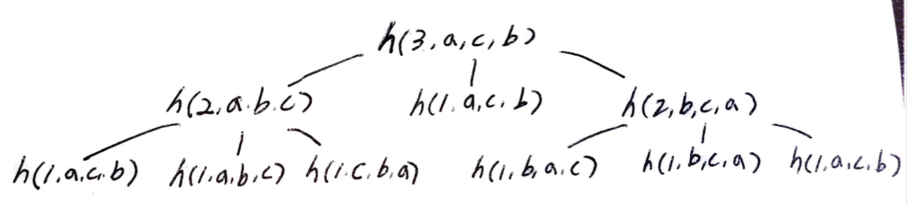

# problem

숫자 `n` 이 주어지면 하노이 타워에 링을
옮기는 절차를 구하는 문제이다.

# References

* [Program for Tower of Hanoi](https://www.geeksforgeeks.org/c-program-for-tower-of-hanoi/)

# Idea

예를 들어 `n=3`, `a, b, c` 3 개의 타워가 있다고 생각해보자.
`a` 의 링들을 모두 `c` 로 옮겨보자.

```
1                                       1
2                   1          2        2
3        3 2 1      2 3    1   3        3
a b c    a b c    a b c    a b c    a b c 
```

다음과 같이 부분문제를 정의한다.

```
void hanoi(int n, char fr, char to, char by)

 n: 옮겨야할 링의 개수
fr: 링이 위치한 타워
to: 목표의 타워
by: 경유할 타워
```

제일 큰 링은 `3` 이다. `1,2` 을 `a` 에서 `b` 로 옮겨 놓으면
`3` 를 `a` 에서 `c` 로 옮겨 놓을 수 있다. 그리고 `1,2` 을 다시 `b` 에서 `c` 로 옮겨 놓는다. 이 과정을 아래와 같이 그래프로 펼쳐 놓을 수 있다.



[Gray code](/fundamentals/bitmask/graycode/README.md) 를 이용하면 tower of hanoi 를 더욱 쉽게 풀어낼 수 있다.

# Implementation

* [c++11](a.cpp)

# Complexity

```
O(2^N) O(1)
```
