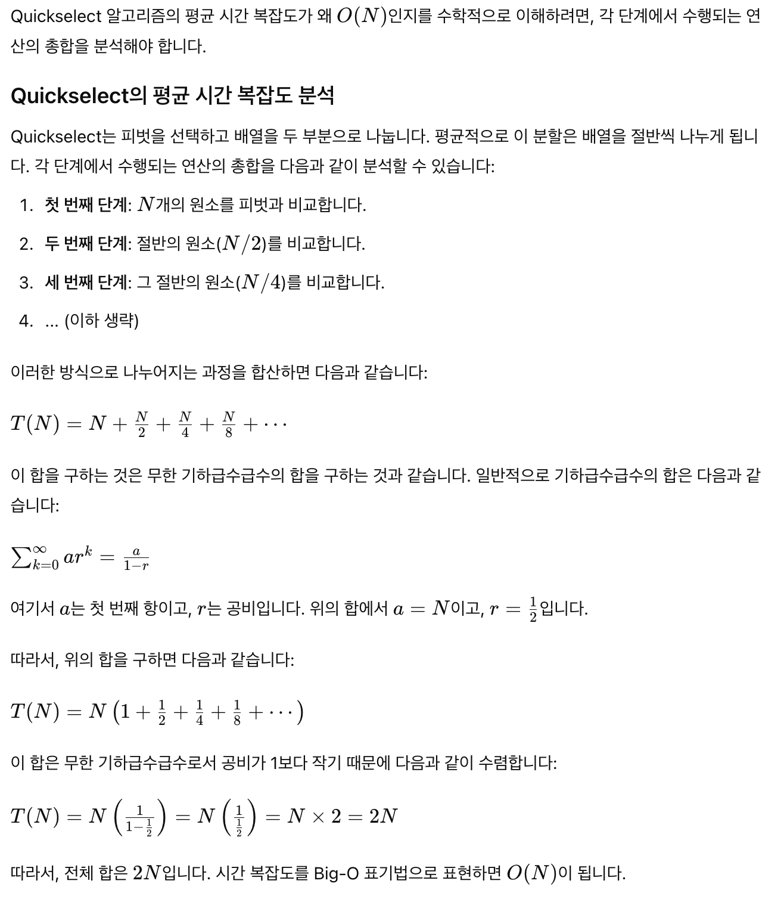

# Problem

[KthLargestElementinanArray](/leetcode/KthLargestElementinanArray/README.md)

# Keyword

```c
- quickSelect(nums, 0, n-1, n-k)
```

# Idea

검색의 대상을 절반씩 줄여가면서 원하는 자료를 찾는다. 기본적으로 [quick-sort](/fundamentals/sort/quicksort/README.md)와 비슷하다. [quick-sort](/fundamentals/sort/quicksort/README.md)와는 달리 partition을 하나씩 버린다.

- Pivot 선택: 랜덤하게 피벗 인덱스를 선택한다.
- Partition: 피벗 값을 기준으로 배열을 두 부분으로 나눈다. 피벗보다 작은 값들은 왼쪽으로, 큰 값들은 오른쪽으로 이동한다.
- 재귀 호출: 피벗 인덱스가 찾고자 하는 `k`번째 값의 위치와 같은지 확인한다. 같다면 해당 값을 반환하고, 다르다면 피벗 인덱스를 기준으로 왼쪽 또는 오른쪽 부분 배열에서 다시 검색을 진행한다.

이 과정을 반복하여 원하는 `k`번째 큰 값을 찾아낸다. 이 방법은 평균적으로 `O(n)` 시간 복잡도를 가진다.

예를 들어 `k = 2, nums = [3, 2, 1, 5, 6, 4]` 인 경우를 살펴보자.

```c
//    k: 2
// nums: 3 2 1 5 6 4
//
//   left: 0
//  right: 5
// ascIdx: 4
// pvtIdx: 1
// pvtVal: 2
//           .
//           b
//   nums: 1 2 3 5 6 4
//                     i
//
//   left: 2
//  right: 5
// ascIdx: 4
// pvtIdx: 1
// pvtVal: 5
//               .
//                 b
//   nums:     3 4 5 6
//                     i
//
// qs(0, 5, 4)
//   qa(2, 5, 4)
```



# Complexity

```
O(N) O(lgN)
```

# Implementation

- [java17](MainApp.java)

# References

* [quick select | wikipedia](https://en.wikipedia.org/wiki/Quickselect)
