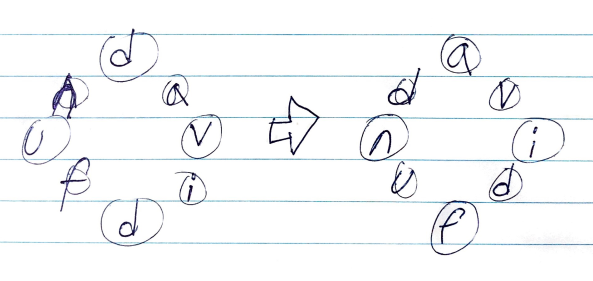

# Problem

문자열 `H` 가 주어진다. 원형 문자열로 배치했을 때 사전순으로
가장 앞에 오는 문자열을 구하는 문제이다.

# Idea



문자열 `H2 = H + H` 를 생성한다. 그리고 `H2` 의 접미사 배열
`sa[]` 를 생성한다. `sa[]` 를 처음부터 순회한다. 이때 
`sa[i] <= s.size()` 일 때 `H2.substr(sa[i], H.size())` 
가 답이다.

# Implementation

* [c++11](a.cpp)

# Complexity

```
O(HlgHlgH) O(H)
```
