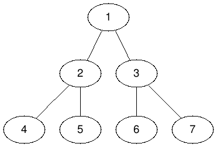

# Problem

* [Lowest Common Ancestor in a Binary Tree @ geeksforgeeks](https://practice.geeksforgeeks.org/problems/lowest-common-ancestor-in-a-binary-tree/1)
* [Lowest Common Ancestor of a Binary Tree @ leetcode](https://leetcode.com/explore/interview/card/top-interview-questions-hard/118/trees-and-graphs/844/)

트리의 루트노드와 자손 노드가 주어진다. LCA (Lowest Common Ancestor) 를 구하라.

# Strategy with single traversal

## Idea

LCA (Lowest Common Ancestor) 는 주로 DFS 로 해결한다. 현재 방문 노드가 `u` 라고 해보자. 그리고 `u` 를 root 로 하는 subtree 를 생각해 보자. LCA 의 후보는 `NULL, u, u->left, u->right` 중 하나이다. 어떤 것이 LCA 인지 결정하는 조건을 고민하면서 접근해 보자.



예를 들어서 위의 그림과 같이 구성된 binary tree 가 있다고 하고 `4` 노드와 `5` 노드의 LCA 를 구해보자. 정답은 `4` 노드와 `5` 노드의 부모 노드인 `2` 노드임을 알 수 있다. 

이것을 재귀적으로 해결하기 위해 `lca` 를 정의해야 한다. `lca` 는 방문할 노드와 `lca` 의 대상노드를 인자로 한다. 그리고 특정 노드를 리턴하도록 디자인하자. 재귀적으로 트리를 탐색할 때 `lca` 가 리턴한 노드가 가장 최근에 발견된 `lca` 라면 계속 유지하는 방향으로 아이디어를 구성한다.

```
lca(p, l, r)

l      - lca 의 왼쪽 노드
r      - lca 의 오른쪽 노드
p      - 방문할 노드
return - p노드를 root로 하는 서브트리의 lca
```

예를 들어서 `4` 노드와 `5` 노드의 `lca` 가 `2` 노드임을 발견하면 `1` 노드를 방문한 것이 리턴할 때 `lca` 가 `2` 노드인 것이 유지되면 좋을 것 같다.

지금까지 생각한 것을 중심으로 여러가지 상황을 고려해보자.

* `p` 가 NULL이면 LCA도 없다. 따라서 NULL 을 리턴한다.

* `p->left` 의 서브트리와 `p->right` 의 서브트리가 `LCA` 를 가지고 있다면 `p` 가 곧 LCA 이기 때문에 `p` 를 리턴한다.

* `p->left` 의 서브트리 혹은 `p->right` 의 서브트리가 `LCA` 를 가지고 있다면 `p->left` 혹은 `p->right` 이 `LCA` 이기 때문에 NULL 이 아닌 녀석을 리턴한다.
  
* `p->left` 의 서브트리와 `p->right` 의 서브트리의 `LCA` 가 모두 NULL 이면 `LCA` 를 가지고 있지 않기 때문에 NULL 을 리턴한다.

지금까지 언급한 알고리즘을 참고 하여 `lca(①, 4, 5)`를 구해보자. 원숫자는 숫자의 값을 보유한 노드를 의미하고 `:` 뒤는 해당 부분문제의 리턴값을 의미한다.

```
lca(①, ④, ⑤) : ②
-lca(②, ④, ⑤) : ②
--lca(④, ④, ⑤) : ④
--lca(⑤, ④, ⑤) : ⑤
-lca(③, ④, ⑤) : NULL
--lca(⑥, ④, ⑤) : NULL
--lca(⑦, ④, ⑤) : NULL
```

## Implementation

[c++11](a.cpp)

## Time Complexity

```
O(N) 
```

## Space Complexity

```
O(lgN) : call stack
```

# Strategy with RMQ

## Idea

하나의 입력데이터에 다수의 질의가 존재하는
경우라면 [RMQT](/fundamentals/tree/rmq/README.md)를 이용하여 각 질의 마다 `O(lgN)`의
시간으로 해결할 수 있다.

다음과 같은 트리에서 `4, 5` 의 LCA를 찾아보자.

```
              1
            /   \
           2     3
          / \   / \
         4   5 6   7
```

`1` 노드 부터 모든 노드를 순회하하여 다시 `1` 노드로 돌아오는 경로를
저장하면 다음과 같다.

```
S = (1,2,4,2,5,2,1,3,6,3,7,3,1)
```

`S` 는 `A` 와 다르게 일련 번호들의 모임이다. `S` 의 원소들 중 임의의
것을 `s` 라 하고 `A` 의 원소들 중 임의의 것을 `a` 라 하자. `s` 에
대응하는 `a` 가 있고 `a` 에 대응하는 `s` 가 있다. `S` 와 `A` 의 관계를
다음과 같이 두가지 배열에 저장하자.

```
vector<int> seq2num;
vector<int> num2seq;
```

`S` 를 입력데이터로 하여 [RMQT](/fundamentals/tree/rmq/README.md)를 제작하자.
`query(4, 5)` 는 `s` 가 될 것이고 이것에 대응하는
`a` 가 곧 LCA가 된다.

## Implementation

[c++11](b.cpp)

## Time Complexity

```
O(N)   : build segment tree
O(loN) : query 
```

# References

* [Lowest Common Ancestor in a Binary Tree | Set 1 @ geeksforgeeks](https://www.geeksforgeeks.org/lowest-common-ancestor-binary-tree-set-1/)
* [Find LCA in Binary Tree using RMQ @ geeksforgeeks](https://www.geeksforgeeks.org/find-lca-in-binary-tree-using-rmq/)
