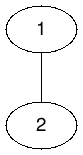
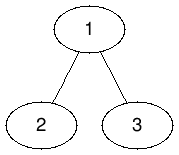
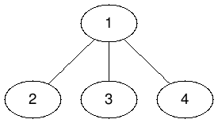
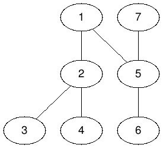

# Abstract

[Kingdom Division @ hackerrank](https://www.hackerrank.com/challenges/kingdom-division/problem)

# Idea

그래프 문제이다. 1번 노드를 시작으로 DFS하면서 경우의 수를 구하자.
트리가 아니기 때문에 루트가 2개 이상 일 수 있다. 입력된 데이터를
기반으로 양방향 그래프를 만들고 1번 노드 부터 모든 노드들을 순회한다.

색상은 0, 1 두가지라고 하자. 1번 노드의 색상이 0일 경우 가지수를
계산해서 2배 하면 답이 된다.



1번 노드 입장에서 자식이 2번 노드 하나인 경우 생각해 보자.
1번 노드와 2번 노드가 같은 색일 경우 가지수와
1번 노드와 2번 노드가 다른 색일 경우 가지수의 합을
A라고 하자.

답은 A * 2 가 된다.



1번 노드 입장에서 자식이 2, 3번 노드 두개인 경우 생각해 보자.

1번 노드와 2번 노드가 같은 색일 경우 가지수와
1번 노드와 2번 노드가 다른 색일 경우 가지수의 합을
A라고 하자.

1번 노드와 3번 노드가 같은 색일 경우 가지수와
1번 노드와 3번 노드가 다른 색일 경우 가지수의 합을
B라고 하자.

답은 A * B * 2가 된다.



1번 노드 입장에서 자식이 2, 3, 4번 노드 세개인 경우 생각해 보자.

1번 노드와 2번 노드가 같은 색일 경우 가지수와
1번 노드와 2번 노드가 다른 색일 경우 가지수의 합을
A라고 하자.

1번 노드와 3번 노드가 같은 색일 경우 가지수와
1번 노드와 3번 노드가 다른 색일 경우 가지수의 합을
B라고 하자.

1번 노드와 4번 노드가 같은 색일 경우 가지수와
1번 노드와 4번 노드가 다른 색일 경우 가지수의 합을
C라고 하자.

답은 A * B * C * 2가 된다.

이때 a노드가 자식이 없다면 즉 leaf node라고 가정해 보자. a노드의 부모
p노드와 같은 색이면 1가지가 존재하고 다르면 0가지가 존재한다. 전체
경우의 수는 곱연산을 통해 구하기 때문에 0이라고 취급해야 전체 경우의
수에서 제외 된다.

위의 세가지 경우를 잘 생각해 보면 규칙을 찾아 낼 수 있다.  a노드의
가지수를 구하는 경우 a노드의 자식들이 b, c... 등이 있다고 하자.
a노드와 b노드가 같은 색인 경우 가지수와 a노드와 b노드가 다른 색인 경우
가지수의 합을 ab 가지수라고 하자.  a노드의 가지수는 ab * ac * ...와
같다.



위와 같이 루트가 두개 이상인 경우도 고려해보자. 반복문을 활용한
DFS보다는 다른 방법을 이용해야 한다. 양방향 그래프 처리를 위해 입력
데이터가 1 2라면 2 1도 추가로 연결 하자.  위 그림에서 2의 자식은 3,
4와 1이 해당한다. 그렇게 해야 5를 방문했을때 7를 처리 할 수 있다.

# Implementation

[c++11](a.cpp)

# Time Complexity

memoization덕분에 선형 시간을 갖는다.

```
O(N)
```

# Space Complexity

```
O(N) ???
```
