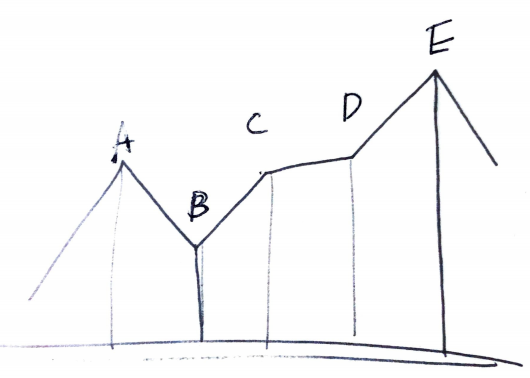

# Problem

[Best Time to Buy and Sell Stock II](https://leetcode.com/problems/best-time-to-buy-and-sell-stock-ii/)

주식의 일별 가격 `P[]` 가 주어진다. 하루에 한번 사기 혹은 팔기 거래를
할 수 있고 원하는 날짜 만큼 거래가 가능하다. 이익이 최고가 되었을 때
그 이익을 구하는 문제이다.

# Idea



위와 같이 가격 및 날짜의 그래프를 참고해 보자. 

직관적으로 생각할 때 `A, B, C, D, E` 구간 중
가장 큰 이익은 `E-B` 와 같다. 즉, `B` 가격에 사고 `E` 가격에 파는 것을 의미한다.

한편 이것은 `E-B = (C-B) + (D-C) + (E-D)` 와
같다. 

그렇다면 `A[i] - A[i-1] > 0` 일때 `A[i] - A[i-1]` 를 모두 합하면 답과
같다.

# Implementation

* [c++11](a.cpp)
* [kotlin](MainApp.kt)

# Complexity

```
O(N) O(1)
```
