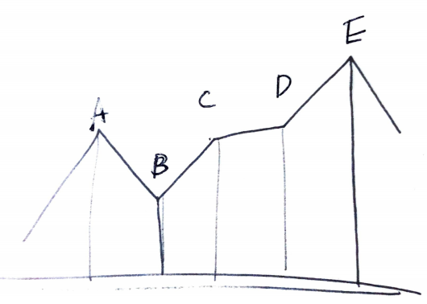

# Problem

[Best Time to Buy and Sell Stock](https://leetcode.com/problems/best-time-to-buy-and-sell-stock/)

일별 주식의 가격 `P[]` 가 주어진다. 한번만 특정한 날에 사고 다른날에
팔 수 있다. 이익이 최고일 때 그 이익을 구하는 문제이다.

# Idea



위와 같이 가격 및 날짜의 그래프를 참고해 보자. 

직관적으로 생각할 때 `A, B, C, D, E` 구간 중 가장 큰 이익은 `E-B` 와 같다. 즉,
`B` 가격에 사고 `E` 가격에 파는 것을 의미한다.

한편 이것은 `E-B = (C-B) + (D-C) + (E-D)` 와 같다. 

그렇다면 `P[i] - P[i-1] > 0` 일때 `P[i] - P[i-1]` 를 모두 합하면 답과 같다.

이웃한 숫자의 차이를 나열하고 그 연속된 합이 최고일 때를 구하면 그것이 답이다.

연속된 합이 최고일 때를 구하는 것은 [Kadane’s
Algorithm](/fundamentals/array/kadane/README.md) 과 같다.

따라서 `i` 를 `1` 부터 끝까지 순회하면서 `P[i] - P[i-1]` 를 구한다. 그리고 local
max, global max 업데이트한다. 모든 반복을 마치면 global max 가 곧 답이다.
 
다음은 `P = [7, 1, 5, 3, 6, 4]` 의 풀이 과정이다.

```
   P: 7 1 5 3 6 4
diff: 0-6 4-2 3-2  
lmax: 0 0 4 2 5 3
gmax: 0 0 4 4 5 5 
```

`5` 가 곧 답이다.

# Implementation

* [go](a.go)
* [java](MainApp.java)

# Complexity

```
O(N) O(1)
```
