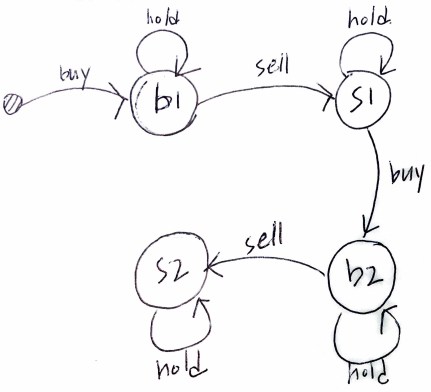

# Problem

[Best Time to Buy and Sell Stock III](https://leetcode.com/problems/best-time-to-buy-and-sell-stock-iii/)

주식의 일별 가격 `P[]` 가 주어진다. 한번의 거래는 사고 팔고를 의미한다. 최대 두번 거래할 수 있을 때 최고 이익을 구하는 문제이다.

# Idea

`int s1, b1, s2, b2` 를 선언하여 첫번째 사는 경우, 첫번째 파는 경우, 두번째 사는 경우, 두번째 파는 경우의 이익을 각각 저장하자.

인덱스 `i` 를 이용하여 `P` 를 처음부터 끝까지 순회하며 다음을 반복한다.

* `b1 = max(b1, -P[i])` 참고 있거나 사는 경우다.
* `s1 = max(s1, b1+P[i])` 참고 있거나 파는 경우다.
* `b2 = max(b2, s1-P[i]` 참고 있거나 사는 경우다.
* `s2 = max(s2, b2+p[i]` 참고 있거나 파는 경우다.

모든 반복을 마치면 `s2` 가 곧 답이다.



# Implementation

* [c++11](a.cpp)

# Complexity

```
O(N) O(1)
```
