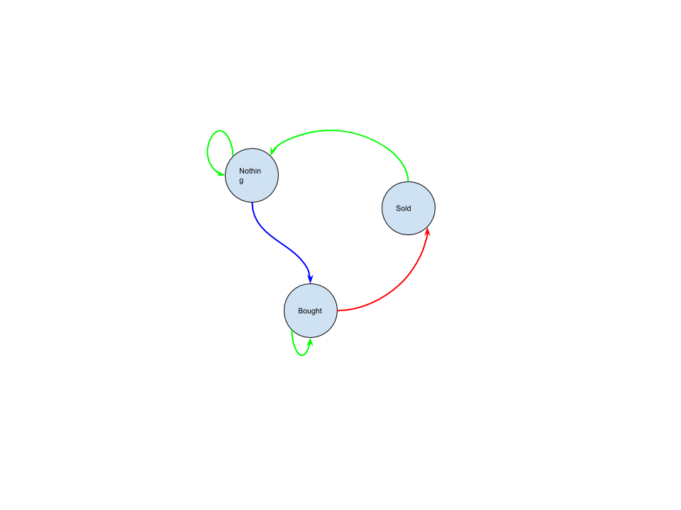

# Problem

[Best Time to Buy and Sell Stock with Cooldown](https://leetcode.com/problems/best-time-to-buy-and-sell-stock-with-cooldown/)

주식의 일별 가격 `P[]` 가 주어진다. 한번의 거래는 사고 팔고를
의미한다. 무수히 많은 거래를 할 수 있다. 단, 팔고 나면 반드시 하루는
쉬어야 한다. 최대이익을 구하는 문제이다.

# Idea


예를 들어 `P = [1, 2, 3, 0, 2]` 일 때 `[buy, sell, cooldown, buy,
sell]` 을 하면 최대이익 3 을 얻는다.

다음과 같이 마지막에 한 행동의 경우의 수를 고려하여 3 가지 상태를
제작한다.



`int statH, statB, statS` 를 선언한다. 앞서 언급한 바와 같이 각각
`hold, buy, sell` 을 수행한 후 최대 이익을 저장한다. 바로 이전 상태도
저장할 필요가 있다. `int bStatH, bStatB, bStatS` 를 선언하여 바로 
이전 상태의 최대 이익을 저장한다. 

이때 `bStatB = -P[0]` 으로 초기화 하여 첫째날을 처리해준다.

이제 인덱스 `i` 를 `[1..n)` 동안 순회하면서 다음을 반복한다.

* `statH = max(bStatH, bStatS)`
  * 바로 이전 상태중 hold 한 것과 sell 한 것중 최대값을 현재 상태중 hold 에 저장한다.
* `statB = max(bStatB, bStatH - P[i])`
  * 바로 이전 상태중 buy 한 것과 hold 한 것에서 현재 주식의 가격 `P[i]` 를 뺀 것중 최대값을 현재 상태중 buy 에 저장한다.
* `statS = bStatB + P[i]`
  * 바로 이전 상태중 buy 한 것에서 현재 주식의 가격 `P[i]` 를 더한다.
* 바로 이전 상태들의 최대이익을 현재 상태들의 최대이익으로 저장한다.

모든 반복을 마치면 `max(statH, statS)` 가 곧 답이다. 주식을 팔고 최대이익을 낼 수는 없으므로 `statB` 는 생략한다.

# Implementation

* [c++11](a.cpp)
* [java8](Solution.java)

# Complexity

```
O(N) O(1)
```
