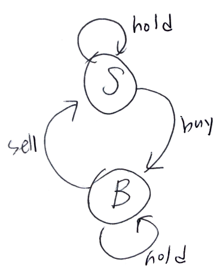

# Problem

[Best Time to Buy and Sell Stock with Transaction Fee](https://leetcode.com/problems/best-time-to-buy-and-sell-stock-with-transaction-fee/)

# Idea

주식의 일별 가격 `P[]`, 숫자 `fee` 가 주어진다. 한번의 거래는 사고 팔고를 의미한다. 무수히 많은 거래를 할 수 있다. 단, 팔고 나면 반드시 수수료 `fee` 를 지불해야 한다. 최대이익을 구하는 문제이다.

다음과 같이 두가지 상태를 생각할 수 있다.



`int S, B` 를 선언하여 마지막에 매수했을 때, 매도했을 때 최대이익을 저장한다. 인덱스 `i` 를 `[0..n)` 동안 순회하면서 다음을 반복한다.

* `t = S`
* `S = max(S, P+P[i])`
* `B = max(B, t - P[i] - fee)`

모든 반복을 마치면 `S` 가 곧 답이다.

# Implementation

* [c++11](a.cpp)
* [java8](Solution.java)

# Complexity

```
O(N) O(1)
```
