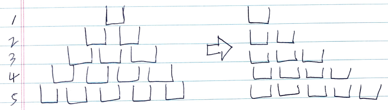

# Problem

[Champagne Tower](https://leetcode.com/problems/champagne-tower/)

# Idea

쏟아 부을 샴페인 잔의 수 `p`, 행과 열 `r, c` 가 주어진다.  `p` 잔 만큼
샴페인을 쏟아 부었을 때 `r, c` 의 잔에 얼만큼 채워지는지를 구하는
문제이다. 참고로 한잔의 양은 `0.0 ~ 1.0` 이다.

아래 그림의 왼쪽은 샴페인 잔이 놓여진 모양이다. 오른쪽은 dynamic
programming 으로 해결하기 위해 사용할 이차원 배열 `C[][]` 에서 잔의 위치이다.



다음은 `n` 잔씩 부었을 때 `C[][]` 가 채워지는 과정이다.

```
n: 1    2         3     4               5           6
C: 1    1         1     1               1           1
        0.5 0.5   1 1   1 1             1 1         1 1
                        0.25 0.5 0.25   0.5 1 0.5   0.75 1 0.75
                                                    0 0.5 0.5 0
```

위의 과정들을 살펴보면 몇가지 규칙들을 발견할 수 있다.

0. 잔이 한번 1 로 채워지면 앞으로 계속 1 이다.
1. 1 로 채워진 잔이 넘치면 넘친 양을 `d` 라고 하자. 그 잔의 아래
   위치한 왼쪽 오른쪽 잔에 `d/2.0` 씩 채워진다.

위의 규칙들을 잘 보면 이전에 구해진 것을 이용하여 새로운 것을 구하는
형태이다.  dynamic programming 이라고 할 만 하다.

캐시 `C[101][101]` 선언하고 `C[0][0] = p` 로 초기화한다. 그리고 다음과
같이 dynamic programming equation 을 만들어볼 수 있다. 1.0 보다 큰 잔
즉 넘치는 잔에 대해서만 처리를 해야 한다. 캐시의 모든 값을 채우면
`C[r][c]` 가 곧 답이다.

```cpp
 halfdelta = (C[i][j] - 1) / 2.0
  C[i][j] += halfdelta
C[i+1][j] += halddelta
   C[i][j] = 1
```

이미 채워진 잔의 정보는 더이상 필요가 없기 때문에 캐시를 1 차원 배열로
선언하면 조금 더 최적화 할 수 있다. 이미 채워진 잔의정보는 더이상
사용하지 않기 때문에 최근 레벨 잔들의 정보만 알수 있음을 주의
하자. 다음은 `4` 잔을 부었을 때 `C[]` 가 채워지는 과정이다. `C[0] = 4`
로 초기화한다.

```
lv: 1
 C: 4

lv: 2
 C: 2 2
    j
    
lv: 3   
 C: 2 0.5 0.5    0.5 1 0.5
      j          j
lv: 4
 C: 0.5 1 0 0    0.5 0 0 0    0 0 0 0
          j          j        j
```

주의 해야할 점은 오른쪽 부터 왼쪽 으로 캐시를 채워나가야 한다. `C[]`
의 모양은 `n` 레벨 잔들의 모양과 같다.  따라서 행과 열을 인덱스 `y, c`
로 순회할 때 `y` 는 `[0..r]`, `x` 는 `[r..0]` 를 범위로 해야
한다. 

위의 과정들을 살펴보면 몇 가지 규칙들을 발견할 수 있다.

0. `C[j] > 1` 이면 `j` 잔을 채우고 넘친 양을 `d` 라고 했을 때 `C[j+1]
   += d, C[j] = d` 이다.
1. `C[j] <= 1` 이면 `j` 잔을 채우고 넘친 양이 없기 때문에 `C[j] = 0` 이다.

`C[]` 를 모두 채우면 `min(1.0, C[c])` 가 답이다. 채우는 행위를
`r, c` 까지만 하기 때문에 `C[c]` 가 1 보다 클 수 있기 때문이다.

# Implementation

* [c++11](a.cpp)

# Complexity

```
O(rc) O(c)
```
