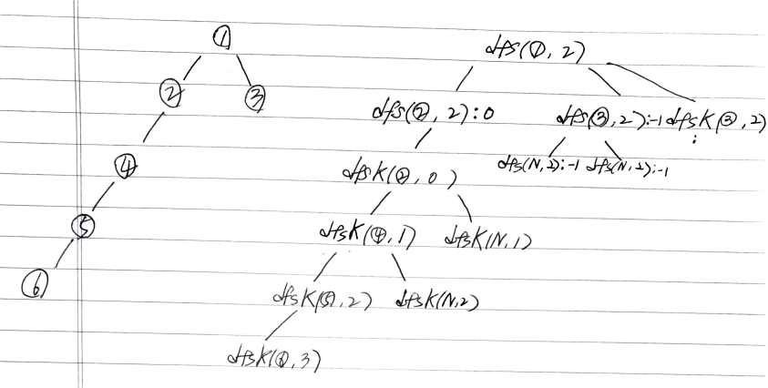

# Problem

[Closest Leaf in a Binary Tree](https://leetcode.com/problems/closest-leaf-in-a-binary-tree/)

# Idea

트리의 루트노드 `u` 와 숫자 `k` 가 주어진다. `k` 값을 갖는 노드로 부터 가장 가까이
위치한 잎노드의 값을 구하는 문제이다. `k` 값을 갖는 노드를 `v` 라고 하자.

`int m_mind, int m_minv` 를 멤버 변수로 선언한다.
그리고 다음과 같이 두가지의 부분문제를 정의한다.

```cpp
int dfs(TreeNode* u, int k)
     u: tree node
     k: target value
return: -1 (There is no node whose value is k in the subtree rooted u)
        [0..] (There is a node whose value is k in the subtree rooted u)


void dfsK(TreeNode* u, int lv)
 u: tree node
lv: level of u
```

`dfsK` 는 잎노드까지 탐색하여 `m_minv` 를 갱신한다. `u->left, u->right` 가 모두
NULL 이면 `u` 는 잎노드이다. 이때 `lv < m_mind` 를 검사하여 `m_minv` 를
갱신한다.

`dfs` 는 다음과 같이 구현한다.

0. `u->val == k` 이면 `v` 를 찾은 것이다. `dfsK(u, 0)` 하고 `0` 을 리턴한다.
1. `int l = dfs(u->left, k), int r = dfs(u->right, k)` 를 수행한다. 
2. `l >= 0` 이면 `u->left` 를 루트로 하는 서브트리에 `v` 가 존재한다는 의미이다.
   `dfsK(u->right, l+2)` 하고 `l+1` 을 리턴한다.
3. `r >= 0` 이면 `u->right` 를 루트로 하는 서브트리에 `v` 가 존재한다는 의미이다.
   `dfsK(u->left, r+2)` 하고 `r+1` 을 리턴한다.

다음은 6 개의 노드로 구성된 트리와 `k = 2` 일때 recursion tree 이다.



# Implementation

* [c++11](a.cpp)

# Complexity

```
O(N) O(1)
```
