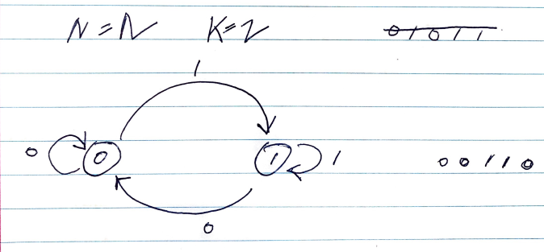

# Problem

> [Cracking the Safe @ leetcode](https://leetcode.com/problems/cracking-the-safe/)

암호의 자릿수 `N` 과 숫자 `K` 가 주어진다. 암호의 한 자릿수는 `0..K-1` 만큼 가능하다. `N` 과 `K` 조건을 만족하는 어떠한 암호도 풀 수 있는 가장 작은 길이의 문자열을 구하는 문제이다.

# References

* [De Bruijn sequence | Set 1 @ geeksforgeeks](https://www.geeksforgeeks.org/de-bruijn-sequence-set-1/)
* [De Bruijn sequence](https://en.wikipedia.org/wiki/De_Bruijn_sequence)

# Idea

예를 들어 `N=2, K=2` 이라고 해보자. 암호는 두자리이고
한자리를 구성하는 숫자는 `[0..1]` 이다. 따라서 
`00011011` 은 답이 될 수 있다. 그러나 `00110` 또한
답이 될 수 있다.

이러한 방법으로 만들어진 문자열을 [De Bruijn
sequence](https://en.wikipedia.org/wiki/De_Bruijn_sequence) 이라고
한다.

De Bruijn sequence 는 특수한 directed graph 를 제작하고 eulerian
circuit 을 이용하여 만들 수 있다. 그 그래프는 `K^(N-1)` 개의 node 와
각 node 별로 out degree 가 2 인 `K^(N-1)*K = K^N` 개의 edge 로 구성된
directed graph 이다. 이 그래프의 eulerian circuit 을 따라 간선의
문자들과 첫번째 노드의 문자열을 이어 붙이면 그것이 De Bruijn sequence
와 같다.

예를 들어 `N = 2, K = 2` 일 때의 방향 그래프와 De Bruijn sequence 는 다음과 같다.



# Implementation

* [c++11](a.cpp)

# Complexity

```
O(K^N) O(N)
```
