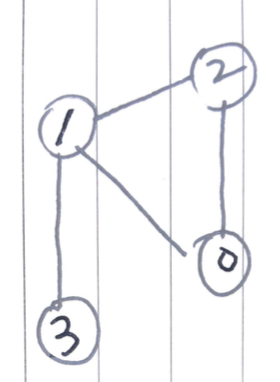
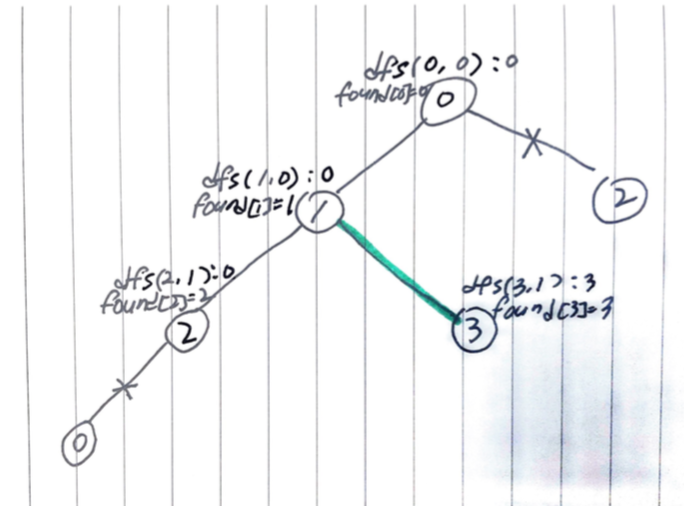

# Problem

[Critical Connections in a Network](https://leetcode.com/problems/critical-connections-in-a-network/)

# References

* [bridge](/fundamentals/graph/bridge/README.md) 를 참고한다.

# Idea

노드의 숫자 `n`, 노드의 연결정보 `E` 가 주어진다. bridge 들을 찾는
문제이다.

예를 들어 다음과 같이 `n = 4, E = [[0,1],[1,2],[2,0],[1,3]]` 인 경우를 살펴보자.



`vector<int> found(n, -1)` 를 선언하여 `found[u]` 에 `u` 노드의 발견 순서를 저장한다.
`int counter = 0` 를 선언하고 다음번 발견 순서를 저장한다. 노드가 발견될 때 마다 하나씩 증가한다.
`vector<vector<int>> ans` 를 선언하여 bridge `{u, v}` 를 저장한다.
그리고 다음과 같이 부분문제 `dfs` 를 정의하고 재귀적으로 해결해 보자.

```c
int dfs(u, p)

     u: 이번에 방문할 노드
     p: u 의 부모 노드
return: u 를 루트로 하는 서브 트리 노드의 발견 순서들 중 가장 빠른 것
```
* `found[u] = counter++` 를 수행한다. 
* `int r = found[u]` 를 선언하여 `u` 를 루트로 하는 서브 트리 노드들의 발견 순서들 중 가장 빠른 것을 저장한다. 
* `u` 의 이웃 `v` 를 순회하며 다음을 반복한다.
  * `u == p` 이면 건너 뛴다.
  * `found[v] == -1` 이면 첫 방문이다. `int minord = dfs(v, u)` 를 수행한다. `minord > found[u]` 이면 `{u, v}` 는 bridge 이다. `ans.push_back({u, v})` 를 수행한다. `r` 을 최소로 유지하기 위해 `r = min(r, minord)` 를 수행한다.
  * `found[v] != -1` 이면 `v` 는 이미 발견된 노드이다. `r` 을 최소로 유지하기 위해 `r = min(r, found[v])` 를 수행한다.
* `r` 을 리턴한다.
 
다음은 `n = 4, E = [[0,1],[1,2],[2,0],[1,3]]` 인 경우의  recursion tree 이다.



# Implementation

* [c++11](a.cpp)

# Complexity

```
O(V+E) O(V)
```
