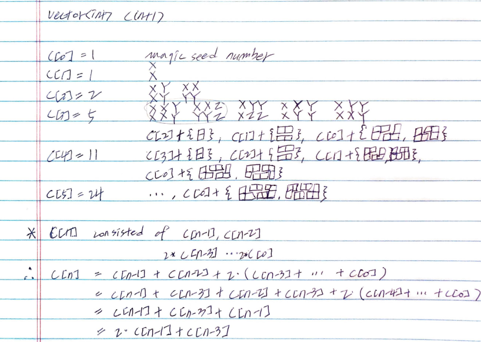

# Problem

[Domino and Tromino Tiling](https://leetcode.com/problems/domino-and-tromino-tiling/)

# Idea

숫자 `N` 이 주어진다. `2 X N` 크기의 보드에 domino, tromino 를 배치할
수 있는 방법의 개수를 구하는 문제이다.

예를 들어 `N = 3` 이면 다음과 같이 5 개의 방법이 존재한다.

```
XYZ XXZ XYY XXY XYY
XYZ YYZ XZZ XYY XXY
```

다음과 같이 dynamic programming 을 이용하여 해결한다.



# Implementation

* [c++11](a.cpp)

# Complexity

```
O(N) O(1)
```