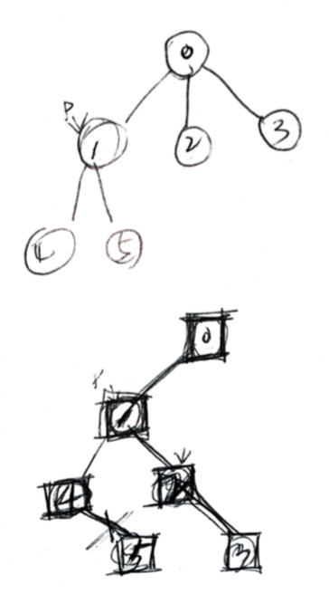

# Problem

* [Encode N-ary Tree to Binary Tree](https://leetcode.com/problems/encode-n-ary-tree-to-binary-tree/)

# Idea

`N-ary Tree` 를 루트노드부터 방문한다. `N-aryNode u` 를 방문한다. 
먼저 `u` 와 대응하는 `TreeNode v` 를 생성한다. `u` 의 첫번째 자식은
`v` 의 왼쪽 자식으로 하고 `u` 의 두번째 부터 나머지 자식들은 `v->left` 의
오른쪽 자손으로 한다.



# Implementation

* [c++11](a.cpp

# Complexity

```
O(N) O(1)
```
