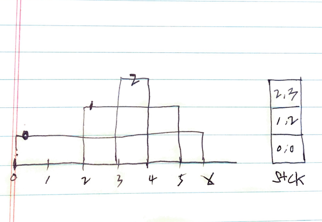

# Problem

* [Exclusive Time of Functions @ leetcode](https://leetcode.com/problems/exclusive-time-of-functions/)

# Idea


예를 들어서 다음과 같이 `n`, `logs` 가 주어졌다고 해보자. 수행시간의 그림을 그려서 해결해보자.

```
n = 2
logs = 
["0:start:0",
 "1:start:2",
 "1:end:5",
 "0:end:6"]
```



결과값을 저장할 벡터를 `r` 이라고 하자.  스택 `stck<pair<int,int>>
stck` 를 정의하여 `idx, stime` 을 저장한다. `end` 를 만날 때 마다
`stck` 에서 하나 꺼내서 수행시간을 기록한다음 `stck` 가 비어있지
않다면 중복합산방지를 위해 `r[idx]` 에서 최근수행시간을 제거해둔다.

# Implementation

* [c++11](a.cpp)

# Complexity

```
O(N) O(N)
```
