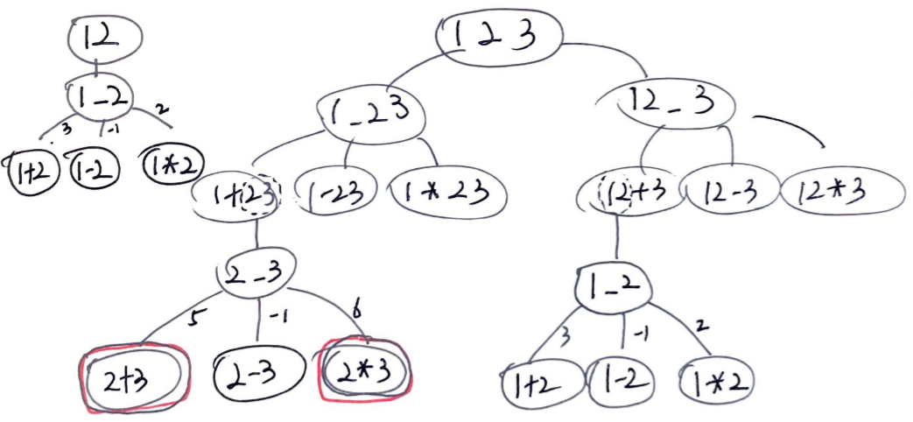

# Problem

[Expression Add Operators](https://leetcode.com/problems/expression-add-operators/)

# Idea

주어진 `num` 의 자리숫를 하나씩 옮겨가며 완전탐색한다.



다음과 같이 `dfs` 를 정의한다.

```c
Idea: backtracking

Define void dfs(num, target, rst, cand, pos, lastEval, lastTerm)
-      num: given number by problem
-   target: given target number by problem
-      rst: result list
-     cand: The candidate string to be inserted to rst
-      pos: starting position of current term 
- lastEval: evaluation of previous lastEval and lastTerm 
- lastTerm: last term
```

다음은 `num = 123` 의 경우 recusion tree 이다.

```c
dfs(0, 0, 0)
  dfs(1,1,1)
    dfs(2,3,2)   - '+'
    dfs(2,-1,-2) - '-'
      dfs(3,2,3)    - '+'
      dfs(3,-4,-3)  - '-'
      dfs(3,3,3)    - '*', "1 - 2 * 3"
    dfs(2,2,2)   - '*'
      dfs(3,5,3)
      dfs(3,-1,3)
      dfs(3,6,3)    - '*', "1 * 2 * 3"
    dfs(3,...)   - '+'
    dfs(3,...)   - '-'
    dfs(3,...)   - '*'
  dfs(2,12,12)
  dfs(3,123,123)
```

# Implementation

* [java17](MainApp.java)
* [go](a.go)

# Complexity

```
O(3^N) O(N)
```
