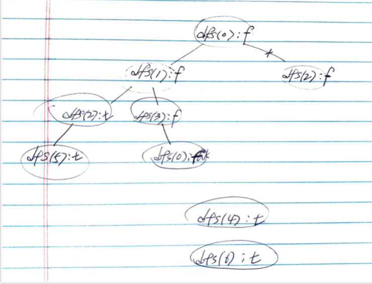

# Problem

[Find Eventual Safe States](https://leetcode.com/problems/find-eventual-safe-states/)

# Idea

그래프 `G[][]` 가 주어지면 Eventual Safe 노드들을 구하는 문제이다.
Eventual Safe 노드는 다음 이웃이 없거나 혹은 있다면 모든 이웃 노드들이
Eventual Safe 노드 인 경우를 말한다.

dfs 를 이용하여 해결한다. `dfs(u)` 할 때 방문 했는지 여부를 `seen[u]`
에 저장하자. 그리고 이웃들 중 하나라도 eventual safe 가 아니면 자신도
eventual safe 가 아니여야 한다. 

dfs loop 에서 리턴하지 않았다면 `u` 는 eventual safe node 이다.
`rslt.push_back(u)` 를 수행하자.

다음은 `G = [[1,2],[2,3],[5],[0],[5],[],[]]` 의 recursion tree 이다.
참고로 답은 `[2,4,5,6]` 이다.



# Implementation

* [c++11](a.cpp)

# Complexity

```
O(E+V) O(V)
```
