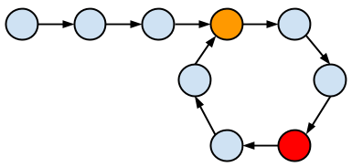
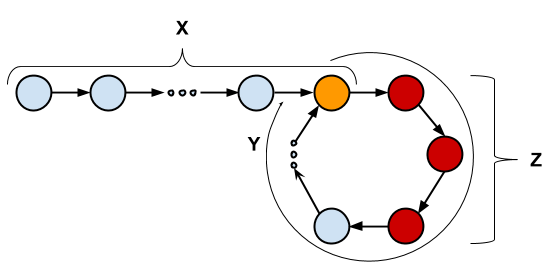

# Problem

[Find the Duplicate Number @ leetcode](https://leetcode.com/explore/interview/card/top-interview-questions-hard/116/array-and-strings/834/)

# References

* [The Starting Node Of A Cycle In A Linked List](http://doctrina.org/Starting_Node_Of_A_Cycle_In_A_Linked_List.html)
* [Cycle detection @ wikipedia](https://en.wikipedia.org/wiki/Cycle_detection)
* [[자료구조 알고리즘] Linked List 루프찾기 @ youtube](https://www.youtube.com/watch?v=AWWxMl9-8CY)

# Abstract

Floyd 의 tortoise and the hare algorithm 을 이용하여 해결할 수 있다.

# Idea

입력으로 사용되는 배열 `v` 의 원소들은 링크드리스트를 구성하는
노드들과 유사하다.  즉 `v[i]=j` 에서 `i` 는 링크드리스트를 구성하는
노드의 아이디이고 `j` 는 연결된 다음 노드의 아이디라고 할 수 있다.

문제의 조건에 의해 `n + 1` 개의 노드들이 존재하고 각 노드의 아이디의 범위는 `[1, n]` 이다. [비둘기집 원리](https://ko.wikipedia.org/wiki/%EB%B9%84%EB%91%98%EA%B8%B0%EC%A7%91_%EC%9B%90%EB%A6%AC)에 의해 최소 두개의 같은 `j` 가 존재한다. 같은 곳을 가리키는 노드가 최소 두개 이상 있다는 얘기와 같다. 이것은 링크드리스트에 싸이클이 존재한다는 것을 의미한다. 

다음 그림에서 주황색 노드는 싸이클의 시작을 알린다. 주황색 노드를 두개의 노드가 가리키고 있다. 이것은 두개의 같은 `j` 가 존재한다는 것과 같다.



문제의 조건에 의해 싸이클은 반드시 존재한다. 이때 노드의 처음부터 한칸씩 전진하는 인덱스를 `slow` 라고 하고 두칸씩 전진하는 인덱스를 `fast` 라고 하자. `slow` 와 `fast` 는 반드시 만날 수 밖에 없다. 싸이클이 있기 때문에 `fast`  는 `slow` 를 앞지를 수 밖에 없다. `slow` 는 홀수 짝수 노드를 번갈아 가며 순회한다. `fast` 는 두칸씩 순회하기 때문에 항상 홀수 노드만 순회한다. 따라서 `fast` 는 `slow` 와 만날 수 밖에 없다.



위의 그림에서 주황색 노드까지의 거리를 `X` 라 하고 싸이클의 길이를 `Y` 라 하고 싸이클의 시작노드부터 빨간 노드까지의 거리를 `Z` 라 하면 다음과 같은 공식을 유도할 수 있다.

```
X + Y * n + Z = 2(X + Z)
```

왼쪽 항은 `fast` 가 빨간 노드까지 이동한 거리이다. 오른쪽 항은 `slow` 가 빨간 노드까지 이동한 거리이다.  `fast` 는 한번에 두칸씩 이동하기 때문에 `slow` 가 빨간노드까지 이동한 거리의 두배는 `fast` 가 이동한 거리와 같다. `fast` 는 `slow` 보다 한번에 이동하는 거리가 크기 때문에 `n` 은 `Y` 의 배수를 의미하고 정수이다. 위의 식을 다음과 같이 유도할 수 있다.

```
X + n * Y + Z = 2(X + Z)
X + Z = n * Y
X + Z = 0 mod Y
```

위의 식으로 부터 `fast` 와 `slow` 가 최초 만나는 빨간노드부터 한칸씩 전진하여 주황노드까지의 거리(`n * Y - Z`)는 처음 노드부터 한칸씩 전진하여 주황노드까지의 거리(`X`)와 같다는 것을 알 수 있다. 

따라서 `fast` 를 처음 노드부터 한칸씩 전진하고 `slow` 를 빨간노드부터 한칸씩 전진하면 싸이클의 시작을 의미하는 주황노드에서 만난다고 할 수 있다.

# Implementation

[c++11](a.cpp)

# Time Complexity

```
O(N)
```

# Space Complexity

```
O(1)
```
