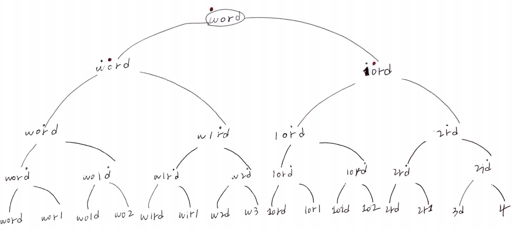

# Problem

* [Generalized Abbreviation](https://leetcode.com/problems/generalized-abbreviation/)

# Idea

문자열 `s` 가 주어지면 가능한 abbreviation 들을 구하는 문제이다.

abbreviation 은 문자와 숫자를 합하여 문자열의 문자개수를 줄여서 표현하는 방법이다.
예를 들면 `word` 일때 다음과 같은 abbreviation 이 가능하다.

```
["word", "1ord", "w1rd", "wo1d", "wor1", "2rd", "w2d", 
"wo2", "1o1d", "1or1", "w1r1", "1o2", "2r1", "3d", "w3", "4"]
```

다음과 같은 부분문제를 정의하고 backtracking 으로 해결한다.

```cpp
solve(string s, int pos, string combi, int cnt)

      s: 주어진 문자열
      i: 이번에 축약해야할 s 의 인덱스
   abbr: 현재 제작중인 축약 문자열
    cnt: 축약된 문자의 숫자, 0 이면 숫자는 아직 없다.
```

다음은 recursion tree 이다.



# Implementation

* [c++11](a.cpp)
* [java8](Solution.java)

# Complexity

```
O(N^2) O(N)
```
