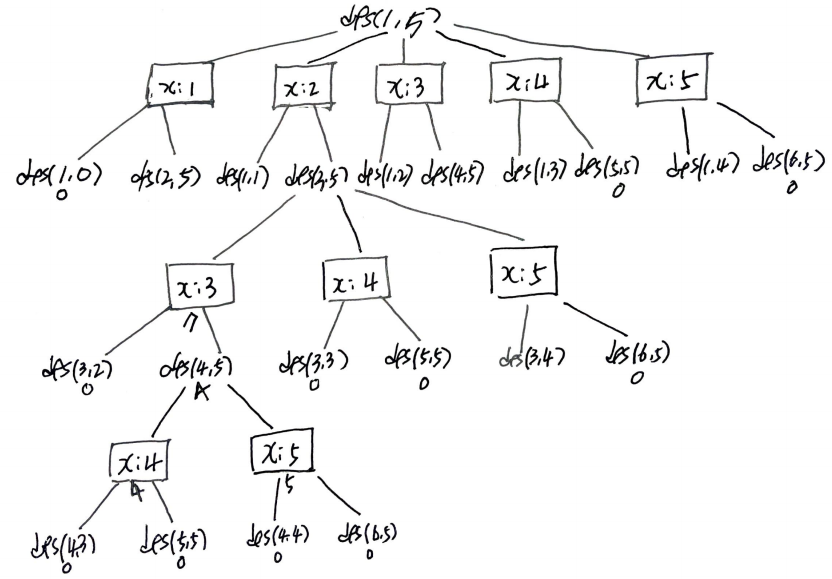

# Problem

[Guess Number Higher or Lower II](https://leetcode.com/problems/guess-number-higher-or-lower-ii/)

숫자 `n` 이 주어진다. 다음과 같은 규칙으로 게임을 수행한다.

* Alice 가 1 에서 n 까지 숫자중 하나를 정한다.
* 당신이 숫자를 추측해 본다.
* 추측한 숫자가 맞았다면 당신이 이겼다.
* 그렇지 않다면 Alice 는 추측한 숫자가 Alice 고른 숫자보다 큰지
  작은지를 말해 준다.
* 당신이 매번 틀렸을 때 마다 추측한 숫자 만큼 돈을 지불한다. 모든 돈을
  지불했다면 게임에서 지는 것이다.
  
항상 이기도록 최소로 필요한 돈을 구하라.

# Recursive Dynamic Programming

## Idea

다음과 같은 부분문제 `dfs` 를 정의한다.

```
int dfs(C, int l, int r)

return: min money to win
     C: cache for l, r
     l: left end number of [1..n]
     r: right end number of [1..n]
```

다음은 recursion tree 이다.

 

## Implementation

* [c++11](a.cpp)
* [java8](Solution.java)

## Complexity

```
O(N^3) o(N^2)
```

# Iterative Dynamic Programming

## Idea

WIP...

## Implementation

* [c++11](iterative.cpp)

## Complexity

```
O(N^3) o(N^2)
```
