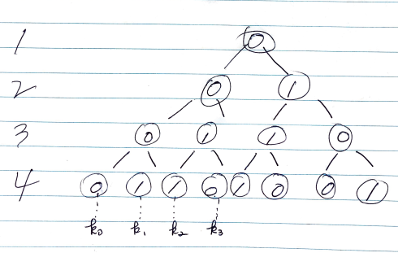

# Problem

* [K-th Symbol in Grammar](https://leetcode.com/problems/k-th-symbol-in-grammar/)

# Idea

숫자 `N` 과 `K` 가 주어지면 `N` 레벨의
`K` 번째 숫자를 구하는 문제이다.

규칙에 의해 만들어지는 숫자로 트리를 그리면 아래와 같은 perfect binary tree 이다.



위 트리를 살펴보면 몇가지 규칙을 발견할 수 있다.
`N` 레벨의 `K` 번째 숫자를 `kth(N, K)` 라고 하자.

`N` 레벨의 `k` 번째 노드는 부모 노드의 왼쪽 혹은 오른쪽 자식이다.

만약 `k` 가 홀수이면 `(k1, k3)` 부모 노드는 `N-1` 레벨의 `(K+1)/2` 번째 노드이다.

그리고 `N` 레벨의 `k` 번째 노드는 부모 노드의 왼쪽 자식이다. 이때 부모 노드가 `0` 이면 자식은 `0` 이고 부모 노드가 `1` 이면 자식 노드는 `1` 이다.

만약 `k` 가 짝수이면 `(k0, k2)` 부모 노드는 `N-1` 레벨의 `K/2` 번째 노드이다.

그리고 `N` 레벨의 `k` 번째 노드는 부모 노드의 오른쪽 자식이다. 이때 부모 노드가 `0` 이면 자식은 `1` 이고 부모 노드가 `1` 이면 자식 노드는 `0` 이다.

# Implementation

[c++11](a.cpp)

# Complexity

```
O(lgN) O(1)
```