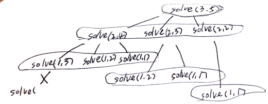

# Problem

[Largest Sum of Averages](https://leetcode.com/problems/largest-sum-of-averages/)

# Idea

수열 `A[]` 와 숫자 `K` 가 주어진다. `A[]` 를 연속된 `K` 그룹으로
나누자. 각 그룹의 평균은 최대이어야 한다. 그때의 평균의 합을 구하는
문제이다.

`A[]` 의 크기를 `N` 이라고 하자. `K, N` 을 줄여가면서 마지막 답을
구해보자.  예전에 구한 것을 새로운 것을 구할 때 사용하기 때문에
dynamic progarmming 이라 할 만 하다. iterative 방법 보다는 recursive
방법이 더욱 이해하기 쉽다. 따라서 recursive 방법만 기술한다.

dynamic programming 을 위해 다음과 같이 캐시를 정의한다.

```cpp
C[k][n] : 
A[0..n) 을 k 그룹으로 나누었을 때 k 그룹들의 평균의 최대 합
```

부분문제 `solve(A[][], k, n)` 을 정의하고 다음과 같은 상황을 고려해서
재귀적으로 해결해보자.

* `n < k` 이면 `0` 을 리턴한다. `C[n][k]` 는 0 이 되기 때문에 부모
  콜스택에서 최대값으로 체택 되지 않을 것이다.
* `k` 를 하나 줄이면 그룹이 하나 만들어 진다. 그 그룹에 포함되는
  녀석들을 `A[n-1]` 부터 하나씩 포함시키면서 `C[k][n]` 을 최대값으로
  갱신한다.

다음은 `A[] = (9, 1, 2, 3, 9), K = 3` 에 대한 recursion tree 이다.



# Implementation

* [c++11](a.cpp)

# Complexity

```
O(KN) O(KN)
```
