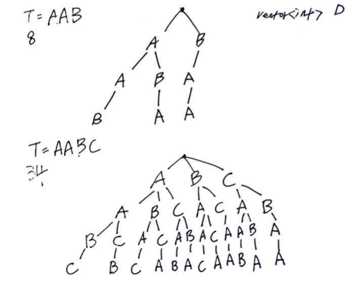

# Problem

[Letter Tile Possibilities](https://leetcode.com/problems/letter-tile-possibilities/)

# Idea

영문 대문자로 구성된 문자열 `T` 가 주어진다. `T` 의 문자 들로
표현 가능한 문자의 개수를 구하는 문제이다.

예를 들어 `T = "AAB"` 의 경우는 `A, B, AA, AB, BA, AAB, ABA, BAA` 와
같이 8 가지 문자열을 표현할 수 있다.

subsequence 를 만들 때 같은 문자가 등장하는 경우는 제외 하자.  모든
경우의 수를 다음과 같이 트리로 표현할 수 있다.



다음과 같이 부분문제를 정의하고 DFS 를 이용해서 해결할 수 있다.  `T`
는 영문 대문자로 구성된 문자열이다. `vector<int> D(26, 0)` 를
선언하여 사용되고 남은 문자들의 개수를 저장하자.

```
void dfs(vector<int> &D, int n, int i)

D: 사용되고 남은 문자들의 개수
n: T.size()
i: 이번에 사용할 문자의 인덱스
```

# Implementation

* [c++11](a.cpp)

# Complexity

```
O(2^T) O(T)
```
