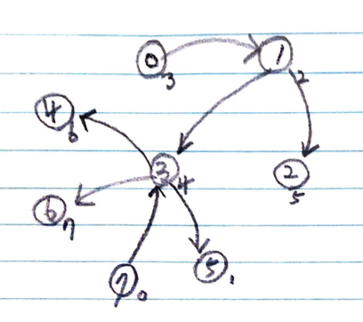
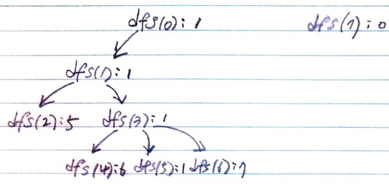

# Problem

[Loud and Rich](https://leetcode.com/problems/loud-and-rich/)

# Idea

`N` 명의 사람들이 있을 때 상대적 부자관계 짝의 모음 `R[]` 이 주어진다.
`R[i][0]` 은 `R[i][1]` 보다 부자이다. 그리고 조용함 정도의 모음 `Q[]`
가 주어진다. 모든 사람 `i` 에 대하여 `i` 보다 더욱 부자인 사람들 중
가장 조용한 사람을 구하는 문제이다.

답을 저장할 벡터 `L[]` 를 선언한다. 즉, `L[i] = j` 이면 `i` 보다
부자인 사람들 중 가장 조용한 사람은 `j` 라는 의미이다.

`R[]` 을 처음부터 순회하여 덜 부자인 사람에서 더 부자인 사람으로
간선을 생성하고 `unordered_map<int, vector<int>> m_adj` 에 저장한다.

이제 그래프 자료구조가 완성되었다. `L[]` 는 `-1` 로 초기화하고
`L[i] < 0` 이면 아직 `i` 노드를 방문하지 않았다고 해보자.

다음과 같은 부분문제를 정의하고 DFS 로 해결한다.

```
int dfs(int i)
     i: 이번에 방문할 사람의 인덱스
return: i 사람 보다 부자인 사람들 중 가장 조용한 사람
```

예를 들어 `R = [[1,0],[2,1],[3,1],[3,7],[4,3],[5,3],[6,3]], Q = [3,2,5,4,6,1,7,0]`
의 경우를 살펴보자.

그래프의 모양은 다음과 같다.



recursion tree 의 모양은 다음과 같다.



`u` 를 이번에 방문하는 사람이라 하고 `v` 를 `u` 의 이웃이라 하자.
DFS loop 에서 지금까지 발견된 `L[u]` 의 조용함 정도가
앞으로 발견될 `dfs(v)` 의 조용함 정도 보다 크다면 `L[u] = dfs(v)`
를 수행한다. 그러나 조건문에서 `dfs(v)` 를 수행하기 때문에 `L[u] = L[v]`
해도 된다.

```c
    for (int v : m_adj[u]) {
      if (Q[m_rst[u]] <= Q[dfs(v, Q)])
        continue;
      m_rst[u] = m_rst[v];
    }
```

# Implementation

* [c++11](a.cpp)

# Complexity

```
O(N) O(N)
```