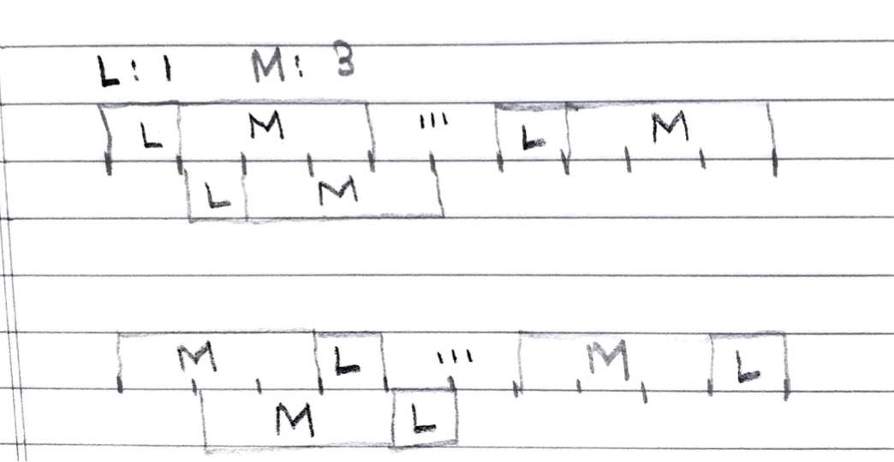

# Problem

[Maximum Sum of Two Non-Overlapping Subarrays](https://leetcode.com/problems/maximum-sum-of-two-non-overlapping-subarrays/)

# Idea

수열 `A[]` 와 두 수 `L, M` 이 주어진다. `A[]` 를 길이가 각각 `L, M` 인
두 subarray 를 구한다. 두 subarray 는 겹치지 않아야 하고 서로의 각
원소들의 합이 최대가 되어야 한다. 이 때 그 합을 구하는 문제이다.

`L, M` 크기의 연속된 두 subarray 를 만들어야 한다. 모든 경우의 수를
생각해 보자. 오른쪽 블록을 `M` 크기의 subarray 로 두고 왼쪽 블록을 `L`
크기의 subarray 로 정한 다음 두개의 블록을 처음부터 끝까지 순회하면서
최대 합을 구한다. 이번에는 오른쪽 블록을 `L` 크기의 subarray 로 두고
왼쪽 블록을 `M` 크기의 subarray 로 정한 다음 비슷한 방법으로 최대 합을
구한다. 2-pass 처럼 보이지만 1-pass 로 할 수 있다.



어디서 부터 어디까지의 합은 [partial
sum](/fundamentals/partialsum/partialsum/README.md) 을 이용한다.
`A[]` 를 순회하면서 partial sum 으로 만들자.

모든 반복을 마치면 `ans` 가 답이다.

# Implementation

* [c++11](a.cpp)

# Complexity

```
O(N) O(1)
```
