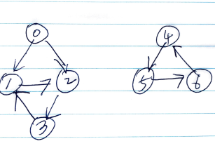

# Problem

* [Minimize Malware Spread](https://leetcode.com/problems/minimize-malware-spread/)

# Idea

그래프를 표현한 이차원 배열 `G` 와 감염된 노드의 일차원 배열 `I` 가 주어진다.
`I` 에서 노드를 하나 찾는다. 이 노드를 제거하면 감염된 노드들의 수가 최소가 되야 한다.

예를 들어서 다음과 같은 그래프가 있고 `I = {0, 4}` 이라고 해보자.



`0` 을 제거하면 감염된 노드들의 수는 `3` 이 될 것이고
`4` 을 제거하면 감염된 노드들의 수는 `4` 가 되기 때문에
답은 `0` 이다.

먼저 `G` 를 탐색하여 그래프들이 연결된 상황을 파악하자.
부모는 `m_prnt[]` 에 노드의 개수는 `m_cnt[]` 에 저장한다.
[merge-find](/fundamantals/disjointset/unionfind/README.md) 를 참고할만 하다.

인덱스 `i` 를 이용하여 `I` 를 순회한다. `m_prnt[I[i]] == I[i]` 인 노드는
그 그래프의 부모이다. `m_cnt[i]` 가 최대인 노드 `i` 가 답이다. 

# Implementation

* [c++11](a.cpp)

# Complexity

```
O(N^2) O(N)
```
