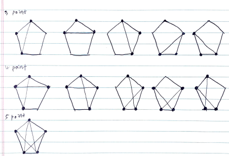

# Problem

[Minimum Score Triangulation of Polygon](https://leetcode.com/problems/minimum-score-triangulation-of-polygon/)

# Idea

수열 `A[]` 가 주어진다. `A[]` 의 점 3 개를 고르면 삼각형을 만들어 낼
수 있다. 삼각형을 n-2 개 만들 수 있다.  삼각형을 구성하는 숫자들의
곱을 `prod` 라고 했을 때 가장 작은 `prod` 합을 구하는 문제이다.

두 점을 먼저 정하면 나머지 한 점을 순회하면서 `sum(prod)` 를 구한다.
[floyd algorithm](/fundamentals/graph/floyd/README.md) 과 약간
비슷하다.

캐시 `int C[][]` 를 선언하고 `C[i][j]` 에 `i, j` 를 고정된 두 점으로
했을 때 최소의 `sum(prod)` 를 저장한다. 이 때 `i < k < j` 인 경우
`C[i][j] = C[i][k] + C[k][j] + A[i]*A[j]*A[k]` 이다.

따라서 점의 개수가 `3` 일 때 부터 `n` 일 때까지 순회하면서 `i, j` 를
정하고 `i < k < j` 동안 `k` 를 증가하면서 `C` 를 채운다. 모든 반복을
마치면 `C[0][n-1]` 이 답이다.



# Implementation

* [c++11](a.cpp)

# Complexity

```
O(N^3) O(N)
```
