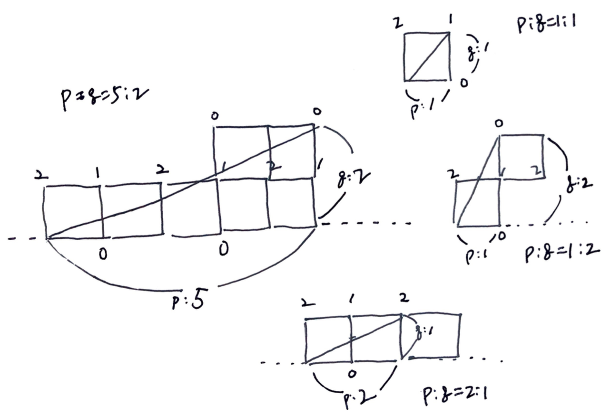

# Problem

[Mirror Reflection](https://leetcode.com/problems/mirror-reflection/)

# Idea

거울로 이루어진 정사각형의 방이 있다. 남서쪽을 제외하고 남동쪽부터 각
모서리에 `0, 1, 2` 의 번호가 부여된다. 그리고 남서쪽 모서리에서 광선을
발사한다. 광선의 가로 세로 비율은 `p, q` 로 주어진다. 광선이 도착하는
모서리를 구하는 문제이다.

아래 그림은 다양한 `p, q` 에 대한 예이다.



`p, q` 를 모두 짝수가 아닐 때까지 2 로 나누면 몇가지 규칙을 발견할 수
있다.

* `p % 2 == 0` 이면 답은 `2` 이다. 
  * `p = 2, q = 1`
* `q % 2 == 0` 이면 답은 `0` 이다.
  * `p = 1, q = 2`
* `p % 2 == 1 && q % 2 == 1` 이면 답은 `1` 이다.

# Implementation

* [c++11](a.cpp)

# Complexity

```
O(lg(min(p,q))) O(1)
```
